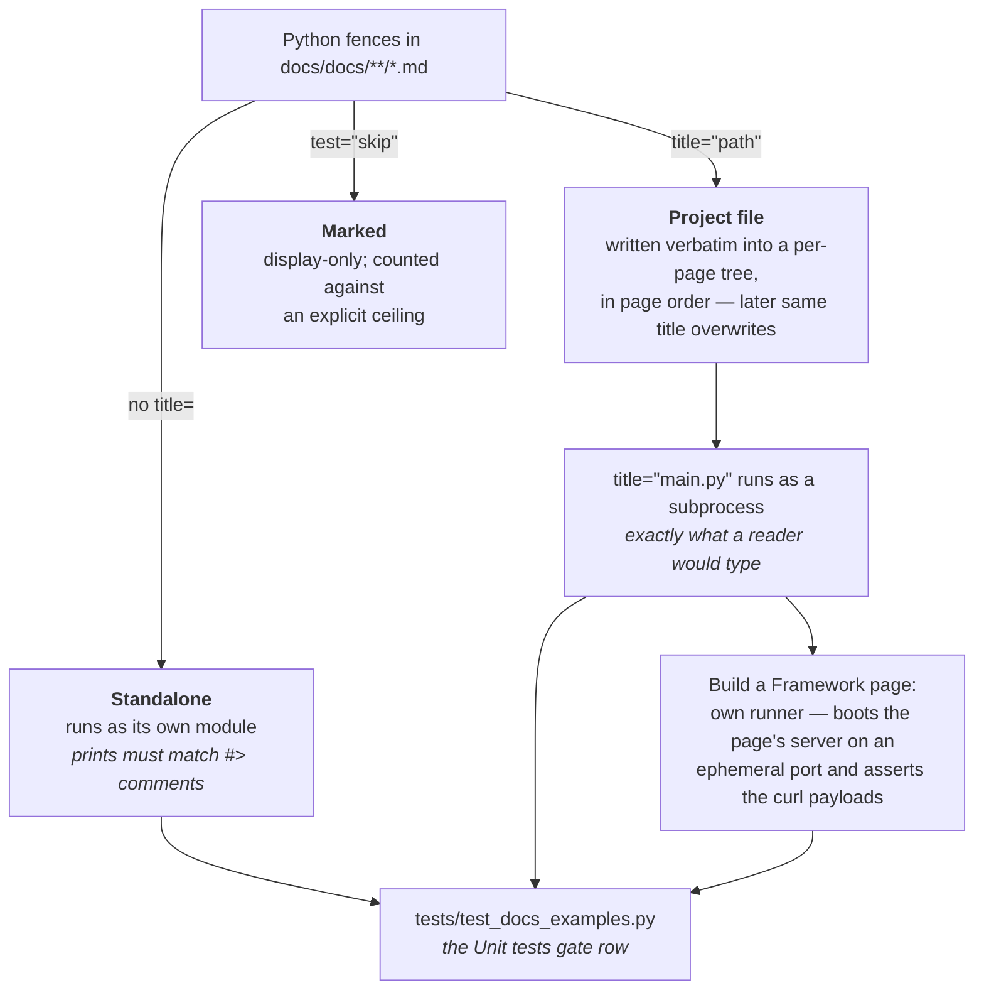
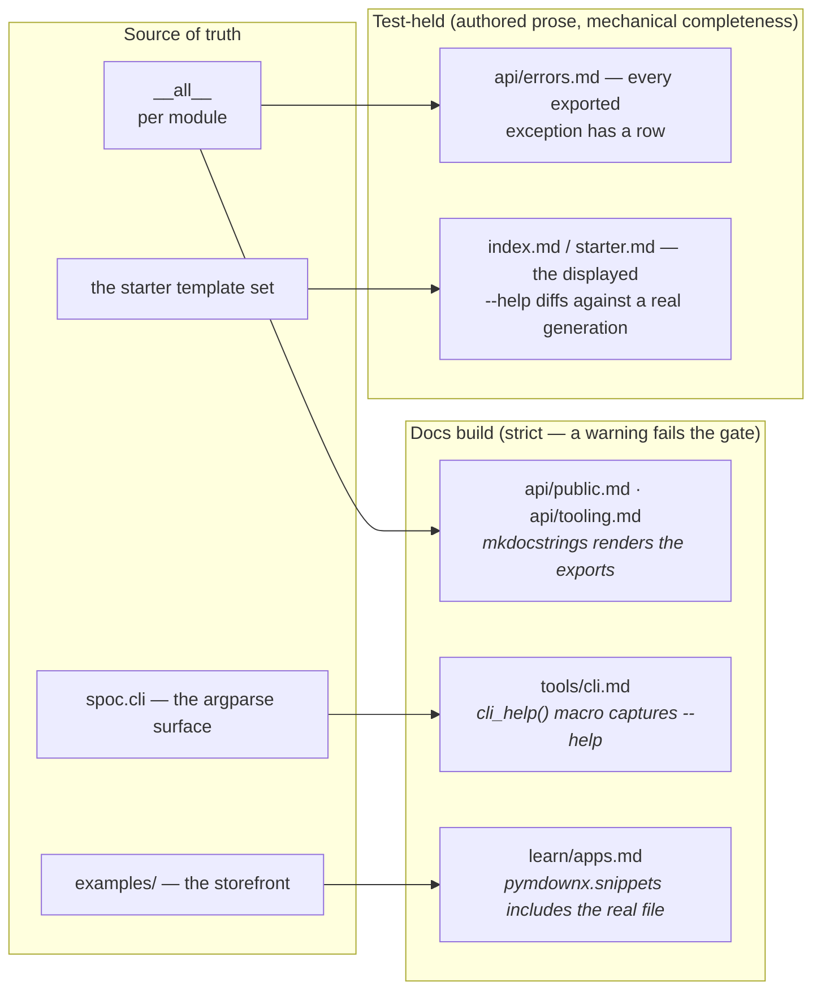

# SPOC — documentation integrity

What **is**, as of the docs-dx change. The documentation cannot drift from the
code because nothing load-bearing in it is authored twice: snippets execute,
reference listings derive, and the two hand-written indexes are held complete
by tests. One source, many projections — the kernel's own shape, applied to
the docs.

## The three snippet states

Every Python fence under `docs/docs/` is in exactly one state; an unmarked
fence that doesn't run fails the suite, so silence is not a state.

## Derived reference, checked indexes

The split matters: the **build** column regenerates content, so it can never
be stale; the **tests** column keeps hand-written prose but makes
_incompleteness_ a failure. Both run in the gate (`.canon/checks.md` — the
Docs build and Unit tests rows).
