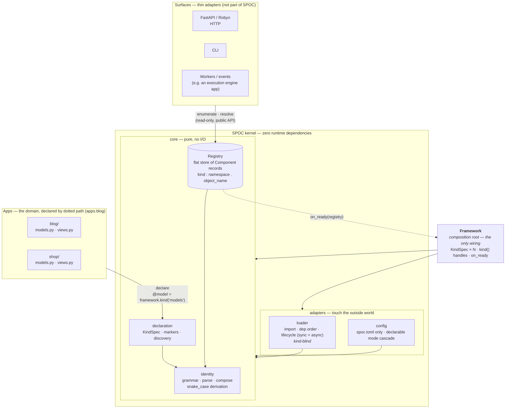
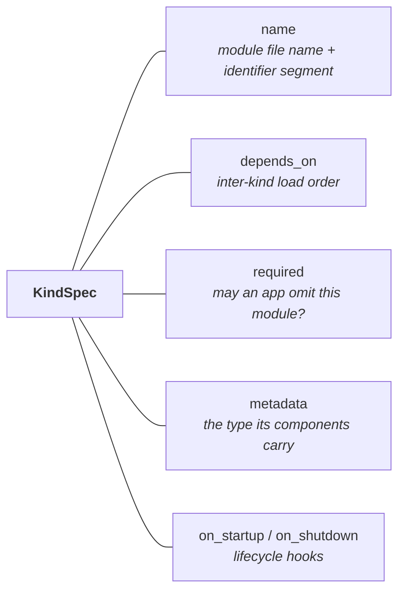
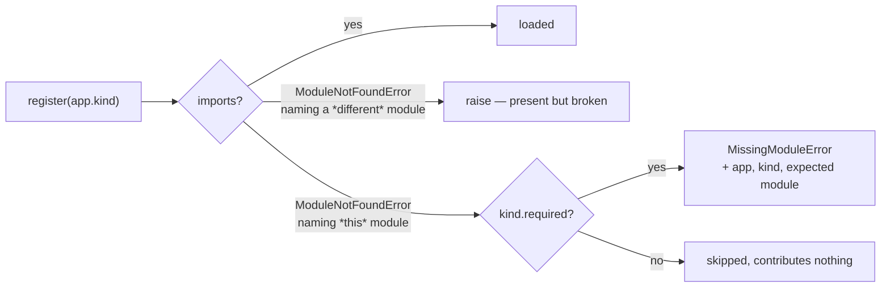
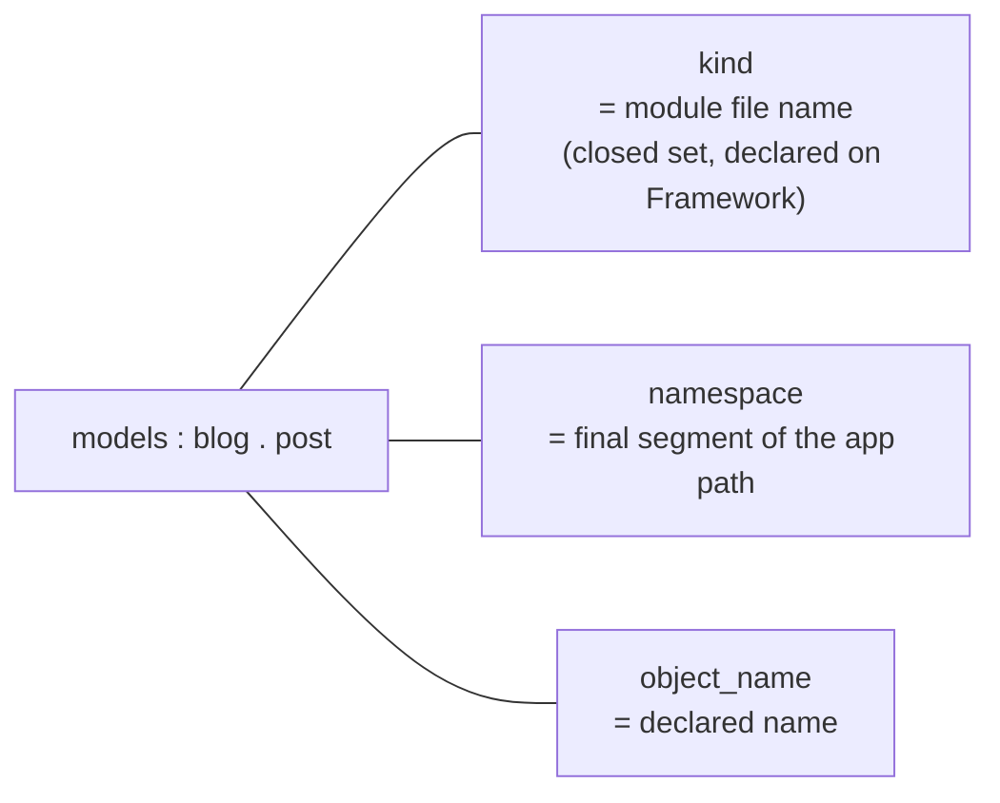
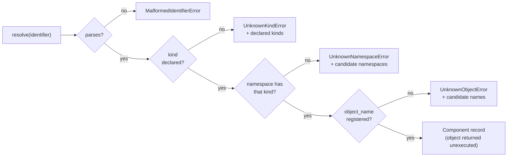
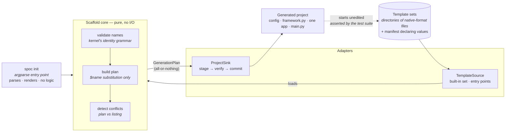
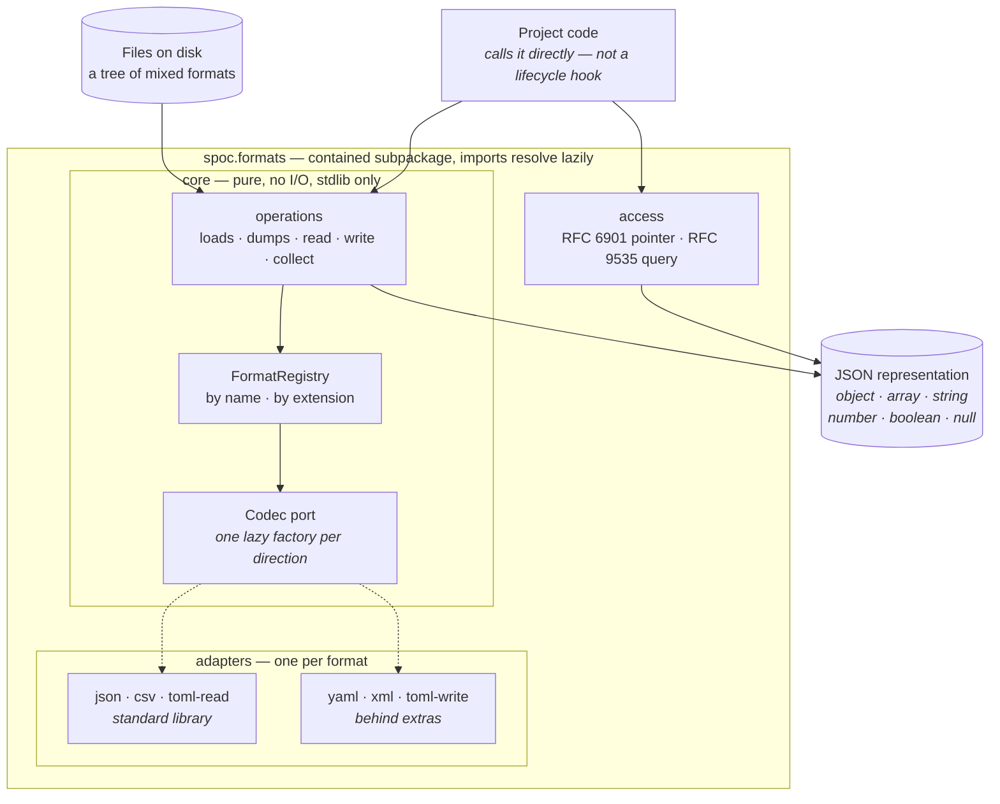
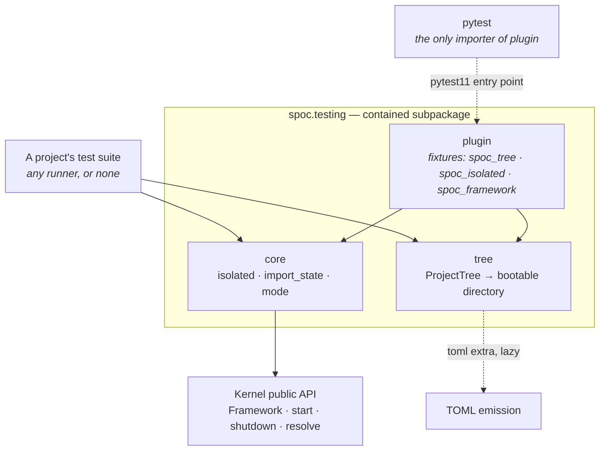
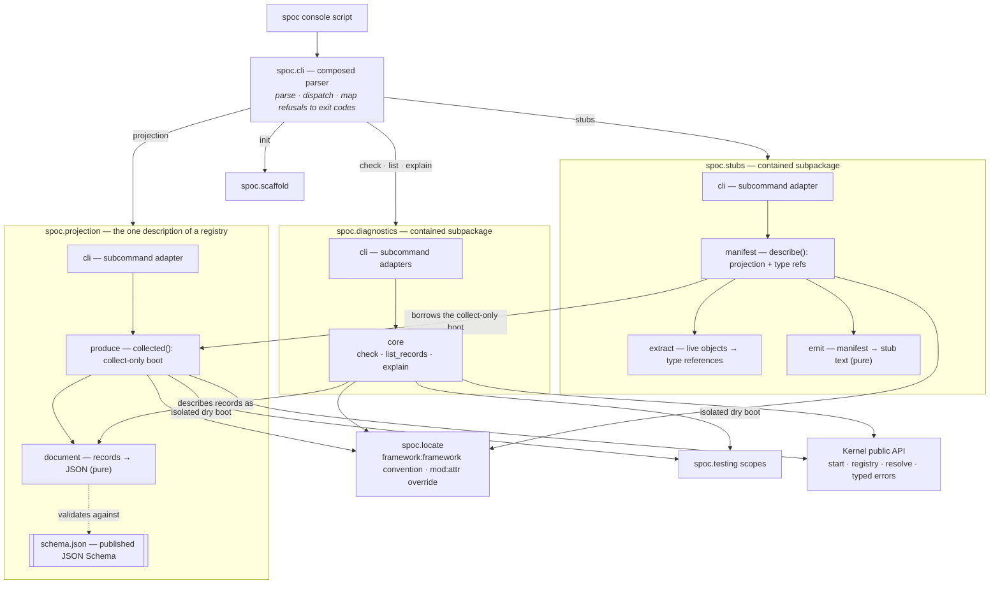

# SPOC — system architecture

What **is**, as of the kernel collapse. SPOC is a component registry with a
dependency-ordered lifecycle: one `Framework` object declares the kind set, apps
declare components inward, surfaces project outward from the registry, and every
dependency points at the kernel — never out of it.

Throughout this document **kernel** means the core package (`spoc` proper, the
box below) as opposed to the contained subpackages — `spoc.formats`,
`spoc.testing`, `spoc.diagnostics`, `spoc.scaffold`, `spoc.stubs`,
`spoc.projection`. It is a boundary within the distribution, not a claim that
SPOC schedules, isolates, or mediates anything.

## The shape

Four jobs, and the module boundaries match them. The core is pure — it performs
no I/O and imports nothing outside the kernel. The adapters touch the outside
world: one imports modules, one reads files. `Framework` is the only place they
meet.

The registry is **not** owned by the loader. That inversion — a pure core concern
nested inside an adapter — is what forced the loader to know what a kind is, and
removing it is the point of this shape.

## A kind is one record

Every per-kind attribute rides one `KindSpec`, so no second structure keyed by
kind name can disagree with it. A bare string is shorthand for a spec with all
defaults.

## Absent is not broken

Optionality is decided per kind, never framework-wide, and it only governs
*absence*. A module that exists and raises while importing is always an error —
the author wrote something that does not work rather than declining to write it.
The two are told apart by which module the import system reports as missing.

## The identifier

Every segment matches `^[a-z][a-z0-9_]*$`, validated at registration. A name
derived from an object's own name is converted to snake_case first
(`UserAccount` → `user_account`); a name stated explicitly is verbatim, and
lookup never converts. Exactly three segments; no operation suffix.

## Resolution

## The scaffolder

`spoc init` is a surface, not kernel. It runs **before** a project exists, so
it appears nowhere in the flow above: nothing in the kernel imports it, and
removing it changes nothing at runtime. Like every other surface it is a thin
adapter over a pure core, and its dependencies point inward.

The dotted edge is the mechanism that keeps templates honest: the suite
generates a project, starts it, and asserts the registry, so a kernel change
that would break new projects fails here rather than reaching users.

## The data surface

`spoc.formats` is a **contained subpackage** of the `spoc` distribution. The kernel never
imports it and importing `spoc` never loads it — there is no edge between them in either
direction, a boundary the test suite enforces rather than packaging. It exists for the
*project's* own data — fixtures, tables, per-app settings — never for the kernel's
configuration, which stays `spoc.toml` through stdlib `tomllib`. The collection-key grammar
restates the kernel's segment convention locally: the two surfaces share a convention,
never code.

The dotted edges are the laziness: a codec's dependency is imported the first time that
*direction* of that *format* is used, so importing `spoc.formats` on a bare install pulls in
nothing, and a missing extra fails naming itself rather than as an `ImportError`.

Reading and querying are separate boxes on purpose. Addressing is split by failure semantics —
a pointer names one value or raises, a query returns a possibly-empty list — and the two are
never relaxed into each other.

## The test harness

`spoc.testing` is the third contained subpackage, under the same boundary as the other
two: the kernel never imports it, importing `spoc` never loads it, and the suite pins
both directions. It consumes only the kernel's *public* contracts — construction,
`start`/`shutdown`, resolution — and owns the process state a boot touches in a test
(`sys.path`, `sys.modules`), which the kernel itself never mutates.

The dotted edge to `plugin` is the inertness contract: the entry point is metadata, so
pytest is the only thing that ever imports the module and a runtime install never loads
a test runner. The dotted edge to TOML emission mirrors the formats rule — a missing
extra fails naming itself.

## The diagnostics and the composed CLI

`spoc.diagnostics` is the fourth contained subpackage: pre-runtime validation
(`check`) and registry introspection (`list`, `explain`) as library-first
operations. A diagnostic run is an isolated dry boot — it composes
`spoc.testing`'s scopes (the one sanctioned edge between contained
subpackages) and the kernel's public API, so nothing a run imports or
registers outlives it. The `spoc` console script is one composed parser in
`spoc.cli`; each surface registers its own subcommands and stays a thin
adapter.

`spoc.stubs` is the fifth contained subpackage. Its product is a `.pyi` beside the
project's composition root, which narrows `resolve` per identifier. A stub never
executes, so naming one app's classes for the type checker adds no runtime coupling
between apps — the decoupling the registry exists to provide survives being described.
`spoc.locate` sits outside every subpackage because they all need it and only
`spoc.cli` may import them.

`spoc.projection` is the sixth, and the only one that is also depended *on*. It owns
the collect-only boot — discovery runs, initialization does not — so a project whose
startup hooks would fail is still describable, and it owns the single description of a
registered component. Both other describing surfaces read that description rather than
building one: the stub adds the static type each identifier yields, which is meaningful
only to a type checker, and `spoc list` renders the same records as prose after a full
boot. One registry, one description, three renderings; the boot depth and the rendering
are the whole of the difference between the commands.

The findings never rephrase anything: `check` reports the kernel's own error
text (failing segment, valid candidates), gathered instead of raised. The
kernel imports none of this — `spoc.cli` is entry-point metadata until the
console script runs.

## Invariants

1. **Zero runtime dependencies** — anything needing a dependency is, by
   definition, not kernel. `dependencies` is empty, so installing spoc acquires
   nothing, and this holds for the shipped scaffolder too: every build-vs-adopt
   decision behind it landed on the standard library. The `spoc.formats`
   surface adopts packages, but every one is quarantined behind an extra and
   imported lazily — a bare install still acquires nothing.
2. **Describes, never executes** — the kernel calls no user code beyond
   lifecycle hooks; resolution is a pure lookup.
3. **One registry, one grammar** — all views are derived from the flat
   store; no second identifier scheme exists.
4. **Loud registration** — a declared component that cannot register fails
   startup with a precise error; nothing is silently dropped.
5. **Dependencies point inward** — the core imports nothing outside itself and
   performs no I/O; the loader never sees a registry; the config adapter only
   reads files. Every crossing is wired in `Framework` and nowhere else.
6. **One declaration point** — every attribute of a kind lives on its
   `KindSpec`. There is no decorator form and no parallel mapping, so a kind
   attribute cannot be stated away from the kind it describes.
7. **One metadata channel** — a record carries the metadata its kind declares
   and nothing else. A kind stating no contract accepts no metadata, so there is
   no untyped escape hatch by default.
8. **Boot leaves the process alone** — start mutates neither `sys.path` nor the
   filesystem; apps import through the normal import system under their declared
   dotted paths, and the only global a boot populates is Python's own module
   cache (which is why restart re-runs discovery, never module-level code).
9. **A stated concurrency contract** — registration is atomic under one lock,
   lifecycle transitions are serialized with exactly one winner, and reads
   between a completed start and a shutdown need no coordination. Shutdown ends
   that window and a read racing it is not covered: reset swaps in a fresh
   registry rather than emptying the live one, so such a read still observes one
   whole registry, but which of the two it observes is a race the caller must
   order itself. One object, one identity: divergent re-registration raises.
   The contract covers *derived* reads too, not only records: a failed `resolve`
   is composed from one observation of the store, so it never names a candidate
   that did not exist when the lookup ran, and a lifecycle phase groups the
   store once for every hook it dispatches, so two hooks in one phase never read
   two different registries — which is also what keeps a phase linear in a
   project's size rather than quadratic.
10. **A stated load order** — modules load, discover, and initialize in one
    total order: the rank of a kind in the declared `depends_on` order, then the
    position of the app in the effective `[spoc.apps]` list. Kind rank comes from
    the declaration, so it is identical for every app and no absent optional
    module can shift it. A kind is therefore a **phase** that completes across
    every app before the next begins, and the app list only ever orders modules
    *within* a phase — which is why no declaration can ask for one app's later
    kind ahead of another app's earlier one. `graphlib` is kept for refusing a
    cycle, not for producing the order.
11. **The inert state is unconditional** — every transition out of `started`
    reaches the inert state, whether or not the app-authored code it invoked
    succeeded and whether or not the rollback of a failed boot succeeded. A
    failing `teardown()` still propagates unwrapped, but the framework is
    restartable rather than stuck reporting itself started. Resetting kernel
    state and clearing the started flag are one operation for exactly this
    reason: as two steps, one of them was skipped.

    The cost is stated rather than hidden: a `teardown()` that raises aborts the
    walk, so modules behind it are not torn down and — because the loader is
    discarded by the reset — never will be. That is a resource leak, chosen over
    the alternative of swallowing failures or reporting them as a group, which
    would break the promise that the caller sees the exact exception the app
    raised. Fix the failing teardown; the kernel will not paper over it.
12. **The synchronous path refuses coroutines before running anything** — it
    establishes that no hook or module function it is about to run is a
    coroutine, and names every one it finds, before invoking the first. A
    coroutine declared by the last module in load order therefore costs no
    earlier module's side effects.
