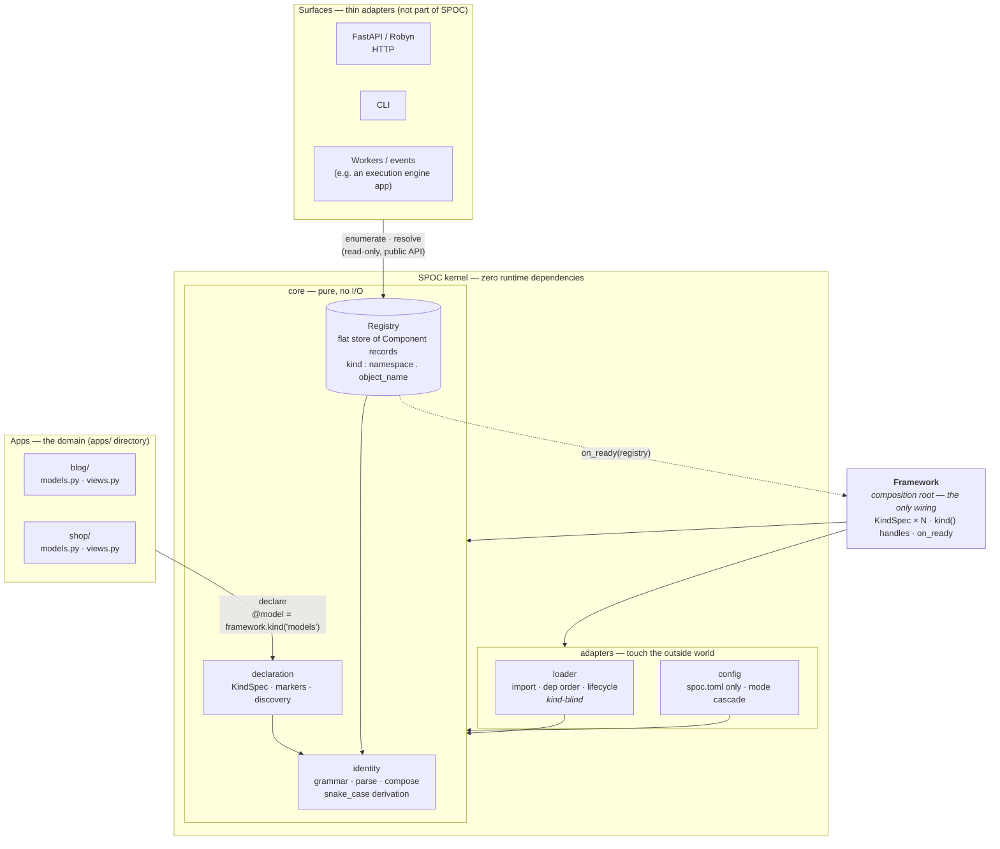
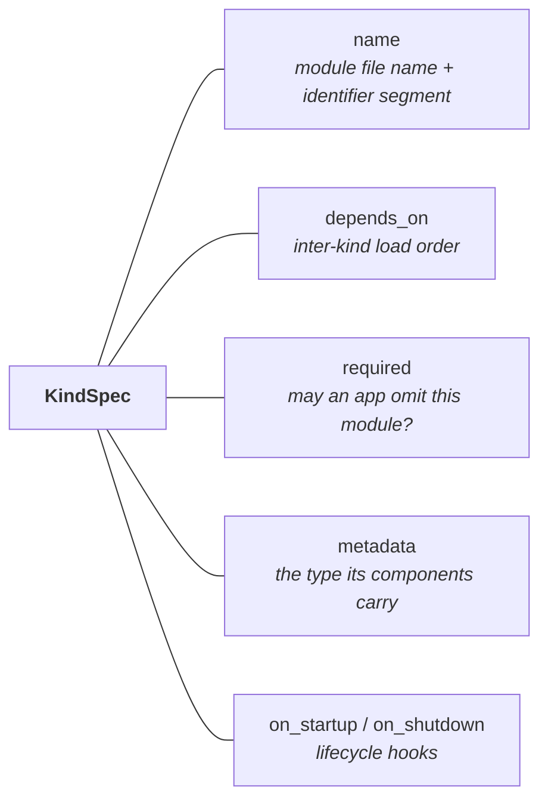
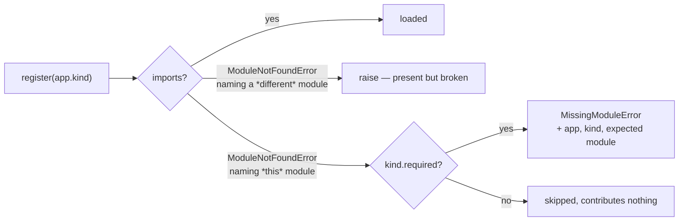
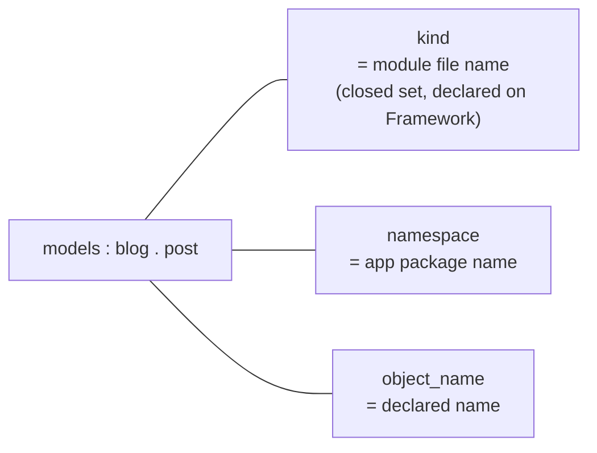
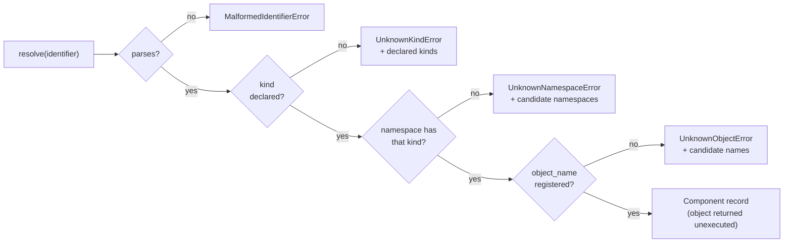
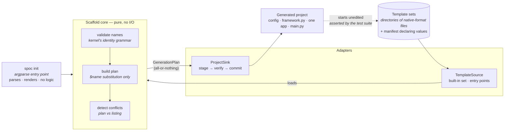

# SPOC — kernel architecture

What **is**, as of the kernel collapse. SPOC is a registry-first runtime
kernel: one `Framework` object declares the kind set, apps declare components
inward, surfaces project outward from the registry, and every dependency points
at the kernel — never out of it.

## The shape

Four jobs, and the module boundaries match them. The core is pure — it performs
no I/O and imports nothing outside the kernel. The adapters touch the outside
world: one imports modules, one reads files. `Framework` is the only place they
meet.

The registry is **not** owned by the loader. That inversion — a pure core concern
nested inside an adapter — is what forced the loader to know what a kind is, and
removing it is the point of this shape.

## A kind is one record

Every per-kind attribute rides one `KindSpec`, so no second structure keyed by
kind name can disagree with it. A bare string is shorthand for a spec with all
defaults.

## Absent is not broken

Optionality is decided per kind, never framework-wide, and it only governs
*absence*. A module that exists and raises while importing is always an error —
the author wrote something that does not work rather than declining to write it.
The two are told apart by which module the import system reports as missing.

## The identifier

Every segment matches `^[a-z][a-z0-9_]*$`, validated at registration. A name
derived from an object's own name is converted to snake_case first
(`UserAccount` → `user_account`); a name stated explicitly is verbatim, and
lookup never converts. Exactly three segments; no operation suffix.

## Resolution

## The scaffolder

`spoc init` is a surface, not kernel. It runs **before** a project exists, so
it appears nowhere in the flow above: nothing in the kernel imports it, and
removing it changes nothing at runtime. Like every other surface it is a thin
adapter over a pure core, and its dependencies point inward.

The dotted edge is the mechanism that keeps templates honest: the suite
generates a project, starts it, and asserts the registry, so a kernel change
that would break new projects fails here rather than reaching users.

## Invariants

1. **Zero runtime dependencies** — anything needing a dependency is, by
   definition, not kernel. This holds for the shipped scaffolder too: every
   build-vs-adopt decision behind it landed on the standard library, so the
   published wheel declares no `Requires-Dist` at all.
2. **Describes, never executes** — the kernel calls no user code beyond
   lifecycle hooks; resolution is a pure lookup.
3. **One registry, one grammar** — all views are derived from the flat
   store; no second identifier scheme exists.
4. **Loud registration** — a declared component that cannot register fails
   startup with a precise error; nothing is silently dropped.
5. **Dependencies point inward** — the core imports nothing outside itself and
   performs no I/O; the loader never sees a registry; the config adapter only
   reads files. Every crossing is wired in `Framework` and nowhere else.
6. **One declaration point** — every attribute of a kind lives on its
   `KindSpec`. There is no decorator form and no parallel mapping, so a kind
   attribute cannot be stated away from the kind it describes.
7. **One metadata channel** — a record carries the metadata its kind declares
   and nothing else. A kind stating no contract accepts no metadata, so there is
   no untyped escape hatch by default.
