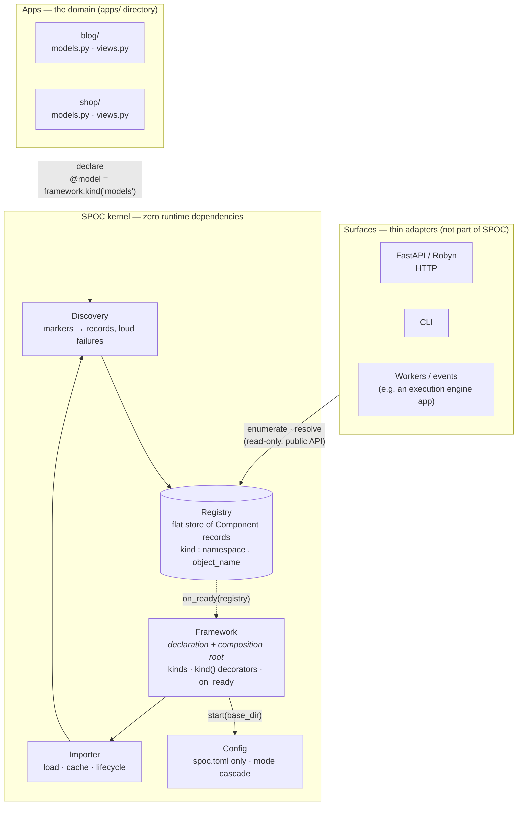
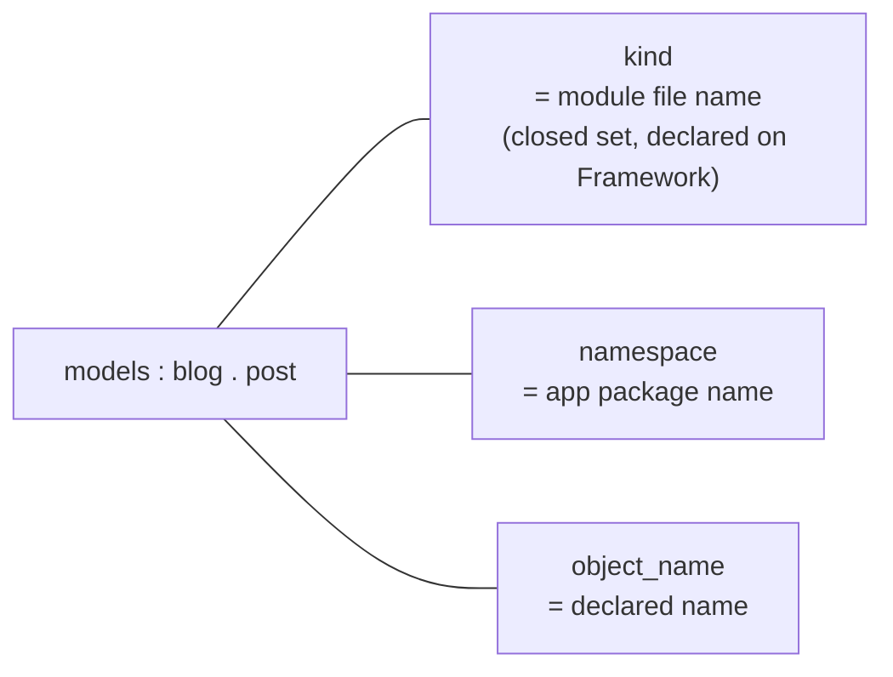
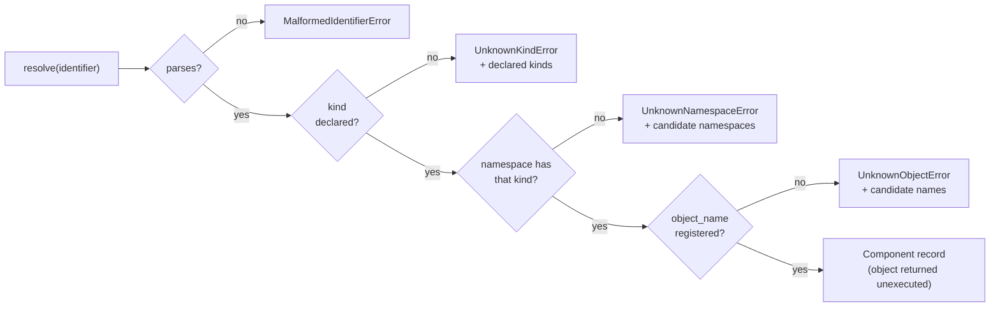

# SPOC — kernel architecture

What **is**, as of the framework-object API. SPOC is a registry-first
runtime kernel: one `Framework` object declares the kind set, apps declare
components inward, surfaces project outward from the registry, and every
dependency points at the kernel — never out of it.

## The shape

## The identifier

Every segment matches `^[a-z][a-z0-9_]*$`, validated at registration —
rejected, never normalized. Exactly three segments; no operation suffix.

## Resolution

## Invariants

1. **Zero runtime dependencies** — anything needing a dependency is, by
   definition, not kernel.
2. **Describes, never executes** — the kernel calls no user code beyond
   lifecycle hooks; resolution is a pure lookup.
3. **One registry, one grammar** — all views are derived from the flat
   store; no second identifier scheme exists.
4. **Loud registration** — a declared component that cannot register fails
   startup with a precise error; nothing is silently dropped.
