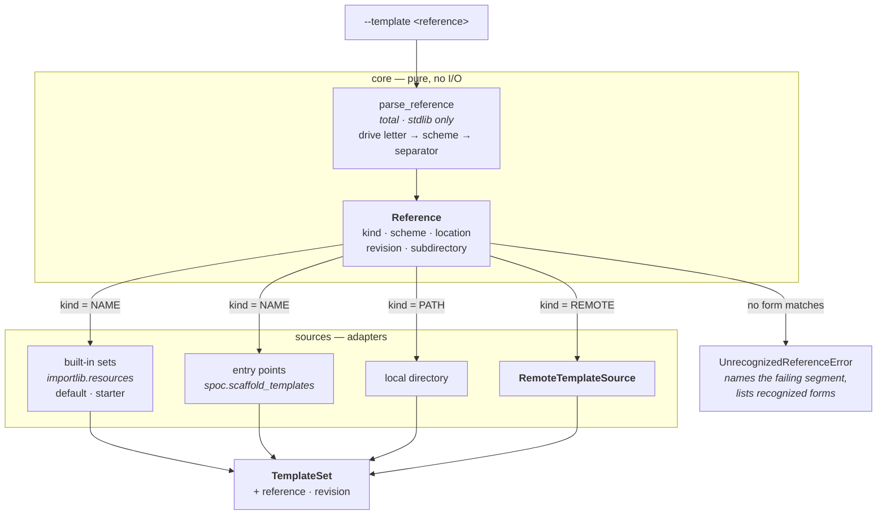
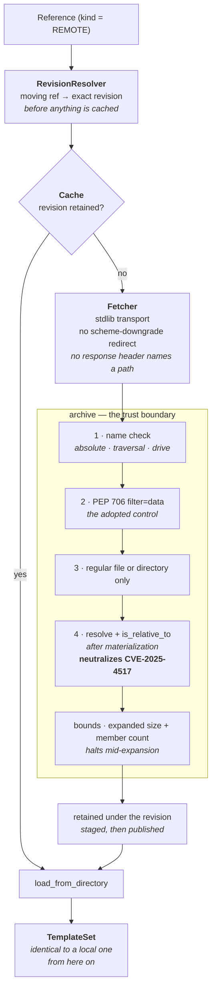
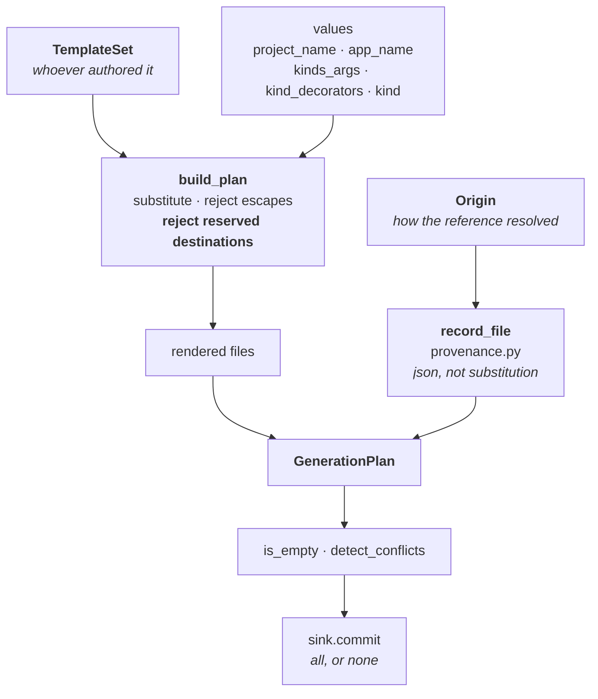
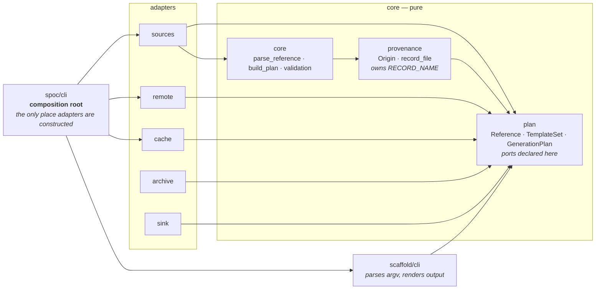

# SPOC — template reference resolution and retrieval

What **is**, as of remote template sources. A `--template` reference is parsed in
the pure core into the form it designates, then dispatched to exactly one
resolver. Retrieval sits entirely *before* the generation pipeline: by the time a
plan exists, a remote set is indistinguishable from a local one.

## Resolution is scheme-first and total

The reference's own spelling decides which kind of source is consulted, before
anything is looked up. Nothing falls through: a reference that designates one
kind never reaches another because the first came up empty.

`available()` lives on `EnumerableSource`, which only the built-in and
entry-point sources implement. A remote reference has no candidate set, so a
not-found error never invents one for it.

Two sets ship inside the distribution (`BUILTIN_SETS`): `default`, the minimal
bootable project, and `starter`, the default vocabulary wired end to end with a
transport-neutral projection module and a stdlib command surface. `starter` is
fully concrete — no `per_kind` repetition — because the `resources` kind's
lifecycle hooks cannot be expressed by name substitution.

## Retrieval, and where each control sits

Everything below happens before `build_plan`. A failure anywhere leaves the
destination untouched, because the destination has not been opened yet.

### Why four layers and not one

Layers 1–3 can each be bypassed by a bug in the layer itself; layer 4 is the one
that holds regardless. That is not defensive habit — it is a response to what has
actually happened to this exact feature elsewhere:

| Advisory | Where it was | Layer that stops it here |
| --- | --- | --- |
| Django CVE-2021-3281 | absolute paths and `..` in `archive.extract()` | 1, 2 |
| Django CVE-2025-59682 | *partial* traversal via a shared common prefix | 4 — `is_relative_to` compares components, not string prefixes |
| Django, Aug 2026 | `Content-Disposition` filename reached `os.path.join` | Nothing the remote party says is used to build a path |
| CPython CVE-2025-4517 | traversal bypass **inside** `filter="data"` | 4 — the project's floor is 3.12, which admits unpatched interpreters |

The last row is why layer 4 exists at all. The tests for it stub layers 1 and 2
to pass everything, so they exercise containment rather than the standard
library's filter.

## How the plan is composed

A generation plan has two contributors, and only one of them is the template set.

The record's values never enter `values`, so no substitution path reaches them —
a set cannot supply what the record says. `.spoc-template.json` is a reserved
destination, so a set cannot claim it either, and the refusal happens in the pure
core before anything is written. The record joins the plan *before* the checks,
so it inherits never-overwrite and all-or-nothing like any rendered file.

`spoc app` renders app-shaped files through the same `build_plan` but contributes
no record: it adds to a project that already has one, and never edits what the
author owns.

## Dependency direction

The scaffold's own CLI never constructs a source. It receives a factory from the
composition root, so mounting that surface without wiring retrieval yields local
template sets only — a remote reference is the sole path by which the kernel
performs outbound network access, and it is visible in one place.
