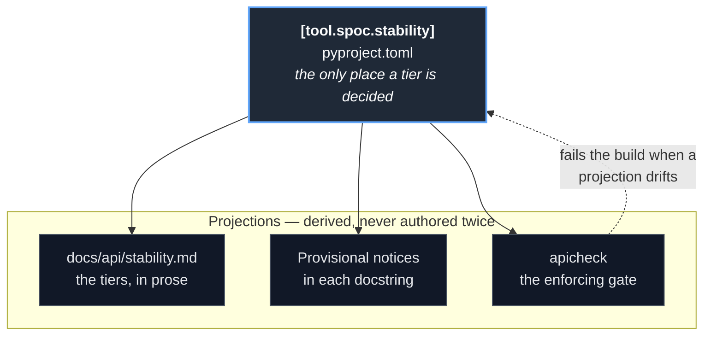
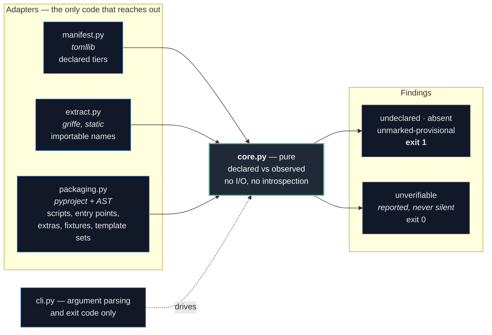

# SPOC — the stability contract

What **is**, as of the stability contract. One table declares the tier of every
element of the published surface; everything else that states or enforces a tier is
a projection of that table. There is no second place where a tier is decided.

This mirrors the kernel's own shape — one registry, many projections — applied to
the package's surface rather than to a project's components.

## Source of truth, and what derives from it

`[tool.spoc.stability]` in `pyproject.toml` is the only authority. The docs page,
the notice in each provisional docstring, and the check all read from it; none of
them may disagree with it, because the check compares them.

## How the check is wired

The core is pure: it is handed a declared contract and an observed surface and
returns findings. Every adapter around it reaches out to exactly one place, so
replacing any of them touches one file. The tool lives in `scripts/py/`, outside
the distribution — a checker shipped inside `spoc` would need a tier of its own and
would have to police itself.

Dependencies point inward. `core.py` imports no adapter, knows nothing of TOML,
griffe, or the terminal, and is the only module with tests of its own — it is where
every decision is made.

## Why `unverifiable` is a finding rather than a pass

Griffe documents that it cannot see console scripts, entry points, or extras;
`packaging.py` covers those, and some kinds — a file *schema*, for instance — no
observer covers at all. Rather than let a declared element pass because nothing
looked at it, the core compares each element's kind against the set of kinds the
observers claim, and reports the remainder.

It does not fail the build, because a coverage gap is not a divergence. It is always
printed, because a check that silently skips what it cannot inspect reads as
"everything passed" when it isn't.
