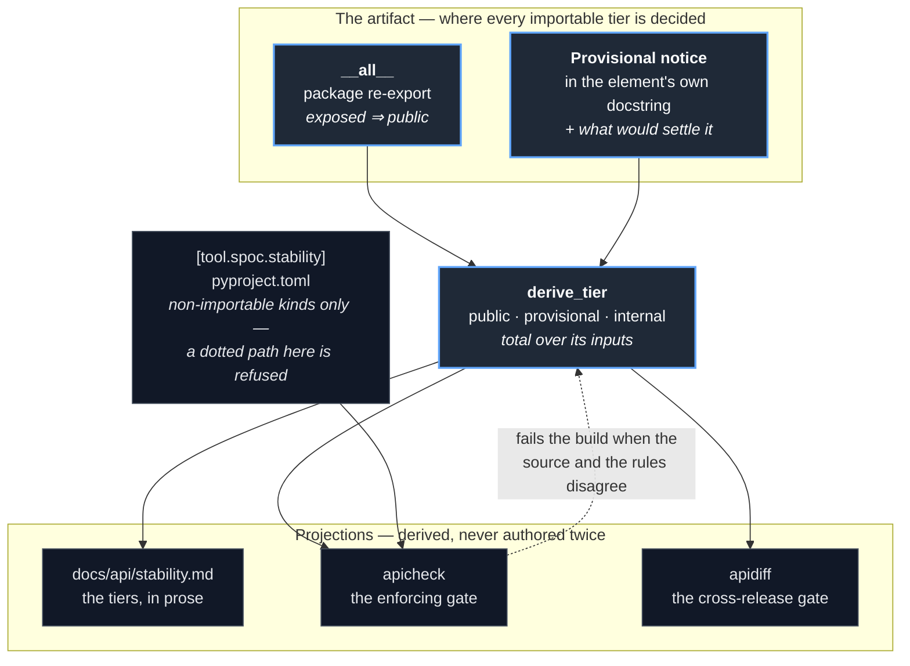
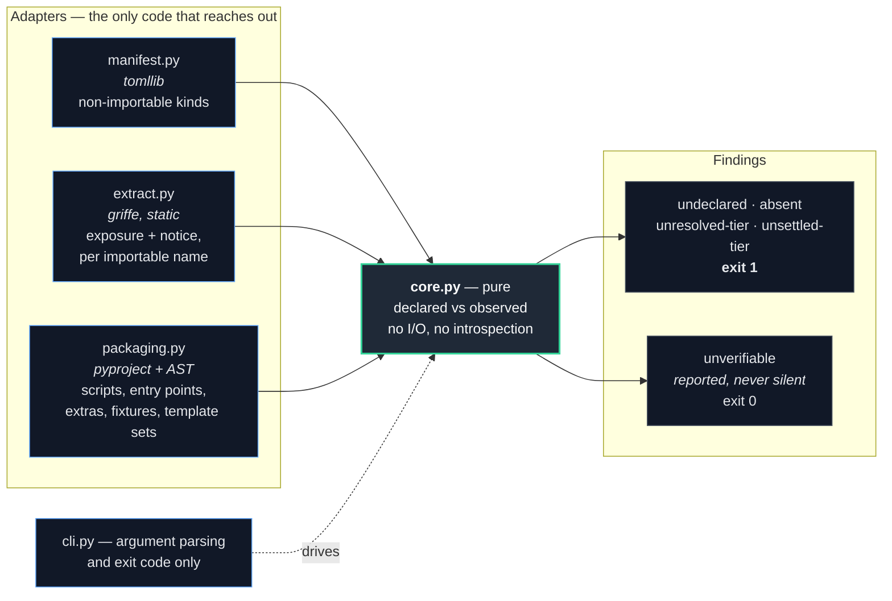

# SPOC — the stability contract

What **is**, as of the derived stability contract. The tier of every importable
element is a consequence of how the source exposes and documents it — there is no
list of names to keep in step, because there is no list.

This mirrors the kernel's own shape — one source, many projections — applied to the
package's surface rather than to a project's components.

## Source of truth, and what derives from it

**The source code is the authority.** Two facts decide an importable element's tier,
and both are read off the artifact itself: whether a package re-exports the name, and
whether its own documentation carries the provisional notice.

`[tool.spoc.stability]` in `pyproject.toml` still exists, but only for the kinds no
static observer can attribute a tier to — the command, the entry point, the fixtures,
the extras, the config schema, the template set. An importable name there is refused.

## What may be exposed at all

The rules above say what tier follows *from* exposure. A separate rule governs the
exposure itself, so a published namespace cannot grow without anything being broken:
a name is re-exported only if a consumer outside the package must write it to invoke
an operation, implement a contract the package accepts, distinguish a condition they
can respond to differently, or supply a value the package reads. Anything that exists
so the package can assemble itself stays in its defining module.

## How the check is wired

The core is pure: it is handed a declared contract and an observed surface and
returns findings. Every adapter around it reaches out to exactly one place, so
replacing any of them touches one file. The tool lives in `scripts/py/`, outside
the distribution — a checker shipped inside `spoc` would need a tier of its own and
would have to police itself.

Dependencies point inward. `core.py` imports no adapter, knows nothing of TOML,
griffe, or the terminal, and is the only module with tests of its own — it is where
every decision is made.

## Why `unverifiable` is a finding rather than a pass

Griffe documents that it cannot see console scripts, entry points, or extras;
`packaging.py` covers those, and some kinds — a file *schema*, for instance — no
observer covers at all. Rather than let a declared element pass because nothing
looked at it, the core compares each element's kind against the set of kinds the
observers claim, and reports the remainder.

It does not fail the build, because a coverage gap is not a divergence. It is always
printed, because a check that silently skips what it cannot inspect reads as
"everything passed" when it isn't.
