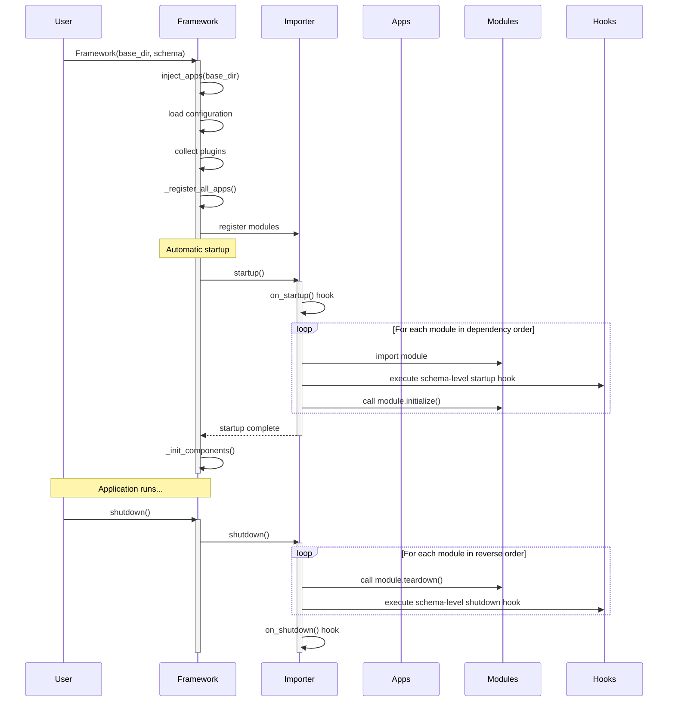
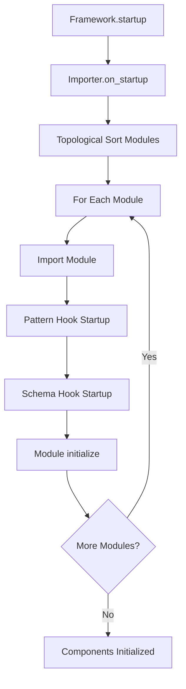
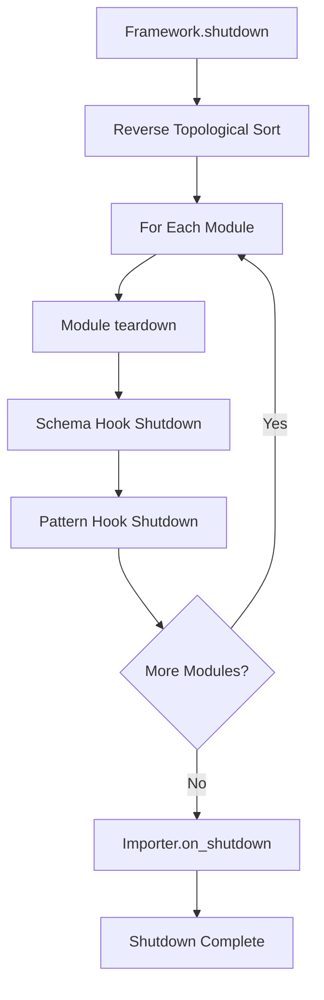

# Lifecycle Management

Master SPOC's lifecycle system to handle startup, shutdown, and resource management in your applications.

---

## Overview

SPOC provides a powerful lifecycle system that manages the initialization and teardown of your application modules. This system ensures modules are loaded in the correct order based on dependencies and provides hooks for custom initialization and cleanup logic.

**What you'll learn:**

- How the framework lifecycle works from instantiation to shutdown
- Three ways to implement lifecycle hooks
- Hook execution order and dependency resolution
- Error handling strategies
- Practical patterns for database connections, caching, and resource management

---

## The Complete Lifecycle

Understanding SPOC's lifecycle helps you know when and where to execute initialization and cleanup code.

### Lifecycle Phases



### Phase Breakdown

1. **Instantiation Phase**
   - Framework object created
   - Configuration loaded from `spoc.toml` and `settings.py`
   - Plugins discovered and loaded
   - Apps registered with the importer

2. **Startup Phase** (automatic)
   - Global `on_startup()` hook executes
   - Modules imported in dependency order
   - Schema-level hooks execute for each module
   - Module-level `initialize()` functions called
   - Components collected and registered

3. **Runtime Phase**
   - Application logic executes
   - Components are accessible
   - Modules are fully initialized

4. **Shutdown Phase** (manual)
   - Modules torn down in reverse dependency order
   - Module-level `teardown()` functions called
   - Schema-level hooks execute for each module
   - Global `on_shutdown()` hook executes

---

## Module-Level Lifecycle Functions

The simplest way to add lifecycle behavior is through module-level functions.

### Basic Implementation

Define `initialize()` and `teardown()` functions in any module:

```python
# apps/blog/models.py
import logging
from typing import Dict, Any

logger = logging.getLogger(__name__)

# Your module code
class Post:
    pass

# Lifecycle functions
def initialize() -> None:
    """
    Called when this module is loaded.
    Executes after dependencies are initialized.
    """
    logger.info("Initializing blog models...")
    # Setup code here

def teardown() -> None:
    """
    Called when the framework shuts down.
    Executes before dependent modules are torn down.
    """
    logger.info("Tearing down blog models...")
    # Cleanup code here
```

### Execution Guarantees

- `initialize()` runs **once** per module after all dependencies are loaded
- `teardown()` runs **once** per module in reverse dependency order
- Functions are optional - modules without them load normally
- Errors in lifecycle functions halt the startup/shutdown process

### Practical Example: Database Connection

```python
# apps/blog/models.py
import sqlite3
from typing import Optional

# Module-level connection
_db_connection: Optional[sqlite3.Connection] = None

def initialize() -> None:
    """Establish database connection on startup."""
    global _db_connection
    print("Connecting to database...")
    _db_connection = sqlite3.connect("blog.db")
    _db_connection.execute("""
        CREATE TABLE IF NOT EXISTS posts (
            id INTEGER PRIMARY KEY,
            title TEXT NOT NULL,
            content TEXT
        )
    """)
    _db_connection.commit()
    print("Database ready!")

def teardown() -> None:
    """Close database connection on shutdown."""
    global _db_connection
    if _db_connection:
        print("Closing database connection...")
        _db_connection.close()
        _db_connection = None

def get_db() -> sqlite3.Connection:
    """Get the database connection."""
    if _db_connection is None:
        raise RuntimeError("Database not initialized")
    return _db_connection

# Your models use get_db()
class Post:
    @staticmethod
    def create(title: str, content: str) -> int:
        db = get_db()
        cursor = db.execute(
            "INSERT INTO posts (title, content) VALUES (?, ?)",
            (title, content)
        )
        db.commit()
        return cursor.lastrowid
```

---

## Schema-Level Hooks

Schema hooks provide centralized lifecycle management with access to the loaded module object.

### Hook Definition

Hooks are defined in the `Schema` when creating your framework:

```python
from pathlib import Path
from types import ModuleType
from spoc import Framework, Schema

def on_models_startup(module: ModuleType) -> None:
    """
    Called after a models module is loaded.

    Args:
        module: The loaded module object
    """
    print(f"Models loaded: {module.__name__}")
    # Access module attributes
    if hasattr(module, 'initialize_cache'):
        module.initialize_cache()

def on_models_shutdown(module: ModuleType) -> None:
    """
    Called before a models module is torn down.

    Args:
        module: The module being shut down
    """
    print(f"Models shutting down: {module.__name__}")
    if hasattr(module, 'flush_cache'):
        module.flush_cache()

schema = Schema(
    modules=["models", "views"],
    dependencies={
        "views": ["models"],
    },
    hooks={
        "models": {
            "startup": on_models_startup,
            "shutdown": on_models_shutdown,
        },
    },
)

framework = Framework(
    base_dir=Path(__file__).parent,
    schema=schema,
)
```

### Hook Signature

All schema hooks receive the module object:

```python
def hook_function(module: ModuleType) -> None:
    """
    Args:
        module: The loaded module object with all its attributes
    """
    pass
```

### When to Use Schema Hooks

Use schema hooks when you need to:

- Inspect module attributes before initialization
- Perform cross-module setup (e.g., registering models with an ORM)
- Add behavior to all modules of a certain type
- Validate module structure or components

### Example: ORM Registration

```python
# main.py
from types import ModuleType
from typing import List, Type

class ORM:
    """Simple ORM that tracks model classes."""
    models: List[Type] = []

    @classmethod
    def register(cls, model: Type) -> None:
        cls.models.append(model)
        print(f"Registered model: {model.__name__}")

def register_models(module: ModuleType) -> None:
    """
    Automatically register all model classes with the ORM.

    Looks for classes with __spoc__ metadata of type 'model'.
    """
    for attr_name in dir(module):
        if attr_name.startswith('_'):
            continue

        attr = getattr(module, attr_name)

        # Check if it's a SPOC component of type 'model'
        if hasattr(attr, '__spoc__'):
            metadata = attr.__spoc__.metadata
            if metadata.get('type') == 'model':
                ORM.register(attr)

schema = Schema(
    modules=["models", "views"],
    dependencies={"views": ["models"]},
    hooks={
        "models": {
            "startup": register_models,
        },
    },
)
```

---

## Pattern-Based Hooks with register_hook()

For advanced scenarios, register hooks that match module patterns using wildcards.

### Registration API

```python
from spoc.core.importer import Importer

Importer.register_hook(
    pattern="*.models",  # Matches any app's models module
    on_startup=lambda components: print(f"Models loaded: {components}"),
    on_shutdown=lambda components: print(f"Models unloading: {components}"),
)
```

### Pattern Syntax

| Pattern | Matches | Example |
|---------|---------|---------|
| `*.models` | All models modules | `blog.models`, `users.models` |
| `blog.*` | All modules in blog app | `blog.models`, `blog.views` |
| `*.views` | All views modules | Any app's views |
| `test.*.models` | Nested app models | `test.app1.models` |
| `core.services` | Exact module | Only `core.services` |

### Wildcard Support

- `*` - Matches any sequence of characters
- `?` - Matches any single character
- Patterns are converted to regex internally

### Hook Signature for Patterns

Pattern hooks receive a **set of components** instead of the module:

```python
def pattern_hook(components: set) -> None:
    """
    Args:
        components: Set of components decorated with @Components.register()
    """
    for component in components:
        print(f"Processing: {component}")
```

### Example: Cache Warmup for All Services

```python
# framework/lifecycle.py
from typing import Set, Any
from spoc.core.importer import Importer

def warmup_services(components: Set[Any]) -> None:
    """
    Warm up all service components on startup.

    Args:
        components: Set of registered service components
    """
    print(f"Warming up {len(components)} services...")

    for service in components:
        # Check if service has a warmup method
        if hasattr(service, 'warmup') and callable(service.warmup):
            print(f"  - Warming up {service.__name__}")
            service.warmup()

def cleanup_services(components: Set[Any]) -> None:
    """
    Clean up all service components on shutdown.

    Args:
        components: Set of registered service components
    """
    print(f"Cleaning up {len(components)} services...")

    for service in components:
        if hasattr(service, 'cleanup') and callable(service.cleanup):
            print(f"  - Cleaning up {service.__name__}")
            service.cleanup()

# Register pattern-based hooks
Importer.register_hook(
    pattern="*.services",
    on_startup=warmup_services,
    on_shutdown=cleanup_services,
)
```

Usage in your service module:

```python
# apps/blog/services.py
from spoc import Components

components = Components()
components.add_type("service")

@components.register("service")
class BlogService:
    _cache = {}

    @classmethod
    def warmup(cls) -> None:
        """Populate cache on startup."""
        print("Loading blog posts into cache...")
        cls._cache['posts'] = ["Post 1", "Post 2", "Post 3"]

    @classmethod
    def cleanup(cls) -> None:
        """Clear cache on shutdown."""
        print("Flushing blog cache...")
        cls._cache.clear()
```

---

## Hook Execution Order

Understanding the order in which hooks execute is critical for managing dependencies.

### Startup Sequence



**Order:**

1. Global `Importer.on_startup()` hook
2. **For each module in dependency order:**
   - Module is imported
   - Pattern-based hooks execute (if pattern matches)
   - Schema-level hooks execute (if defined)
   - Module's `initialize()` function called (if exists)
3. Components collected and framework ready

### Shutdown Sequence



**Order:**

1. **For each module in reverse dependency order:**
   - Module's `teardown()` function called (if exists)
   - Schema-level hooks execute (if defined)
   - Pattern-based hooks execute (if pattern matches)
2. Global `Importer.on_shutdown()` hook

### Dependency Resolution Example

Given this schema:

```python
schema = Schema(
    modules=["models", "services", "views"],
    dependencies={
        "services": ["models"],
        "views": ["services", "models"],
    },
)
```

**Startup order:**

1. `models` - no dependencies
2. `services` - depends on models
3. `views` - depends on both

**Shutdown order:**

1. `views` - unload first (most dependent)
2. `services` - unload second
3. `models` - unload last (no dependents)

### Multiple Hooks on Same Module

When multiple hook types are registered for a module:

```python
# Pattern hook
Importer.register_hook(
    pattern="*.models",
    on_startup=lambda c: print("Pattern: Models loading"),
)

# Schema hook
schema = Schema(
    modules=["models"],
    hooks={
        "models": {
            "startup": lambda m: print("Schema: Models loading"),
        },
    },
)

# Module-level hook
# In models.py
def initialize():
    print("Module: Models loading")
```

**Execution order:**

1. Pattern hook: "Pattern: Models loading"
2. Schema hook: "Schema: Models loading"
3. Module hook: "Module: Models loading"

---

## Custom Startup/Shutdown Names

Customize the lifecycle function names using the `Importer` constructor.

### Default Names

By default, SPOC looks for:

- `initialize()` for startup
- `teardown()` for shutdown

### Changing Function Names

Create a custom Importer with different names:

```python
from spoc.core.importer import Importer

# Use 'setup' and 'cleanup' instead
importer = Importer(
    on_startup_name="setup",
    on_shutdown_name="cleanup",
)
```

**Note:** You typically won't create Importer directly; the Framework creates it internally.

### Use Case: Legacy Code Integration

When integrating with existing code that uses different naming conventions:

```python
# apps/legacy/database.py

def setup():  # Instead of initialize()
    """Legacy code uses 'setup' naming."""
    print("Setting up legacy database...")

def cleanup():  # Instead of teardown()
    """Legacy code uses 'cleanup' naming."""
    print("Cleaning up legacy database...")
```

Configure framework to use legacy names:

```python
# This feature requires custom framework configuration
# Currently, you would need to modify the framework source
# or ensure your code uses initialize/teardown names
```

**Current limitation:** The Framework creates its own Importer instance, so you cannot easily change lifecycle function names without modifying the framework code. This is a potential enhancement for future versions.

### Disabling Lifecycle Functions

Set names to `None` to disable lifecycle function checking:

```python
importer = Importer(
    on_startup_name=None,  # Don't look for initialize()
    on_shutdown_name=None,  # Don't look for teardown()
)
```

---

## Error Handling in Lifecycle Hooks

Proper error handling prevents partial initialization and ensures clean shutdown.

### Error Propagation

Errors in lifecycle hooks **halt the startup/shutdown process**:

```python
# apps/blog/models.py

def initialize():
    """This error prevents the framework from starting."""
    raise RuntimeError("Database connection failed!")

# Framework initialization will raise SpocError
```

### Best Practices

#### 1. Graceful Degradation

```python
def initialize():
    """Try to initialize, but don't fail if optional resources unavailable."""
    try:
        connect_to_cache()
        print("Cache connected")
    except ConnectionError:
        print("Warning: Cache unavailable, continuing without it")
        # Don't raise - the app can work without cache
```

#### 2. Resource Cleanup on Error

```python
def initialize():
    """Ensure partial resources are cleaned up on error."""
    connection = None
    try:
        connection = connect_to_database()
        initialize_tables(connection)
    except Exception as e:
        # Clean up partial state
        if connection:
            connection.close()
        raise RuntimeError(f"Database initialization failed: {e}") from e
```

#### 3. Idempotent Teardown

```python
_database = None
_cache = None

def initialize():
    global _database, _cache
    _database = connect_to_database()
    _cache = connect_to_cache()

def teardown():
    """Safe to call even if initialize failed partway."""
    global _database, _cache

    # Close database if it exists
    if _database is not None:
        try:
            _database.close()
        except Exception as e:
            print(f"Warning: Error closing database: {e}")
        finally:
            _database = None

    # Close cache if it exists
    if _cache is not None:
        try:
            _cache.close()
        except Exception as e:
            print(f"Warning: Error closing cache: {e}")
        finally:
            _cache = None
```

#### 4. Logging Errors

```python
import logging
import traceback

logger = logging.getLogger(__name__)

def initialize():
    """Log detailed error information."""
    try:
        connect_to_external_service()
    except Exception as e:
        logger.error(
            "Failed to initialize external service",
            exc_info=True,  # Include stack trace
            extra={
                'service': 'external_api',
                'error_type': type(e).__name__,
            }
        )
        raise

def teardown():
    """Log teardown errors but don't propagate."""
    try:
        disconnect_from_service()
    except Exception as e:
        logger.warning(
            "Error during teardown (non-fatal)",
            exc_info=True,
        )
        # Don't raise - best effort cleanup
```

### Framework Error Handling

The framework wraps lifecycle errors in `SpocError`:

```python
from spoc.core.exceptions import SpocError

try:
    framework = Framework(
        base_dir=Path(__file__).parent,
        schema=schema,
    )
except SpocError as e:
    print(f"Framework failed to start: {e}")
    print(f"Caused by: {e.__cause__}")
```

---

## Practical Use Cases

Real-world patterns for common lifecycle scenarios.

### Use Case 1: Database Connection Pool

```python
# apps/blog/models.py
from typing import Optional
import sqlite3
from contextlib import contextmanager

class ConnectionPool:
    """Simple connection pool for SQLite."""

    def __init__(self, database: str, pool_size: int = 5):
        self.database = database
        self.pool_size = pool_size
        self._connections = []
        self._in_use = set()

    def initialize(self):
        """Create connection pool."""
        print(f"Creating connection pool ({self.pool_size} connections)...")
        for _ in range(self.pool_size):
            conn = sqlite3.connect(self.database, check_same_thread=False)
            self._connections.append(conn)

    def get_connection(self) -> sqlite3.Connection:
        """Get a connection from the pool."""
        if not self._connections:
            raise RuntimeError("Connection pool exhausted")

        conn = self._connections.pop()
        self._in_use.add(conn)
        return conn

    def return_connection(self, conn: sqlite3.Connection):
        """Return a connection to the pool."""
        if conn in self._in_use:
            self._in_use.remove(conn)
            self._connections.append(conn)

    @contextmanager
    def connection(self):
        """Context manager for safe connection handling."""
        conn = self.get_connection()
        try:
            yield conn
        finally:
            self.return_connection(conn)

    def shutdown(self):
        """Close all connections."""
        print("Closing connection pool...")

        # Close active connections
        for conn in self._in_use:
            conn.close()
        self._in_use.clear()

        # Close pooled connections
        for conn in self._connections:
            conn.close()
        self._connections.clear()

# Module-level pool
_pool: Optional[ConnectionPool] = None

def initialize():
    """Initialize the connection pool."""
    global _pool
    _pool = ConnectionPool("blog.db", pool_size=5)
    _pool.initialize()

    # Create tables
    with _pool.connection() as conn:
        conn.execute("""
            CREATE TABLE IF NOT EXISTS posts (
                id INTEGER PRIMARY KEY AUTOINCREMENT,
                title TEXT NOT NULL,
                content TEXT,
                created_at TIMESTAMP DEFAULT CURRENT_TIMESTAMP
            )
        """)
        conn.commit()

def teardown():
    """Shutdown the connection pool."""
    global _pool
    if _pool:
        _pool.shutdown()
        _pool = None

def get_pool() -> ConnectionPool:
    """Get the connection pool."""
    if _pool is None:
        raise RuntimeError("Connection pool not initialized")
    return _pool

# Usage in your models
class Post:
    @staticmethod
    def create(title: str, content: str) -> int:
        pool = get_pool()
        with pool.connection() as conn:
            cursor = conn.execute(
                "INSERT INTO posts (title, content) VALUES (?, ?)",
                (title, content)
            )
            conn.commit()
            return cursor.lastrowid

    @staticmethod
    def get_all():
        pool = get_pool()
        with pool.connection() as conn:
            cursor = conn.execute("SELECT * FROM posts")
            return cursor.fetchall()
```

### Use Case 2: Cache Warmup

```python
# apps/blog/services.py
from typing import Dict, List, Optional
import time

class ArticleCache:
    """In-memory cache for articles."""

    def __init__(self):
        self._cache: Dict[int, dict] = {}
        self._last_update: Optional[float] = None

    def warmup(self):
        """Pre-populate cache with frequently accessed data."""
        print("Warming up article cache...")
        start = time.time()

        # Simulate loading from database
        articles = [
            {"id": 1, "title": "Getting Started", "views": 1000},
            {"id": 2, "title": "Advanced Topics", "views": 500},
            {"id": 3, "title": "Best Practices", "views": 750},
        ]

        for article in articles:
            self._cache[article["id"]] = article

        self._last_update = time.time()

        elapsed = time.time() - start
        print(f"Cache warmed up with {len(articles)} articles in {elapsed:.2f}s")

    def get(self, article_id: int) -> Optional[dict]:
        """Get article from cache."""
        return self._cache.get(article_id)

    def flush(self):
        """Clear the cache."""
        print(f"Flushing cache ({len(self._cache)} items)...")
        self._cache.clear()
        self._last_update = None

# Module-level cache
_cache: Optional[ArticleCache] = None

def initialize():
    """Initialize and warm up cache."""
    global _cache
    _cache = ArticleCache()
    _cache.warmup()

def teardown():
    """Flush cache on shutdown."""
    global _cache
    if _cache:
        _cache.flush()
        _cache = None

def get_cache() -> ArticleCache:
    """Get the cache instance."""
    if _cache is None:
        raise RuntimeError("Cache not initialized")
    return _cache
```

### Use Case 3: External API Client

```python
# apps/notifications/services.py
from typing import Optional
import requests
from requests.adapters import HTTPAdapter
from urllib3.util.retry import Retry

class EmailAPIClient:
    """HTTP client for email service API."""

    def __init__(self, api_key: str, base_url: str):
        self.api_key = api_key
        self.base_url = base_url
        self.session: Optional[requests.Session] = None

    def initialize(self):
        """Create HTTP session with retry logic."""
        print("Initializing email API client...")

        self.session = requests.Session()

        # Configure retries
        retry_strategy = Retry(
            total=3,
            backoff_factor=1,
            status_forcelist=[429, 500, 502, 503, 504],
        )
        adapter = HTTPAdapter(max_retries=retry_strategy)

        self.session.mount("http://", adapter)
        self.session.mount("https://", adapter)

        # Set default headers
        self.session.headers.update({
            "Authorization": f"Bearer {self.api_key}",
            "Content-Type": "application/json",
        })

        # Test connection
        try:
            response = self.session.get(f"{self.base_url}/health")
            response.raise_for_status()
            print("Email API client ready!")
        except requests.RequestException as e:
            self.session.close()
            raise RuntimeError(f"Failed to connect to email API: {e}") from e

    def send_email(self, to: str, subject: str, body: str):
        """Send an email via the API."""
        if not self.session:
            raise RuntimeError("Client not initialized")

        response = self.session.post(
            f"{self.base_url}/send",
            json={
                "to": to,
                "subject": subject,
                "body": body,
            }
        )
        response.raise_for_status()
        return response.json()

    def shutdown(self):
        """Close HTTP session."""
        if self.session:
            print("Closing email API client session...")
            self.session.close()
            self.session = None

# Module-level client
_client: Optional[EmailAPIClient] = None

def initialize():
    """Initialize the email client."""
    global _client

    # In production, load from config
    api_key = "your-api-key"
    base_url = "https://api.emailservice.com"

    _client = EmailAPIClient(api_key, base_url)
    _client.initialize()

def teardown():
    """Shutdown the email client."""
    global _client
    if _client:
        _client.shutdown()
        _client = None

def get_client() -> EmailAPIClient:
    """Get the email client instance."""
    if _client is None:
        raise RuntimeError("Email client not initialized")
    return _client
```

### Use Case 4: Background Worker Pool

```python
# apps/tasks/workers.py
from concurrent.futures import ThreadPoolExecutor
from typing import Optional, Callable, Any
import time

class WorkerPool:
    """Background worker pool for async tasks."""

    def __init__(self, max_workers: int = 4):
        self.max_workers = max_workers
        self.executor: Optional[ThreadPoolExecutor] = None
        self._shutdown = False

    def initialize(self):
        """Start the worker pool."""
        print(f"Starting worker pool with {self.max_workers} workers...")
        self.executor = ThreadPoolExecutor(
            max_workers=self.max_workers,
            thread_name_prefix="spoc-worker",
        )
        self._shutdown = False

    def submit(self, fn: Callable, *args, **kwargs) -> Any:
        """Submit a task to the worker pool."""
        if not self.executor or self._shutdown:
            raise RuntimeError("Worker pool not available")

        return self.executor.submit(fn, *args, **kwargs)

    def shutdown(self, wait: bool = True):
        """Shutdown the worker pool."""
        if self.executor and not self._shutdown:
            print("Shutting down worker pool...")
            self._shutdown = True
            self.executor.shutdown(wait=wait)
            self.executor = None
            print("Worker pool stopped")

# Module-level pool
_pool: Optional[WorkerPool] = None

def initialize():
    """Initialize the worker pool."""
    global _pool
    _pool = WorkerPool(max_workers=4)
    _pool.initialize()

def teardown():
    """Shutdown the worker pool."""
    global _pool
    if _pool:
        _pool.shutdown(wait=True)  # Wait for pending tasks
        _pool = None

def get_pool() -> WorkerPool:
    """Get the worker pool instance."""
    if _pool is None:
        raise RuntimeError("Worker pool not initialized")
    return _pool

# Usage example
def long_running_task(task_id: int):
    """Simulated background task."""
    print(f"Task {task_id} starting...")
    time.sleep(2)
    print(f"Task {task_id} complete!")
    return f"Result {task_id}"

# Submit tasks from other modules
def process_in_background():
    pool = get_pool()
    future = pool.submit(long_running_task, 42)
    # Can check future.result() later
```

### Use Case 5: Resource Monitoring

```python
# apps/monitoring/services.py
from typing import Dict, List
import psutil
import threading
import time

class ResourceMonitor:
    """Monitor system resources during application runtime."""

    def __init__(self, interval: int = 60):
        self.interval = interval
        self._monitoring = False
        self._thread: Optional[threading.Thread] = None
        self._metrics: List[Dict] = []

    def _monitor_loop(self):
        """Background monitoring loop."""
        while self._monitoring:
            metrics = {
                'timestamp': time.time(),
                'cpu_percent': psutil.cpu_percent(interval=1),
                'memory_percent': psutil.virtual_memory().percent,
                'disk_percent': psutil.disk_usage('/').percent,
            }
            self._metrics.append(metrics)

            # Keep only last 100 readings
            if len(self._metrics) > 100:
                self._metrics.pop(0)

            time.sleep(self.interval)

    def start(self):
        """Start monitoring."""
        if self._monitoring:
            return

        print(f"Starting resource monitor (interval: {self.interval}s)...")
        self._monitoring = True
        self._thread = threading.Thread(
            target=self._monitor_loop,
            daemon=True,
            name="resource-monitor",
        )
        self._thread.start()

    def stop(self):
        """Stop monitoring."""
        if not self._monitoring:
            return

        print("Stopping resource monitor...")
        self._monitoring = False
        if self._thread:
            self._thread.join(timeout=5)
            self._thread = None

        # Print summary
        if self._metrics:
            avg_cpu = sum(m['cpu_percent'] for m in self._metrics) / len(self._metrics)
            avg_mem = sum(m['memory_percent'] for m in self._metrics) / len(self._metrics)
            print(f"Resource usage - CPU: {avg_cpu:.1f}%, Memory: {avg_mem:.1f}%")

    def get_metrics(self) -> List[Dict]:
        """Get collected metrics."""
        return self._metrics.copy()

# Module-level monitor
_monitor: Optional[ResourceMonitor] = None

def initialize():
    """Start resource monitoring."""
    global _monitor
    _monitor = ResourceMonitor(interval=30)  # Check every 30 seconds
    _monitor.start()

def teardown():
    """Stop monitoring and print summary."""
    global _monitor
    if _monitor:
        _monitor.stop()
        _monitor = None
```

---

## Complete Example

A comprehensive example showing all lifecycle concepts together:

```python
# main.py
from pathlib import Path
from types import ModuleType
from typing import Set, Any
from spoc import Framework, Schema
from spoc.core.importer import Importer

# Pattern-based hooks
def warmup_all_services(components: Set[Any]) -> None:
    """Warmup hook for all service modules."""
    print(f"\n[Pattern Hook] Warming up {len(components)} services")
    for component in components:
        if hasattr(component, 'warmup'):
            component.warmup()

def cleanup_all_services(components: Set[Any]) -> None:
    """Cleanup hook for all service modules."""
    print(f"\n[Pattern Hook] Cleaning up {len(components)} services")
    for component in components:
        if hasattr(component, 'cleanup'):
            component.cleanup()

# Register pattern hooks before framework creation
Importer.register_hook(
    pattern="*.services",
    on_startup=warmup_all_services,
    on_shutdown=cleanup_all_services,
)

# Schema hooks
def on_models_startup(module: ModuleType) -> None:
    """Schema hook for models modules."""
    print(f"[Schema Hook] Models module loaded: {module.__name__}")

def on_models_shutdown(module: ModuleType) -> None:
    """Schema hook for models modules."""
    print(f"[Schema Hook] Models module unloading: {module.__name__}")

# Create schema with hooks
schema = Schema(
    modules=["models", "services", "views"],
    dependencies={
        "services": ["models"],
        "views": ["models", "services"],
    },
    hooks={
        "models": {
            "startup": on_models_startup,
            "shutdown": on_models_shutdown,
        },
    },
)

# Create framework
framework = Framework(
    base_dir=Path(__file__).parent,
    schema=schema,
    echo=False,
    mode="strict",
)

def main():
    """Application entry point."""
    print("\n" + "="*60)
    print("Application Running")
    print("="*60)

    # Use framework components
    print(f"\nInstalled apps: {framework.installed_apps}")
    print(f"\nComponent types: {list(framework.components.__dict__.keys())}")

    # Simulate application work
    print("\n(Application logic would run here...)")

    # Shutdown
    print("\n" + "="*60)
    print("Shutting Down")
    print("="*60)
    framework.shutdown()

if __name__ == "__main__":
    main()
```

```python
# apps/blog/models.py
"""
Blog models with database connection lifecycle.
"""
import sqlite3
from typing import Optional

# Module-level database connection
_db: Optional[sqlite3.Connection] = None

def initialize():
    """
    Module-level initialization hook.
    Called automatically by SPOC during startup.
    """
    global _db
    print(f"[Module Hook] Initializing blog.models")
    print("  - Connecting to database...")
    _db = sqlite3.connect("blog.db")
    _db.execute("""
        CREATE TABLE IF NOT EXISTS posts (
            id INTEGER PRIMARY KEY,
            title TEXT NOT NULL
        )
    """)
    _db.commit()
    print("  - Database ready!")

def teardown():
    """
    Module-level teardown hook.
    Called automatically by SPOC during shutdown.
    """
    global _db
    print(f"[Module Hook] Tearing down blog.models")
    if _db:
        print("  - Closing database connection...")
        _db.close()
        _db = None

def get_db() -> sqlite3.Connection:
    """Get the database connection."""
    if _db is None:
        raise RuntimeError("Database not initialized")
    return _db

class Post:
    """Blog post model."""

    @staticmethod
    def create(title: str) -> int:
        db = get_db()
        cursor = db.execute("INSERT INTO posts (title) VALUES (?)", (title,))
        db.commit()
        return cursor.lastrowid
```

```python
# apps/blog/services.py
"""
Blog services with cache warmup lifecycle.
"""
from typing import Dict, Optional
from spoc import Components

components = Components()
components.add_type("service")

@components.register("service")
class BlogService:
    """Blog service with caching."""

    _cache: Dict[str, any] = {}

    @classmethod
    def warmup(cls):
        """Called by pattern hook during startup."""
        print("[Component Hook] BlogService warming up")
        print("  - Loading popular posts into cache...")
        cls._cache['popular_posts'] = ["Post 1", "Post 2", "Post 3"]

    @classmethod
    def cleanup(cls):
        """Called by pattern hook during shutdown."""
        print("[Component Hook] BlogService cleaning up")
        print("  - Flushing cache...")
        cls._cache.clear()

    @classmethod
    def get_popular_posts(cls):
        return cls._cache.get('popular_posts', [])
```

**Expected Output:**

```
apps_path C:\path\to\project\apps
[Schema Hook] Models module loaded: blog.models
[Module Hook] Initializing blog.models
  - Connecting to database...
  - Database ready!

[Pattern Hook] Warming up 1 services
[Component Hook] BlogService warming up
  - Loading popular posts into cache...

============================================================
Application Running
============================================================

Installed apps: ['blog']

Component types: ['models', 'services', 'views']

(Application logic would run here...)

============================================================
Shutting Down
============================================================

[Component Hook] BlogService cleaning up
  - Flushing cache...

[Pattern Hook] Cleaning up 1 services

[Module Hook] Tearing down blog.models
  - Closing database connection...
[Schema Hook] Models module unloading: blog.models
```

---

## Summary

You've learned how to:

- Understand the full framework lifecycle from instantiation to shutdown
- Implement module-level `initialize()` and `teardown()` functions
- Define schema-level hooks for centralized lifecycle management
- Register pattern-based hooks using `Importer.register_hook()`
- Control hook execution order through dependency management
- Handle errors gracefully in lifecycle hooks
- Apply lifecycle patterns for databases, caches, APIs, and workers

**Key Takeaways:**

1. **Three hook levels**: Module functions, schema hooks, and pattern hooks
2. **Execution order**: Hooks run in dependency order on startup, reverse on shutdown
3. **Error handling**: Lifecycle errors halt the process - handle them carefully
4. **Practical patterns**: Use lifecycle hooks for resource management and initialization

Continue with [Workers](workers.md) to learn how to manage background tasks with lifecycle-aware workers.
