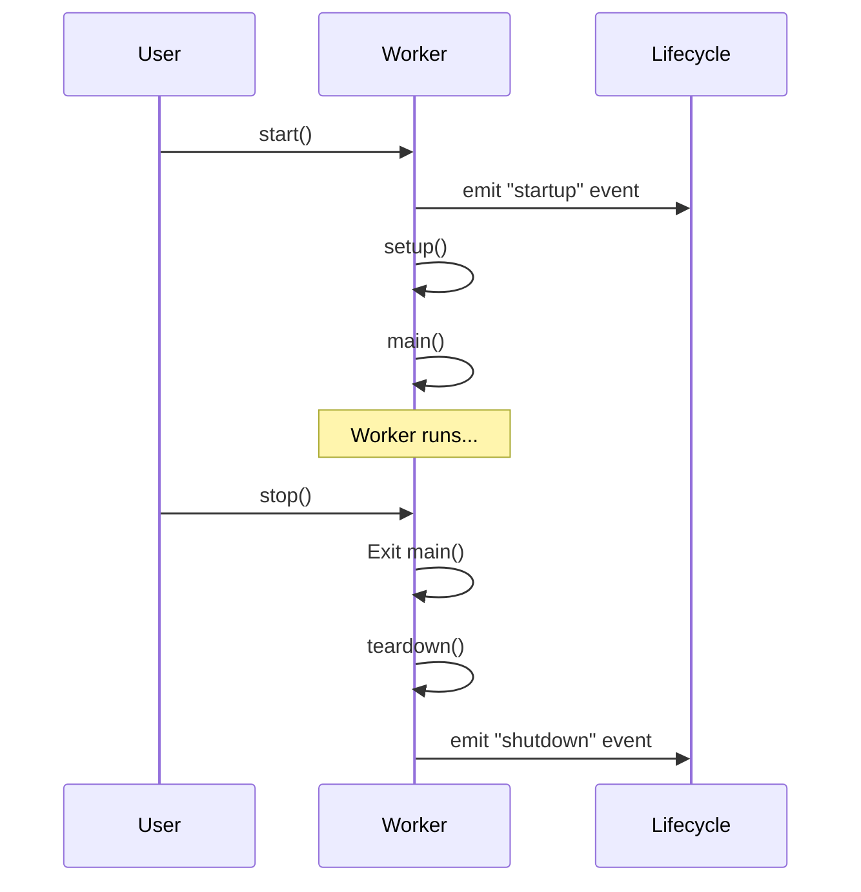

# Workers

Build robust background task systems with SPOC's worker framework. This guide covers everything from basic worker implementation to advanced concurrency patterns.

---

## What Are Workers?

Workers are background task executors that run concurrently with your main application. They provide a consistent interface for running tasks in threads or processes with unified lifecycle management, error handling, and signal management.

**Key Features:**

- Unified API for thread and process-based concurrency
- Lifecycle management (setup, main, teardown)
- Built-in error handling and recovery
- Signal handling for graceful shutdowns
- Async/await support
- Multi-worker orchestration via Server

---

## When to Use Workers

Workers are ideal for several scenarios:

### Background Tasks

Long-running operations that shouldn't block your main application:

- **Message queue processing**: Process jobs from Redis, RabbitMQ, or other queues
- **Scheduled tasks**: Run periodic cleanup, maintenance, or data synchronization
- **Event monitoring**: Watch file systems, databases, or external APIs for changes

### Concurrent Operations

Tasks that benefit from parallel execution:

- **Data processing**: Transform large datasets using multiple cores
- **API request handling**: Service multiple HTTP requests simultaneously
- **Real-time data ingestion**: Handle streams from multiple sources

### Resource Isolation

Operations that need separate execution contexts:

- **Memory-intensive tasks**: Prevent memory leaks from affecting the main process
- **Untrusted code execution**: Isolate potentially problematic code in separate processes
- **State management**: Maintain independent state for different subsystems

---

## ThreadWorker vs ProcessWorker

SPOC provides two worker types optimized for different workloads.

### ThreadWorker

Runs tasks in a separate thread within the same process.

**Best for:**

- I/O-bound tasks (network requests, file operations, database queries)
- Tasks requiring shared memory with the main process
- Lightweight concurrency with low overhead

**Limitations:**

- Subject to Python's Global Interpreter Lock (GIL)
- CPU-bound tasks won't achieve true parallelism
- Shared memory can lead to race conditions without proper synchronization

**Example - I/O Bound Task:**

```python
from spoc.workers import ThreadWorker
import time

class LogWatcher(ThreadWorker):
    """Watch a log file for new entries."""

    def setup(self):
        """Initialize the log file handle."""
        self.log_file = open("/var/log/app.log", "r")
        self.log_file.seek(0, 2)  # Move to end of file

    def main(self):
        """Watch for new log lines."""
        while self.is_running:
            line = self.log_file.readline()
            if line:
                self.process_log_line(line)
            else:
                time.sleep(0.1)  # Wait for new content

    def teardown(self):
        """Close the log file."""
        self.log_file.close()

    def process_log_line(self, line):
        """Process a single log line."""
        if "ERROR" in line:
            print(f"Error detected: {line.strip()}")
```

### ProcessWorker

Runs tasks in a separate process with independent memory.

**Best for:**

- CPU-bound tasks (data processing, calculations, compression)
- Tasks that need to bypass the GIL for true parallelism
- Operations requiring complete memory isolation

**Trade-offs:**

- Higher overhead (separate Python interpreter)
- No shared memory (requires inter-process communication)
- More resource intensive

**Example - CPU Bound Task:**

```python
from spoc.workers import ProcessWorker
import hashlib

class HashCalculator(ProcessWorker):
    """Calculate hashes for files in a queue."""

    def setup(self):
        """Initialize worker state."""
        self.processed_count = 0

    def main(self):
        """Process files from queue."""
        while self.is_running:
            # Simulate getting file from queue
            file_path = self.get_next_file()

            if file_path:
                self.calculate_hash(file_path)
                self.processed_count += 1

    def calculate_hash(self, file_path):
        """Calculate SHA-256 hash of a file."""
        sha256 = hashlib.sha256()
        with open(file_path, "rb") as f:
            for chunk in iter(lambda: f.read(4096), b""):
                sha256.update(chunk)
        return sha256.hexdigest()

    def get_next_file(self):
        """Get next file from queue (placeholder)."""
        # In real implementation, get from shared queue
        return None
```

### Quick Reference

| Feature | ThreadWorker | ProcessWorker |
|---------|-------------|---------------|
| **Concurrency** | Threading | Multiprocessing |
| **Memory** | Shared | Isolated |
| **GIL Impact** | Yes | No |
| **Overhead** | Low | High |
| **Best For** | I/O-bound | CPU-bound |
| **Startup Time** | Fast | Slower |
| **Communication** | Direct | IPC required |

---

## Creating Custom Workers

All workers inherit from `AbstractWorker` and implement three lifecycle methods.

### Basic Worker Structure

```python
from spoc.workers import ThreadWorker

class MyWorker(ThreadWorker):
    """Custom worker implementation."""

    def setup(self):
        """
        Called once before main() starts.

        Use for:
        - Opening file handles or database connections
        - Initializing state variables
        - Setting up resources
        """
        self.context.connection = self.create_connection()
        self.counter = 0

    def main(self):
        """
        Main worker loop.

        Runs until self.is_running becomes False.
        Should check is_running regularly to allow graceful shutdown.
        """
        while self.is_running:
            # Do work here
            self.counter += 1
            time.sleep(1)

    def teardown(self):
        """
        Called once after main() completes.

        Use for:
        - Closing file handles or database connections
        - Saving state
        - Cleanup operations
        """
        self.context.connection.close()
        print(f"Processed {self.counter} items")
```

### The Worker Lifecycle



### Lifecycle Events

Workers emit lifecycle events that you can handle:

```python
from spoc.workers import ThreadWorker

class MonitoredWorker(ThreadWorker):
    """Worker with lifecycle event handling."""

    def lifecycle(self, event_type, **data):
        """
        Handle lifecycle events.

        Args:
            event_type: Type of event ("startup", "shutdown", "error")
            **data: Additional event data (e.g., exception for errors)
        """
        match event_type:
            case "startup":
                print(f"{self.name} is starting up")
                self.context.start_time = time.time()

            case "shutdown":
                elapsed = time.time() - self.context.start_time
                print(f"{self.name} ran for {elapsed:.2f} seconds")

            case "error":
                exception = data.get("exception")
                print(f"{self.name} error: {exception}")
                # Log to monitoring system, send alerts, etc.

    def main(self):
        """Worker main loop."""
        while self.is_running:
            # Do work
            time.sleep(1)
```

**Available Events:**

- `"startup"` - Worker has started, setup() completed
- `"shutdown"` - Worker is shutting down, teardown() completed
- `"error"` - An exception occurred during execution (includes `exception` in data)

---

## The Server Class

The `Server` manages multiple workers as a cohesive unit, handling startup, shutdown, and signal management.

### Basic Server Usage

```python
from spoc.workers import Server, ThreadWorker, ProcessWorker

class Worker1(ThreadWorker):
    def main(self):
        while self.is_running:
            print(f"{self.name} working...")
            time.sleep(1)

class Worker2(ProcessWorker):
    def main(self):
        while self.is_running:
            print(f"{self.name} processing...")
            time.sleep(1)

# Create server
server = Server(name="MyAppServer")

# Add workers
server.add_worker(Worker1(name="ThreadWorker-1"))
server.add_worker(Worker2(name="ProcessWorker-1"))

# Start all workers and run until interrupted
server.run_forever()
```

### Server Methods

```python
# Create a server
server = Server(name="MyServer")

# Add workers
server.add_worker(worker1)
server.add_worker(worker2)

# Start all workers
server.start()

# Stop all workers
server.stop()

# Wait for all workers to finish
server.join_all(timeout=5.0)

# Run until interrupted (combines start, wait, stop, join)
server.run_forever()
```

### run_forever() and Signal Handling

The `run_forever()` method provides automatic signal handling for graceful shutdowns.

```python
from spoc.workers import Server, ThreadWorker
import signal

class GracefulWorker(ThreadWorker):
    def setup(self):
        """Initialize state."""
        self.items_processed = 0

    def main(self):
        """Process items until stopped."""
        while self.is_running:
            # Simulate processing
            self.items_processed += 1
            time.sleep(0.5)

    def teardown(self):
        """Save state before shutdown."""
        print(f"Processed {self.items_processed} items before shutdown")

# Create and configure server
server = Server(name="GracefulServer")
server.add_worker(GracefulWorker(name="Worker-1"))

# Run until SIGINT (Ctrl+C) or SIGTERM
server.run_forever()
```

**How Signal Handling Works:**

1. Server registers handlers for `SIGINT` and `SIGTERM`
2. When signal received, server calls `stop()` on all workers
3. Workers exit their main loops gracefully
4. Teardown methods execute for cleanup
5. Server waits for all workers to finish (with timeout)

**Handled Signals:**

- `SIGINT` - Interrupt from keyboard (Ctrl+C)
- `SIGTERM` - Termination request from system/container orchestrator

---

## Async Support

Workers fully support async/await for modern asynchronous programming.

### Async Worker Example

```python
from spoc.workers import ThreadWorker
import asyncio

class AsyncAPIWorker(ThreadWorker):
    """Worker that makes async HTTP requests."""

    async def setup(self):
        """Async setup method."""
        # Create async HTTP client
        self.session = await self.create_session()

    async def main(self):
        """Async main loop."""
        while self.is_running:
            # Fetch data from API
            data = await self.fetch_data()
            await self.process_data(data)
            await asyncio.sleep(5)

    async def teardown(self):
        """Async cleanup."""
        await self.session.close()

    async def fetch_data(self):
        """Fetch data from API."""
        # Simulated async HTTP request
        await asyncio.sleep(0.1)
        return {"status": "ok"}

    async def process_data(self, data):
        """Process fetched data."""
        print(f"Processed: {data}")

    async def create_session(self):
        """Create HTTP session."""
        # In real code, use aiohttp or similar
        return object()

    async def lifecycle(self, event_type, **data):
        """Async lifecycle handler."""
        print(f"Async event: {event_type}")
```

### run_async_safely()

The `run_async_safely()` function runs coroutines correctly whether an event loop exists or not.

```python
from spoc.workers import run_async_safely
import asyncio

async def my_coroutine():
    """Example async function."""
    await asyncio.sleep(1)
    return "Done"

# Safely run coroutine (creates event loop if needed)
run_async_safely(my_coroutine())
```

**Behavior:**

- If event loop is running: Creates task in existing loop
- If no event loop: Creates new loop and runs coroutine with `asyncio.run()`
- Automatically uses uvloop if available for better performance

---

## uvloop Integration

SPOC automatically uses [uvloop](https://github.com/MagicStack/uvloop) for improved async performance when available.

### Enable uvloop

```python
from spoc.workers import set_uvloop_if_available

# Enable uvloop for all async operations
set_uvloop_if_available()

# Now create async workers - they'll use uvloop automatically
worker = AsyncAPIWorker(name="FastWorker")
worker.start()
```

**Benefits:**

- 2-4x faster than default asyncio event loop
- Better performance for I/O-bound async workloads
- Drop-in replacement (no code changes needed)

**Installation:**

```bash
pip install uvloop
```

---

## Worker Patterns and Best Practices

### Pattern 1: Background Job Processor

Process jobs from a queue in the background.

```python
from spoc.workers import ThreadWorker
from queue import Queue
import time

class JobProcessor(ThreadWorker):
    """Process jobs from a shared queue."""

    def __init__(self, name, job_queue):
        super().__init__(name)
        self.job_queue = job_queue

    def main(self):
        """Process jobs until stopped."""
        while self.is_running:
            try:
                # Get job with timeout to allow checking is_running
                job = self.job_queue.get(timeout=1.0)
                self.process_job(job)
                self.job_queue.task_done()
            except Exception:
                # Queue empty, continue
                continue

    def process_job(self, job):
        """Process a single job."""
        print(f"{self.name} processing: {job}")
        time.sleep(0.5)  # Simulate work

# Create shared queue
job_queue = Queue()

# Create server with multiple workers
server = Server(name="JobServer")
server.add_worker(JobProcessor("Worker-1", job_queue))
server.add_worker(JobProcessor("Worker-2", job_queue))

# Add jobs
for i in range(10):
    job_queue.put(f"Job-{i}")

# Process jobs
server.start()
job_queue.join()  # Wait for all jobs to complete
server.stop()
server.join_all()
```

### Pattern 2: Periodic Tasks

Run tasks on a schedule.

```python
from spoc.workers import ThreadWorker
import time
from datetime import datetime

class PeriodicWorker(ThreadWorker):
    """Execute tasks on a schedule."""

    def __init__(self, name, interval_seconds):
        super().__init__(name)
        self.interval = interval_seconds

    def main(self):
        """Run task periodically."""
        while self.is_running:
            start_time = time.time()

            # Execute the task
            self.execute_task()

            # Sleep for remaining interval
            elapsed = time.time() - start_time
            sleep_time = max(0, self.interval - elapsed)

            # Sleep in small chunks to check is_running
            while sleep_time > 0 and self.is_running:
                time.sleep(min(1.0, sleep_time))
                sleep_time -= 1.0

    def execute_task(self):
        """Override this method with your task logic."""
        print(f"[{datetime.now()}] Task executed")

class DataSyncWorker(PeriodicWorker):
    """Sync data every 5 minutes."""

    def __init__(self, name):
        super().__init__(name, interval_seconds=300)

    def execute_task(self):
        """Sync data from remote source."""
        print(f"Syncing data at {datetime.now()}")
        # Perform sync logic here

# Run periodic worker
worker = DataSyncWorker(name="DataSync")
server = Server()
server.add_worker(worker)
server.run_forever()
```

### Pattern 3: Multi-Stage Pipeline

Process data through multiple stages with different workers.

```python
from spoc.workers import ThreadWorker, ProcessWorker
from queue import Queue

class StageWorker(ThreadWorker):
    """Base class for pipeline stage workers."""

    def __init__(self, name, input_queue, output_queue):
        super().__init__(name)
        self.input_queue = input_queue
        self.output_queue = output_queue

    def main(self):
        """Process items from input to output."""
        while self.is_running:
            try:
                item = self.input_queue.get(timeout=1.0)
                result = self.process_item(item)
                if result is not None:
                    self.output_queue.put(result)
                self.input_queue.task_done()
            except Exception:
                continue

    def process_item(self, item):
        """Override this method for stage-specific processing."""
        raise NotImplementedError

class FetchStage(StageWorker):
    """Stage 1: Fetch raw data."""

    def process_item(self, item):
        """Fetch data."""
        return {"id": item, "raw_data": f"data-{item}"}

class TransformStage(ProcessWorker):
    """Stage 2: Transform data (CPU-intensive)."""

    def __init__(self, name, input_queue, output_queue):
        super().__init__(name)
        self.input_queue = input_queue
        self.output_queue = output_queue

    def main(self):
        """Transform items."""
        while self.is_running:
            try:
                item = self.input_queue.get(timeout=1.0)
                result = self.transform(item)
                self.output_queue.put(result)
                self.input_queue.task_done()
            except Exception:
                continue

    def transform(self, item):
        """CPU-intensive transformation."""
        # Simulate heavy processing
        return {**item, "transformed": True}

class SaveStage(StageWorker):
    """Stage 3: Save results."""

    def process_item(self, item):
        """Save to database."""
        print(f"Saved: {item}")
        return None  # End of pipeline

# Create pipeline
fetch_to_transform = Queue()
transform_to_save = Queue()
input_queue = Queue()

server = Server(name="Pipeline")
server.add_worker(FetchStage("Fetch", input_queue, fetch_to_transform))
server.add_worker(TransformStage("Transform", fetch_to_transform, transform_to_save))
server.add_worker(SaveStage("Save", transform_to_save, Queue()))

# Feed pipeline
for i in range(10):
    input_queue.put(i)

# Run pipeline
server.run_forever()
```

### Pattern 4: Health Monitoring

Monitor worker health and restart on failure.

```python
from spoc.workers import ThreadWorker
import time

class HealthMonitor(ThreadWorker):
    """Monitor and restart failed workers."""

    def __init__(self, name, workers_to_monitor):
        super().__init__(name)
        self.workers = workers_to_monitor

    def main(self):
        """Check worker health periodically."""
        while self.is_running:
            for worker in self.workers:
                if not worker._thread_or_process.is_alive():
                    print(f"Worker {worker.name} died, restarting...")
                    self.restart_worker(worker)

            time.sleep(5)  # Check every 5 seconds

    def restart_worker(self, worker):
        """Restart a failed worker."""
        # Create new instance of same worker type
        new_worker = type(worker)(worker.name)
        new_worker.start()

        # Replace in monitoring list
        idx = self.workers.index(worker)
        self.workers[idx] = new_worker

    def lifecycle(self, event_type, **data):
        """Handle lifecycle events."""
        if event_type == "error":
            print(f"Health monitor detected error: {data.get('exception')}")
```

---

## Best Practices

### 1. Always Check is_running

Check `self.is_running` regularly in your main loop to allow graceful shutdown:

```python
def main(self):
    """Good: Checks is_running regularly."""
    while self.is_running:
        self.do_work()
        time.sleep(1)
```

```python
def main(self):
    """Bad: No shutdown check."""
    while True:  # Will never stop gracefully
        self.do_work()
        time.sleep(1)
```

### 2. Use Appropriate Worker Type

Choose based on your workload:

```python
# I/O-bound: Use ThreadWorker
class APIClient(ThreadWorker):
    def main(self):
        while self.is_running:
            response = requests.get("https://api.example.com")
            self.process(response)

# CPU-bound: Use ProcessWorker
class DataCruncher(ProcessWorker):
    def main(self):
        while self.is_running:
            data = self.get_data()
            result = self.heavy_computation(data)
```

### 3. Clean Up Resources

Always clean up in teardown():

```python
def setup(self):
    """Acquire resources."""
    self.db_conn = connect_to_database()
    self.file_handle = open("data.txt", "w")

def teardown(self):
    """Release resources."""
    if hasattr(self, 'db_conn'):
        self.db_conn.close()
    if hasattr(self, 'file_handle'):
        self.file_handle.close()
```

### 4. Handle Errors Gracefully

Catch and handle exceptions in your worker code:

```python
def main(self):
    """Handle errors without crashing."""
    while self.is_running:
        try:
            self.do_risky_operation()
        except ConnectionError as e:
            print(f"Connection failed: {e}, retrying...")
            time.sleep(5)
        except Exception as e:
            # Let unexpected errors propagate to lifecycle handler
            raise
```

### 5. Use Lifecycle Events for Monitoring

Implement lifecycle events for observability:

```python
def lifecycle(self, event_type, **data):
    """Send lifecycle events to monitoring system."""
    match event_type:
        case "startup":
            metrics.increment("worker.started")
        case "shutdown":
            metrics.increment("worker.stopped")
        case "error":
            metrics.increment("worker.errors")
            logger.error(f"Worker error: {data['exception']}")
```

### 6. Use Context for Shared State

Use `self.context` for sharing state between methods:

```python
def setup(self):
    """Initialize shared context."""
    self.context.processed_count = 0
    self.context.start_time = time.time()

def main(self):
    """Access shared context."""
    while self.is_running:
        self.do_work()
        self.context.processed_count += 1

def teardown(self):
    """Report using shared context."""
    elapsed = time.time() - self.context.start_time
    rate = self.context.processed_count / elapsed
    print(f"Processed {self.context.processed_count} items at {rate:.2f}/sec")
```

### 7. Test Worker Logic Separately

Extract business logic for easier testing:

```python
class DataWorker(ThreadWorker):
    """Worker with testable logic."""

    def main(self):
        """Worker loop."""
        while self.is_running:
            data = self.fetch_data()
            result = self.process_data(data)  # Testable
            self.save_result(result)

    @staticmethod
    def process_data(data):
        """Pure function - easy to test."""
        return data.upper()

# Test the logic
def test_process_data():
    assert DataWorker.process_data("hello") == "HELLO"
```

---

## Common Pitfalls

### Pitfall 1: Blocking Operations Without Timeout

```python
# Bad: Will block forever, can't shut down gracefully
def main(self):
    while self.is_running:
        item = self.queue.get()  # Blocks forever if queue empty
        self.process(item)

# Good: Use timeout to check is_running
def main(self):
    while self.is_running:
        try:
            item = self.queue.get(timeout=1.0)
            self.process(item)
        except Empty:
            continue
```

### Pitfall 2: Shared Mutable State (ThreadWorker)

```python
# Bad: Race condition with shared state
class CounterWorker(ThreadWorker):
    shared_counter = 0  # Class variable - shared!

    def main(self):
        while self.is_running:
            self.shared_counter += 1  # Race condition!

# Good: Use instance variables or locks
class SafeCounterWorker(ThreadWorker):
    def setup(self):
        self.counter = 0  # Instance variable

    def main(self):
        while self.is_running:
            self.counter += 1  # Safe
```

### Pitfall 3: Memory Leaks in Long-Running Workers

```python
# Bad: Unbounded memory growth
def main(self):
    results = []
    while self.is_running:
        result = self.compute()
        results.append(result)  # List grows forever!

# Good: Process and discard
def main(self):
    while self.is_running:
        result = self.compute()
        self.save_result(result)  # Process immediately
```

---

## Summary

You now understand:

- When to use workers for background tasks and concurrency
- ThreadWorker vs ProcessWorker trade-offs and use cases
- Worker lifecycle (setup, main, teardown)
- The Server class for managing multiple workers
- Signal handling with run_forever()
- Async/await support with run_async_safely()
- uvloop integration for performance
- Common patterns for job processing, periodic tasks, and pipelines
- Best practices for robust worker implementation

Workers provide a solid foundation for building concurrent, fault-tolerant systems. Use them to offload background work, process data in parallel, and build responsive applications.

---

## Next Steps

- **Study Examples**: Review `examples/workers.py` for working code
- **Framework Integration**: Combine workers with SPOC Framework for complete applications
- **Advanced Patterns**: Explore worker pools, retry logic, and circuit breakers
- **API Reference**: See [Framework API](../api/framework.md) for complete documentation
