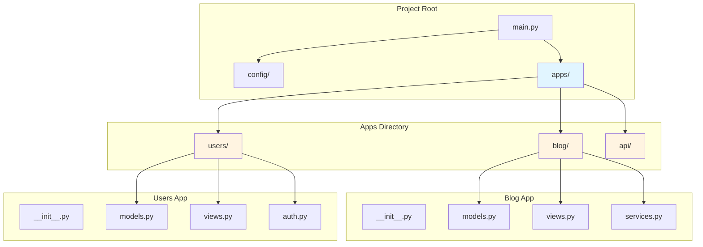
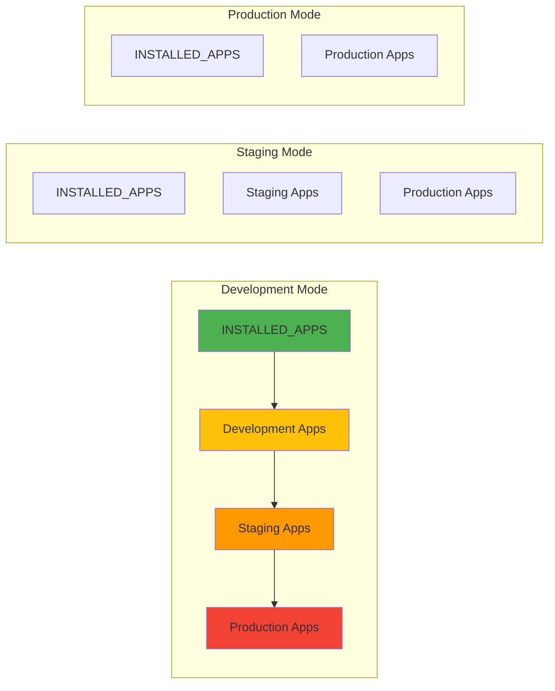

# App-Based Architecture

SPOC's app system provides a Django-inspired way to organize your Python applications into self-contained, reusable modules. This guide explains the conceptual foundation of SPOC's app architecture.

---

## What Are Apps in SPOC?

In SPOC, an **app** is a self-contained Python package that encapsulates related functionality. Similar to Django apps, SPOC apps are:

- **Modular**: Each app focuses on a specific domain or feature
- **Self-contained**: Apps have their own models, views, services, and logic
- **Reusable**: Apps can be shared across projects
- **Isolated**: Apps minimize dependencies on other apps
- **Discoverable**: SPOC automatically finds and loads configured apps

### Apps vs. Modules

Understanding the distinction is crucial:

- **App**: A Python package (directory with `__init__.py`) containing related functionality
- **Module**: A Python file (`.py`) within an app (e.g., `models.py`, `views.py`)

```
apps/blog/          # This is an app
    ├── models.py   # This is a module
    ├── views.py    # This is a module
    └── services.py # This is a module
```

---

## App Directory Structure

SPOC expects apps to be organized in an `apps/` directory at the root of your project. The framework automatically adds this directory to Python's import path.

### Basic Structure

```
myproject/
├── apps/                   # Apps directory (auto-injected into Python path)
│   ├── blog/              # Blog app
│   │   ├── __init__.py
│   │   ├── models.py      # Data models
│   │   ├── views.py       # View functions/classes
│   │   └── services.py    # Business logic
│   │
│   ├── users/             # Users app
│   │   ├── __init__.py
│   │   ├── models.py
│   │   ├── views.py
│   │   └── auth.py        # Custom module
│   │
│   └── api/               # API app
│       ├── __init__.py
│       ├── endpoints.py
│       └── serializers.py
│
├── config/                 # Configuration directory
│   ├── settings.py        # Application settings
│   └── spoc.toml          # SPOC configuration
│
└── main.py                # Application entry point
```

### Architecture Diagram



---

## App Discovery and Configuration

SPOC discovers apps through configuration settings. Apps can be registered in two locations:

### 1. Python Settings (`config/settings.py`)

The `INSTALLED_APPS` list in your settings file defines apps that are **always loaded**, regardless of environment:

```python
"""Application Settings"""

from pathlib import Path

# Base Directory
BASE_DIR: Path = Path(__file__).resolve().parent.parent

# Always-installed apps (loaded in all environments)
INSTALLED_APPS: list = [
    "core",      # Core functionality
    "auth",      # Authentication
    "api",       # API endpoints
]

# Plugins for extending functionality
PLUGINS: dict = {
    "middleware": ["core.middleware"],
    "hooks": ["auth.hooks"],
}
```

### 2. TOML Configuration (`config/spoc.toml`)

Environment-specific apps can be defined in `spoc.toml`:

```toml
[spoc]
mode = "development"  # Current environment mode

# Apps loaded per environment
[spoc.apps]
production = ["analytics", "monitoring"]
staging = ["debugging"]
development = ["testing_utils", "dev_tools"]
```

### App Loading Order

SPOC loads apps in a specific order with environment cascading:



**Loading rules:**

1. **Development mode**: Loads all apps (development → staging → production)
2. **Staging mode**: Loads staging + production apps only
3. **Production mode**: Loads production apps only
4. **INSTALLED_APPS**: Always loaded first, regardless of mode

**Example:**

```python
# In development mode, this app list is assembled:
[
    "core",           # From INSTALLED_APPS
    "auth",           # From INSTALLED_APPS
    "api",            # From INSTALLED_APPS
    "testing_utils",  # From [spoc.apps.development]
    "dev_tools",      # From [spoc.apps.development]
    "debugging",      # From [spoc.apps.staging]
    "analytics",      # From [spoc.apps.production]
    "monitoring",     # From [spoc.apps.production]
]
```

---

## The `inject_apps()` Function

The `inject_apps()` function is the mechanism that makes app imports work. It adds the `apps/` directory to Python's `sys.path`.

### How It Works

```python
def inject_apps(
    base_dir: Path,
    apps_dir_name: str = "apps",
    *,
    position: int = 0
) -> Path:
    """
    Ensure an 'apps' directory exists under `base_dir`
    and inject it into Python's import path.
    """
    apps_path = base_dir / apps_dir_name
    ensure_directory(apps_path)
    add_to_python_path(apps_path, position=position)
    return apps_path
```

### What It Does

1. **Creates the apps directory** if it doesn't exist
2. **Adds the directory to `sys.path`** at the specified position (default: beginning)
3. **Returns the path** to the apps directory

### Automatic Injection

The Framework automatically calls `inject_apps()` during initialization:

```python
class Framework:
    def __init__(
        self,
        base_dir: Path,
        schema: Schema,
        echo: bool = False,
        mode: FrameworkMode = "strict",
    ) -> None:
        # Inject apps directory into Python path
        inject_apps(base_dir)

        # ... rest of initialization
```

### Import Path Behavior

After `inject_apps()` runs, apps become importable as top-level packages:

```python
# Before inject_apps()
# ❌ Cannot import
from blog.models import Post  # ModuleNotFoundError

# After inject_apps()
# ✅ Can import
from blog.models import Post      # Works!
from users.auth import login      # Works!
from api.endpoints import router  # Works!
```

---

## Module Naming Conventions

SPOC uses a consistent naming pattern for loading modules from apps.

### Fully Qualified Module Names

Apps are loaded using the pattern: `appname.modulename`

**Examples:**

```python
"blog.models"      # models.py in the blog app
"blog.views"       # views.py in the blog app
"users.models"     # models.py in the users app
"users.auth"       # auth.py in the users app
"api.endpoints"    # endpoints.py in the api app
```

### Schema-Based Loading

The Framework Schema defines which modules to load from each app:

```python
from spoc import Framework, Schema

schema = Schema(
    # These modules will be loaded from EVERY app
    modules=["models", "views", "services"],

    # Module dependencies
    dependencies={
        "views": ["models"],       # views.py depends on models.py
        "services": ["models"],    # services.py depends on models.py
    }
)
```

### How It Works

For each app in `INSTALLED_APPS`, SPOC attempts to load the specified modules:

```python
# Given INSTALLED_APPS = ["blog", "users"]
# and modules = ["models", "views"]

# SPOC will try to load:
"blog.models"   # ✅ apps/blog/models.py
"blog.views"    # ✅ apps/blog/views.py
"users.models"  # ✅ apps/users/models.py
"users.views"   # ✅ apps/users/views.py
```

### Strict vs. Loose Mode

SPOC supports two loading modes:

- **Strict mode** (default): All modules must exist in all apps, or an error is raised
- **Loose mode**: Missing modules are skipped without errors

```python
# Strict mode - all apps MUST have models.py and views.py
framework = Framework(
    base_dir=BASE_DIR,
    schema=schema,
    mode="strict"  # Default
)

# Loose mode - apps without models.py or views.py are OK
framework = Framework(
    base_dir=BASE_DIR,
    schema=schema,
    mode="loose"
)
```

---

## App Isolation and Reusability

Designing apps for isolation and reusability is a core principle in SPOC.

### Isolation Principles

**1. Minimize Cross-App Dependencies**

Apps should be as self-contained as possible:

```python
# ❌ Bad: Direct import from another app
# In apps/blog/views.py
from users.models import User  # Tight coupling!

# ✅ Good: Use dependency injection or interfaces
# In apps/blog/views.py
def create_post(user_service):
    """Create a post using an injected user service."""
    user = user_service.get_user(user_id=1)
    # ... create post
```

**2. Use Components for Discoverability**

Instead of direct imports, use SPOC's component system:

```python
# In apps/users/models.py
from spoc import Components

components = Components()
components.add_type("model")

@components.register("model")
class User:
    """User model."""
    id: int
    username: str
```

```python
# In apps/blog/services.py
# Access via the framework's component registry
def create_post(framework, user_id: int):
    """Create a post for a user."""
    # Get the User component from the registry
    User = framework.get_component("model", "User")
    user = User(id=user_id, username="john")
    # ... rest of logic
```

**3. Clear Boundaries**

Each app should have a well-defined purpose:

```
apps/
├── auth/          # Authentication and authorization only
├── blog/          # Blog posts and comments only
├── users/         # User profiles and management only
└── notifications/ # Notification system only
```

### Reusability Strategies

**1. Generic App Design**

Design apps to be context-independent:

```python
# apps/notifications/services.py
"""Generic notification service - works in any project."""

def send_notification(user_id: int, message: str, channel: str = "email"):
    """Send a notification to a user."""
    # This doesn't know about blogs, e-commerce, etc.
    # It's a generic notification service
    pass
```

**2. Configuration-Driven Behavior**

Use settings to customize app behavior:

```python
# config/settings.py
NOTIFICATION_CHANNELS = ["email", "sms", "push"]
NOTIFICATION_TEMPLATES_DIR = BASE_DIR / "templates" / "notifications"
```

```python
# apps/notifications/services.py
from config import settings

def get_available_channels():
    """Get configured notification channels."""
    return settings.NOTIFICATION_CHANNELS
```

**3. App-Specific Settings**

Apps can define their own configuration:

```python
# apps/blog/settings.py
"""Blog app configuration."""

MAX_POST_LENGTH = 10000
POSTS_PER_PAGE = 20
ALLOW_COMMENTS = True
COMMENT_MODERATION = False
```

---

## Best Practices for Organizing Apps

### 1. Single Responsibility Principle

Each app should have one clear purpose:

```
✅ Good:
apps/
├── authentication/  # User login, logout, password reset
├── blog/           # Blog posts and comments
└── analytics/      # Usage tracking and reporting

❌ Bad:
apps/
└── everything/     # Users, posts, comments, analytics, etc.
```

### 2. Consistent Module Structure

Use consistent naming across apps:

```
apps/
├── blog/
│   ├── __init__.py
│   ├── models.py      # Data models
│   ├── views.py       # Request handlers
│   ├── services.py    # Business logic
│   └── utils.py       # Helper functions
│
└── users/
    ├── __init__.py
    ├── models.py      # Data models (same structure)
    ├── views.py       # Request handlers
    ├── services.py    # Business logic
    └── utils.py       # Helper functions
```

### 3. App Dependencies in Schema

Declare dependencies explicitly in your schema:

```python
schema = Schema(
    modules=["models", "views", "services"],
    dependencies={
        "views": ["models"],           # views need models
        "services": ["models"],        # services need models
    }
)
```

### 4. Use `__init__.py` for Public API

Expose only what's needed:

```python
# apps/blog/__init__.py
"""Blog app public API."""

from .models import Post, Comment
from .services import create_post, delete_post

__all__ = [
    "Post",
    "Comment",
    "create_post",
    "delete_post",
]
```

### 5. Documentation in Each App

Document app purpose and usage:

```python
# apps/blog/__init__.py
"""
Blog App
========

Provides blog post and comment functionality.

Components:
    - Post model: Blog post data
    - Comment model: Comment data
    - create_post(): Create new posts
    - delete_post(): Delete posts

Dependencies:
    - users app (for authentication)

Configuration:
    - MAX_POST_LENGTH: Maximum post length
    - ALLOW_COMMENTS: Enable/disable comments
"""
```

### 6. Testing Strategy

Each app should have its own tests:

```
tests/
├── test_blog.py       # Tests for blog app
├── test_users.py      # Tests for users app
└── test_api.py        # Tests for api app
```

### 7. Environment-Specific Apps

Use TOML configuration for environment-specific apps:

```toml
[spoc.apps]
production = [
    "monitoring",    # Only in production
    "analytics",     # Only in production
]

development = [
    "debug_toolbar", # Only in development
    "test_data",     # Only in development
]
```

---

## Complete Example

Here's a complete example showing the app system in action:

### Project Structure

```
myproject/
├── apps/
│   ├── users/
│   │   ├── __init__.py
│   │   └── models.py
│   │
│   └── blog/
│       ├── __init__.py
│       ├── models.py
│       ├── views.py
│       └── services.py
│
├── config/
│   ├── settings.py
│   └── spoc.toml
│
└── main.py
```

### Configuration

```python
# config/settings.py
from pathlib import Path

BASE_DIR: Path = Path(__file__).resolve().parent.parent

INSTALLED_APPS: list = [
    "users",
    "blog",
]

PLUGINS: dict = {
    "middleware": [],
    "hooks": [],
}
```

```toml
# config/spoc.toml
[spoc]
mode = "development"
```

### App Implementation

```python
# apps/users/models.py
"""User models."""

import dataclasses as dc
from spoc import Components

components = Components()
components.add_type("model")

@dc.dataclass
@components.register("model")
class User:
    """User model."""
    id: int
    username: str
    email: str
```

```python
# apps/blog/models.py
"""Blog models."""

import dataclasses as dc
from spoc import Components

components = Components()
components.add_type("model")

@dc.dataclass
@components.register("model")
class Post:
    """Blog post model."""
    id: int
    title: str
    content: str
    author_id: int
```

```python
# apps/blog/views.py
"""Blog views."""

from spoc import Components

components = Components()
components.add_type("view")

@components.register("view")
def list_posts():
    """List all blog posts."""
    return {"action": "list_posts"}

@components.register("view")
def create_post():
    """Create a new blog post."""
    return {"action": "create_post"}
```

```python
# apps/blog/services.py
"""Blog business logic."""

from spoc import Components

components = Components()
components.add_type("service")

@components.register("service")
class PostService:
    """Service for managing blog posts."""

    def create_post(self, title: str, content: str, author_id: int):
        """Create a new blog post."""
        # Business logic here
        return {"title": title, "content": content, "author_id": author_id}

    def delete_post(self, post_id: int):
        """Delete a blog post."""
        # Business logic here
        return {"deleted": post_id}
```

### Application Entry Point

```python
# main.py
"""Main application entry point."""

from pathlib import Path
from spoc import Framework, Schema

BASE_DIR = Path(__file__).resolve().parent

# Define schema
schema = Schema(
    modules=["models", "views", "services"],
    dependencies={
        "views": ["models"],
        "services": ["models"],
    }
)

# Initialize framework
framework = Framework(
    base_dir=BASE_DIR,
    schema=schema,
    echo=True,
    mode="strict"
)

# Access components
print("Installed apps:", framework.installed_apps)
# Output: ['users', 'blog']

# Get a specific component
Post = framework.get_component("model", "Post")
print(f"Post component: {Post}")

# Shutdown when done
framework.shutdown()
```

---

## Summary

SPOC's app-based architecture provides:

1. **Clear Organization**: Apps group related functionality
2. **Automatic Discovery**: Framework finds and loads apps from configuration
3. **Path Injection**: `inject_apps()` makes apps importable
4. **Naming Conventions**: Consistent `appname.modulename` pattern
5. **Isolation**: Apps are self-contained with minimal coupling
6. **Reusability**: Apps can be shared across projects
7. **Environment Control**: Load different apps per environment

By following these patterns and best practices, you can build maintainable, scalable applications with SPOC's app system.

---

## Next Steps

- [Quick Start Guide](../getting-started/quick-start.md) - Build your first SPOC app
- [Configuration Guide](../getting-started/configuration.md) - Learn about settings and TOML config
- [Components API](../api/components.md) - Component registration and discovery
- [Framework API](../api/framework.md) - Framework lifecycle and management
