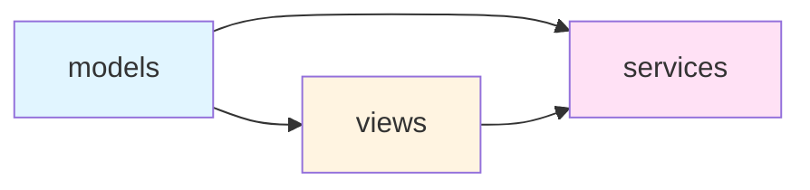
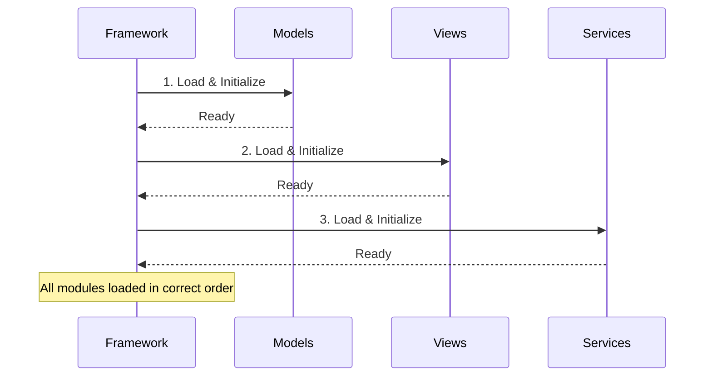
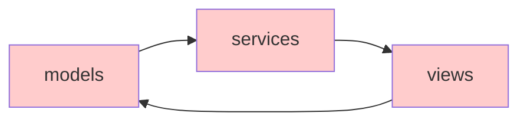
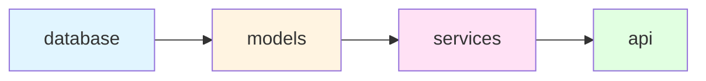
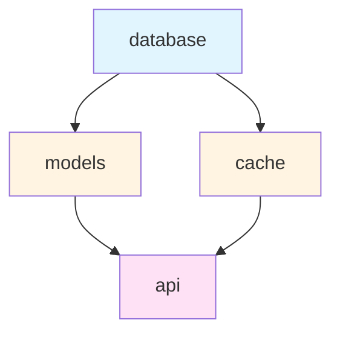
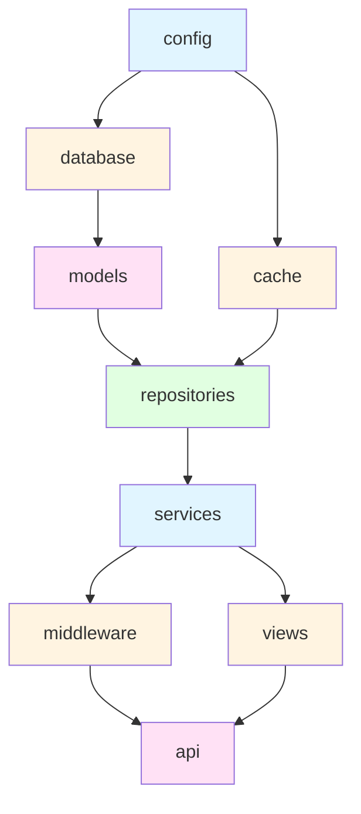
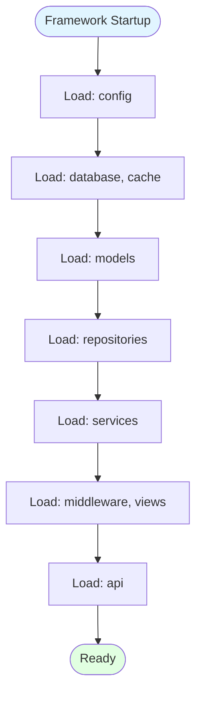
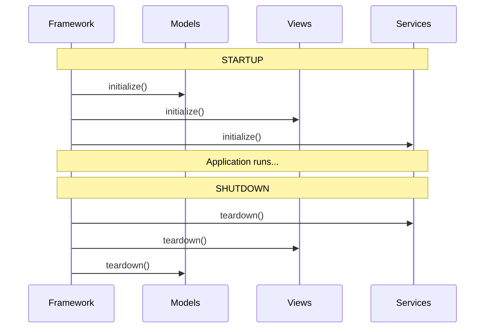
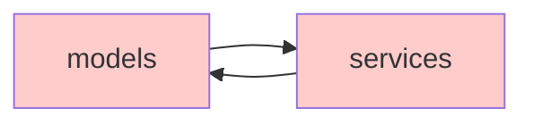
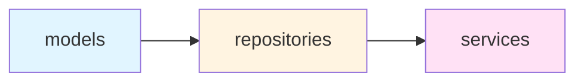

# Dependency Management

SPOC's dependency management system ensures modules are loaded in the correct order, preventing initialization failures and runtime errors. This guide explains how SPOC resolves dependencies, detects circular dependencies, and provides best practices for structuring your application.

---

## Why Dependency Management Matters

In modular applications, components often depend on each other. For example:

- Views depend on models being loaded first
- Services depend on database connections being established
- API handlers depend on authentication middleware

Without proper dependency management, you might encounter:

- **Initialization Errors**: Accessing undefined modules or resources
- **Runtime Failures**: Missing dependencies causing crashes
- **Unpredictable Behavior**: Different initialization order in different runs

SPOC's dependency graph ensures deterministic, correct initialization order automatically.

---

## Defining Dependencies in Schema

Dependencies are declared in the `Schema` object when creating your framework:

```python
from spoc import Framework, Schema
from pathlib import Path

schema = Schema(
    # List all modules to load
    modules=["models", "views", "services"],

    # Define dependencies between modules
    dependencies={
        "views": ["models"],         # views depends on models
        "services": ["models", "views"]  # services depends on both
    }
)

framework = Framework(
    base_dir=Path(__file__).parent,
    schema=schema
)
```

### Dependency Rules

1. **Key**: The module that has dependencies
2. **Value**: List of modules it depends on
3. **Resolution**: SPOC loads dependencies before dependents
4. **Transitive**: Dependencies are resolved recursively

---

## How Dependency Resolution Works

SPOC uses a **Directed Acyclic Graph (DAG)** with topological sorting to determine the correct initialization order.

### Example: Three-Module System

```python
schema = Schema(
    modules=["models", "views", "services"],
    dependencies={
        "views": ["models"],
        "services": ["models", "views"]
    }
)
```

**Dependency Graph:**



**Initialization Order:**



**Result**: `models` → `views` → `services`

---

## The DependencyGraph Class

SPOC's dependency resolution is powered by the `DependencyGraph` class in `spoc.core.utils`.

### Core Methods

#### `add_node(node)`

Adds a node to the graph representing a module.

```python
from spoc.core.utils import DependencyGraph

graph = DependencyGraph[str]()
graph.add_node("models")
graph.add_node("views")
```

#### `add_edge(from_node, to_node)`

Creates a directed edge from one node to another, indicating that `to_node` depends on `from_node`.

```python
# views depends on models
graph.add_edge("models", "views")

# services depends on both models and views
graph.add_edge("models", "services")
graph.add_edge("views", "services")
```

#### `topological_sort()`

Performs topological sort to determine initialization order.

```python
# Returns modules in dependency order
order = graph.topological_sort()
# Result: ["models", "views", "services"]
```

**Algorithm**: Uses Kahn's algorithm with in-degree calculation.

**Time Complexity**: O(V + E) where V = vertices (modules), E = edges (dependencies)

#### `reversed()`

Creates a new graph with all edges reversed, used for shutdown order.

```python
# Reverse the graph for shutdown
shutdown_graph = graph.reversed()
shutdown_order = shutdown_graph.topological_sort()
# Result: ["services", "views", "models"]
```

---

## Circular Dependency Detection

SPOC automatically detects circular dependencies and raises `CircularDependencyError` with a detailed error message.

### Example: Circular Dependency

```python
schema = Schema(
    modules=["models", "views", "services"],
    dependencies={
        "views": ["models"],
        "models": ["services"],  # Creates a cycle!
        "services": ["views"]
    }
)

# This will raise CircularDependencyError
framework = Framework(base_dir=Path("."), schema=schema)
```

**Problem Visualization:**



**Error Message:**

```
CircularDependencyError: Circular dependency detected: models -> services -> views -> models
```

### How Detection Works

During `topological_sort()`:

1. Calculate in-degree for each node
2. Process nodes with in-degree of 0
3. If unprocessed nodes remain, a cycle exists
4. Perform depth-first search to identify the exact cycle
5. Raise `CircularDependencyError` with cycle path

---

## Dependency Resolution Examples

### Example 1: Linear Dependencies

Simple chain where each module depends on the previous one.

```python
schema = Schema(
    modules=["database", "models", "services", "api"],
    dependencies={
        "models": ["database"],
        "services": ["models"],
        "api": ["services"]
    }
)
```

**Graph:**



**Initialization Order**: `database` → `models` → `services` → `api`

**Shutdown Order**: `api` → `services` → `models` → `database`

---

### Example 2: Diamond Dependencies

Multiple modules depend on a common base module.

```python
schema = Schema(
    modules=["database", "models", "cache", "api"],
    dependencies={
        "models": ["database"],
        "cache": ["database"],
        "api": ["models", "cache"]
    }
)
```

**Graph:**



**Possible Initialization Orders:**

- `database` → `models` → `cache` → `api`
- `database` → `cache` → `models` → `api`

Both are valid. SPOC guarantees `database` loads first and `api` loads last.

---

### Example 3: Complex Multi-Layer Application

Real-world application with multiple layers and dependencies.

```python
schema = Schema(
    modules=[
        "config",
        "database",
        "cache",
        "models",
        "repositories",
        "services",
        "middleware",
        "views",
        "api"
    ],
    dependencies={
        "database": ["config"],
        "cache": ["config"],
        "models": ["database"],
        "repositories": ["models", "cache"],
        "services": ["repositories"],
        "middleware": ["services"],
        "views": ["services"],
        "api": ["middleware", "views"]
    }
)
```

**Graph:**



**Initialization Flow:**



---

## Startup and Shutdown Order

SPOC ensures proper initialization and cleanup by using the dependency graph in both directions.

### Startup Order

Modules are initialized in **dependency order** (leaves to root):

```python
framework = Framework(base_dir=Path("."), schema=schema)
# Automatically calls startup()

# Internally:
# 1. Build dependency graph
# 2. Perform topological sort
# 3. Load modules in order: models → views → services
# 4. Call initialize() on each module
```

### Shutdown Order

Modules are torn down in **reverse dependency order** (root to leaves):

```python
framework.shutdown()

# Internally:
# 1. Reverse the dependency graph
# 2. Perform topological sort on reversed graph
# 3. Teardown modules in order: services → views → models
# 4. Call teardown() on each module
```

**Example:**



---

## Best Practices

### 1. Keep Dependencies Minimal

Only declare dependencies you actually need.

**Bad:**

```python
# views doesn't actually use services
dependencies={
    "views": ["models", "services"],
    "services": ["models"]
}
```

**Good:**

```python
# Minimal dependencies
dependencies={
    "views": ["models"],
    "services": ["models"]
}
```

### 2. Avoid Circular Dependencies

Design your architecture to prevent circular dependencies.

**Bad:**



**Good:**



### 3. Layer Your Modules

Follow a layered architecture:

```
Data Layer (models, database)
    ↓
Logic Layer (repositories, services)
    ↓
Presentation Layer (views, api)
```

**Implementation:**

```python
schema = Schema(
    modules=["models", "repositories", "services", "views", "api"],
    dependencies={
        # Data layer
        "repositories": ["models"],

        # Logic layer
        "services": ["repositories"],

        # Presentation layer
        "views": ["services"],
        "api": ["services"]
    }
)
```

### 4. Use Clear Naming Conventions

Name modules to reflect their layer and purpose:

- `database.py` - Database connections
- `models.py` - Data models
- `repositories.py` - Data access layer
- `services.py` - Business logic
- `views.py` - Presentation logic
- `api.py` - API endpoints

### 5. Document Complex Dependencies

For complex applications, document why dependencies exist:

```python
schema = Schema(
    modules=["cache", "models", "services"],
    dependencies={
        # services needs models for data structures
        # services needs cache for performance optimization
        "services": ["models", "cache"]
    }
)
```

### 6. Test Dependency Order

Write tests to verify initialization order:

```python
import pytest
from spoc.core.utils import DependencyGraph

def test_dependency_order():
    graph = DependencyGraph[str]()
    graph.add_edge("models", "views")
    graph.add_edge("models", "services")
    graph.add_edge("views", "services")

    order = graph.topological_sort()

    # Verify models loads first
    assert order.index("models") < order.index("views")
    assert order.index("models") < order.index("services")

    # Verify services loads last
    assert order.index("services") > order.index("views")
    assert order.index("services") > order.index("models")
```

### 7. Handle Missing Dependencies Gracefully

Use `mode="loose"` for optional dependencies:

```python
# Strict mode - all modules must exist
framework = Framework(
    base_dir=Path("."),
    schema=schema,
    mode="strict"  # Raises error if module missing
)

# Loose mode - allows missing modules
framework = Framework(
    base_dir=Path("."),
    schema=schema,
    mode="loose"  # Skips missing modules
)
```

---

## Common Pitfalls

### Pitfall 1: Forgetting Transitive Dependencies

**Problem**: Not declaring indirect dependencies.

```python
# services uses repositories, which uses models
# But you only declare direct dependency
dependencies={
    "repositories": ["models"],
    "services": ["repositories"]  # Missing models!
}
```

**Solution**: SPOC handles transitive dependencies automatically. Just declare direct dependencies:

```python
dependencies={
    "repositories": ["models"],
    "services": ["repositories"]  # SPOC knows services needs models
}
```

### Pitfall 2: Dependency on Self

**Problem**: Module depending on itself.

```python
dependencies={
    "models": ["models"]  # Invalid!
}
```

**Solution**: Remove self-dependencies. They're always errors.

### Pitfall 3: Implicit Dependencies

**Problem**: Using imports without declaring dependencies.

```python
# views.py
from .models import User  # Implicit dependency!

# But schema doesn't declare it
dependencies={}  # Missing: "views": ["models"]
```

**Solution**: Always declare dependencies explicitly:

```python
dependencies={
    "views": ["models"]  # Explicit dependency
}
```

---

## Advanced Usage

### Custom Dependency Graphs

Create custom dependency graphs for specialized use cases:

```python
from spoc.core.utils import DependencyGraph

# Build a custom task dependency graph
tasks = DependencyGraph[str]()
tasks.add_edge("fetch_data", "process_data")
tasks.add_edge("process_data", "save_results")
tasks.add_edge("fetch_data", "log_activity")

# Get execution order
execution_order = tasks.topological_sort()
# ["fetch_data", "process_data", "log_activity", "save_results"]

for task in execution_order:
    print(f"Running task: {task}")
```

### Dynamic Dependencies

Add dependencies at runtime based on configuration:

```python
def build_schema(config):
    modules = ["core", "api"]
    dependencies = {"api": ["core"]}

    # Add optional modules based on config
    if config.get("enable_cache"):
        modules.append("cache")
        dependencies["api"] = ["core", "cache"]

    if config.get("enable_auth"):
        modules.append("auth")
        dependencies["api"].append("auth")

    return Schema(modules=modules, dependencies=dependencies)
```

---

## Summary

SPOC's dependency management system:

- **Ensures correct initialization order** using topological sorting
- **Detects circular dependencies** automatically with detailed error messages
- **Handles shutdown properly** by reversing the dependency graph
- **Supports complex architectures** with multi-layer dependencies
- **Provides predictable behavior** with deterministic ordering

By following best practices and understanding how SPOC resolves dependencies, you can build robust, maintainable applications with confidence that modules will always load in the correct order.

---

## Next Steps

- **Learn about Lifecycle Hooks**: [Lifecycle Hooks Guide](../advanced/lifecycle.md)
- **Explore the Framework API**: [Framework API Reference](../api/framework.md)
- **Study the Importer**: [Importer Guide](importer.md)
- **Review Examples**: Check the `examples/` directory for real-world patterns
