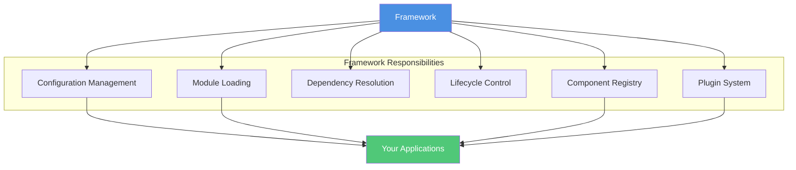
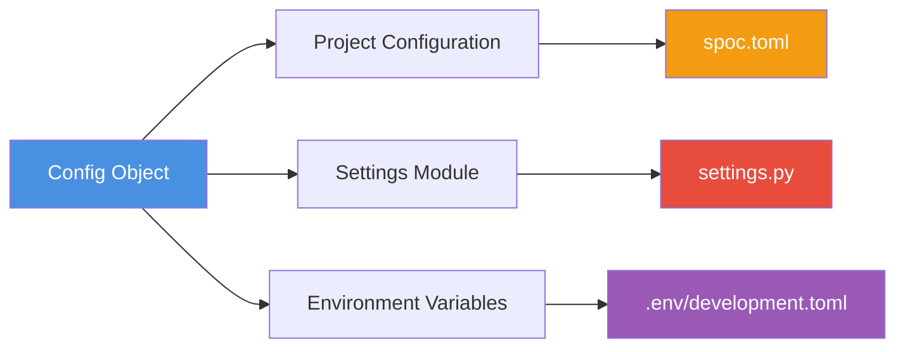
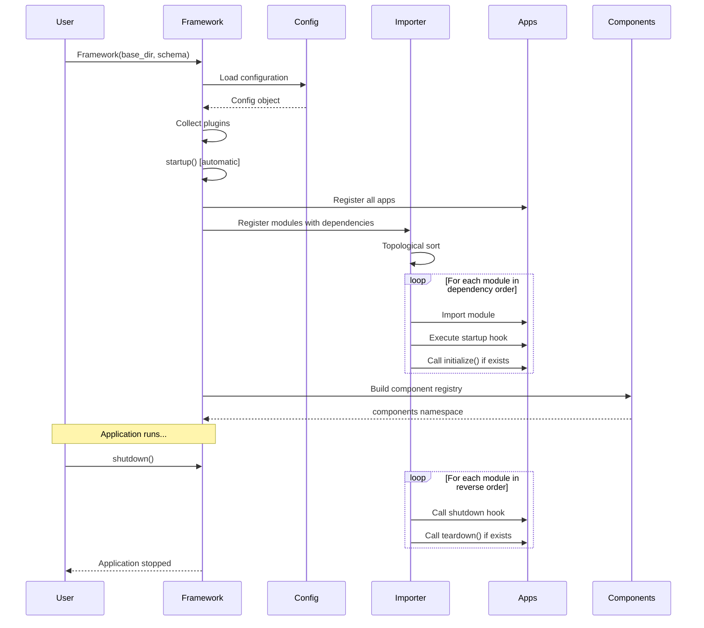
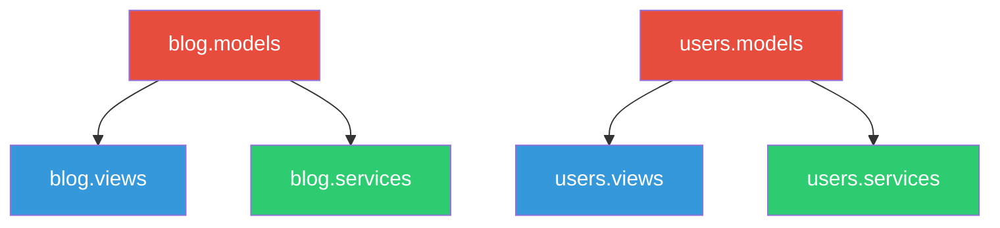

# Understanding the SPOC Framework

The Framework is the heart of SPOC. It's the orchestrator that brings together configuration, modules, components, and lifecycle management into a cohesive application structure. This guide explains the conceptual foundations of the Framework and how it powers your SPOC applications.

---

## What is the Framework?

The Framework is the **core orchestrator** for SPOC applications. Think of it as the conductor of an orchestra - it doesn't play the instruments (your modules and components), but it coordinates when and how they perform together.

The Framework manages:

- **Configuration Discovery**: Locates and loads project settings and environment variables
- **Module Registration**: Registers which modules to load from your apps
- **Dependency Resolution**: Determines the correct order to load modules based on dependencies
- **Lifecycle Orchestration**: Controls startup and shutdown sequences
- **Component Discovery**: Finds and indexes components for easy access
- **Plugin Loading**: Integrates middleware and extensions



---

## The Big Picture

Before diving into details, let's see how the Framework fits into your application:

```python
from pathlib import Path
from spoc import Framework, Schema

# 1. Define your application structure
schema = Schema(
    modules=["models", "views", "services"],
    dependencies={
        "views": ["models"],
        "services": ["models"]
    },
    hooks={
        "models": {
            "startup": lambda m: print(f"Models loaded: {m}"),
        }
    }
)

# 2. Initialize the Framework
framework = Framework(
    base_dir=Path("./my_project"),
    schema=schema,
    echo=False,
    mode="strict"
)

# 3. Use your application
user_model = framework.get_component("model", "users.User")

# 4. Clean shutdown
framework.shutdown()
```

That's it! The Framework handles everything else behind the scenes.

---

## Framework Initialization

When you create a Framework instance, several things happen in sequence:

### 1. Parameter Configuration

```python
framework = Framework(
    base_dir=Path("./my_project"),  # Project root directory
    schema=schema,                  # Module structure definition
    echo=False,                     # Verbose output control
    mode="strict"                   # Error handling mode
)
```

#### Parameter Details

**`base_dir`** - The project root directory
- Must be a `Path` object pointing to your project root
- This directory typically contains your `apps/` folder and `config/` directory
- All module discovery and configuration loading starts from this location

**`schema`** - Defines your application's module structure
- A `Schema` object specifying modules, dependencies, and hooks
- See [Schema Definition](#schema-definition) for details

**`echo`** - Verbose output control
- `True`: Prints detailed debug information during operations
- `False`: Silent operation (default)
- Useful for debugging module loading issues

**`mode`** - Error handling mode
- `"strict"`: Raises errors if modules don't exist (recommended for development)
- `"loose"`: Silently skips missing modules (useful for optional features)
- Controls the Importer's behavior when encountering missing modules

### 2. App Discovery and Injection

The Framework automatically discovers and makes your apps available for import:

```python
# Framework adds C:/path/to/my_project/apps to sys.path
# Now you can import: from blog import models
```

This happens via the `inject_apps()` function, which:
1. Looks for an `apps/` directory in your `base_dir`
2. Adds it to Python's module search path
3. Enables direct imports of your applications

### 3. Configuration Loading

The Framework builds a `Config` object containing three parts:



**Project Configuration** (`config.project`)
- Loaded from `spoc.toml` in your config directory
- Contains mode, app lists, plugin configurations
- Accessed via `framework.config.project`

**Settings Module** (`config.settings`)
- Loaded from `settings.py` or `config.py`
- Contains Python constants like `INSTALLED_APPS`, `PLUGINS`
- Accessed via `framework.config.settings`

**Environment Variables** (`config.environment`)
- Loaded from `.env/<mode>.toml` based on current mode
- Mode-specific environment configuration
- Accessed via `framework.config.environment`

Example configuration access:

```python
# Get the current mode
mode = framework.config.project.get("mode", "development")

# Get installed apps from settings
apps = framework.config.settings.INSTALLED_APPS

# Get environment variables
db_host = framework.config.environment.get("DATABASE_HOST")
```

### 4. Plugin Collection

The Framework collects and loads plugins from two sources:

```python
# From spoc.toml
[spoc.plugins]
middleware = ["myapp.middleware.auth_middleware"]

# From settings.py
PLUGINS = {
    "hooks": ["myapp.hooks.logging_hook"]
}
```

Plugins are organized by group and loaded via URI references. Access them via:

```python
# Get all middleware plugins
middleware = framework.plugins.get("middleware", {})
```

### 5. Automatic Startup

**Important**: The Framework calls `startup()` automatically during initialization!

```python
# These are equivalent:
framework = Framework(base_dir, schema)  # startup() called automatically

# You don't need to do this:
framework = Framework(base_dir, schema)
framework.startup()  # Already called!
```

The startup process:
1. Registers all apps and their modules
2. Resolves dependencies
3. Loads modules in dependency order
4. Executes startup hooks
5. Initializes components registry

---

## Schema Definition

The Schema defines **what** your application is made of - which modules exist and how they relate to each other.

### Basic Schema

```python
from spoc import Schema

schema = Schema(
    modules=["models", "views"],
    dependencies={},
    hooks={}
)
```

### Complete Schema Example

```python
schema = Schema(
    # List of module names to load from each app
    modules=["models", "views", "services", "commands"],

    # Module dependencies (key depends on values)
    dependencies={
        "views": ["models"],           # views need models
        "services": ["models"],        # services need models
        "commands": ["services"],      # commands need services
    },

    # Lifecycle hooks for modules
    hooks={
        "models": {
            "startup": lambda module_set: print(f"Models initialized: {module_set}"),
            "shutdown": lambda module_set: print(f"Models shutting down"),
        },
        "services": {
            "startup": lambda module_set: initialize_services(module_set),
            "shutdown": lambda module_set: cleanup_services(module_set),
        },
    },
)
```

### Schema Components

**`modules`** - List of module names
- These names correspond to Python files in your apps
- Example: `["models"]` means each app should have a `models.py`
- In `"strict"` mode, all apps must have all modules
- In `"loose"` mode, apps can skip modules

**`dependencies`** - Dependency mapping
- Dictionary where keys are modules and values are their dependencies
- Format: `{"dependent": ["dependency1", "dependency2"]}`
- Example: `{"views": ["models"]}` means views must load after models
- The Framework uses this to determine loading order

**`hooks`** - Lifecycle callbacks
- Dictionary mapping module names to Hook dictionaries
- Hooks receive a **set of module objects** (not individual modules)
- `startup` hook: Called after module loads, receives all instances of that module type
- `shutdown` hook: Called before module unloads

### Hook Pattern Matching

Hooks support pattern matching with wildcards:

```python
def handle_all_models(module_set):
    """Called for any app's models module."""
    print(f"Loaded {len(module_set)} model modules")

schema = Schema(
    modules=["models"],
    hooks={
        # Matches blog.models, users.models, etc.
        "*.models": {
            "startup": handle_all_models,
        }
    }
)
```

---

## The Config Object

The Config object is an immutable (frozen) dataclass that holds all configuration:

```python
@dataclass(frozen=True)
class Config:
    project: Dict[str, Any]      # From spoc.toml
    settings: Any                # From settings.py
    environment: Any             # From .env/<mode>.toml
```

### Accessing Configuration

```python
# Project configuration (from spoc.toml)
framework.config.project["mode"]           # "development"
framework.config.project["debug"]          # True
framework.config.project["apps"]           # {"production": [...], ...}

# Settings (from settings.py)
framework.config.settings.INSTALLED_APPS   # ["blog", "users"]
framework.config.settings.BASE_DIR         # Path object
framework.config.settings.PLUGINS          # Plugin configuration

# Environment (from .env/development.toml)
framework.config.environment["DATABASE_URL"]
framework.config.environment["API_KEY"]
```

### Configuration Search Paths

The Framework searches for configuration files in standard locations:

**spoc.toml**:
1. `{base_dir}/config/spoc.toml`
2. `{base_dir}/spoc.toml`

**settings.py**:
1. `{base_dir}/config/settings.py`
2. `{base_dir}/conf/settings.py`
3. `{base_dir}/settings.py`

Also accepts: `config.py`, `configuration.py`

**Environment files**:
1. `{base_dir}/config/.env/{mode}.toml`
2. `{base_dir}/.env/{mode}.toml`

Falls back to `default.toml` if mode-specific file not found.

---

## Framework Lifecycle

The Framework manages your application through distinct lifecycle phases:



### Startup Sequence

The `startup()` method orchestrates module initialization:

```python
def startup(self) -> Framework:
    """Bootstrap the application."""
    self._register_all_apps()    # 1. Register apps
    self.importer.startup()       # 2. Load modules
    self._init_components()       # 3. Index components
    return self
```

**Step 1: Register Apps**

```python
# Collects apps from two sources:
installed_apps = [
    # From settings.py
    *config.settings.INSTALLED_APPS,

    # From spoc.toml based on mode
    *config.project["apps"][mode]
]

# For each app, register its modules:
for app in installed_apps:
    for module in schema.modules:
        importer.register(
            f"{app}.{module}",
            dependencies=[f"{app}.{dep}" for dep in schema.dependencies.get(module, [])]
        )
```

**Step 2: Load Modules**

The Importer performs a topological sort to determine loading order:

```python
# Example with dependencies: {"views": ["models"]}
# Loading order: blog.models, users.models, blog.views, users.views
```

For each module in order:
1. Import the module
2. Execute startup hook (if defined)
3. Call `module.initialize()` (if exists)
4. Mark as initialized

**Step 3: Initialize Components**

The Framework scans loaded modules for decorated components:

```python
# Finds objects with __spoc__ attribute
# Organizes by type (models, views, etc.)
# Creates namespace for easy access
framework.components.models  # {"blog.Post": Post, ...}
framework.components.views   # {"blog.list_posts": list_posts, ...}
```

### Shutdown Sequence

The `shutdown()` method tears down in reverse order:

```python
def shutdown(self) -> Framework:
    """Tear down the application."""
    self.importer.shutdown()
    return self
```

For each module in reverse dependency order:
1. Execute shutdown hook (if defined)
2. Call `module.teardown()` (if exists and initialized)
3. Mark as uninitialized

Example shutdown order:
```
views → services → models
(reverse of startup order)
```

### Lifecycle Hooks in Action

Hooks receive a **set of component objects** from the module:

```python
def initialize_models(model_set):
    """Called when a models module loads."""
    print(f"Initializing {len(model_set)} models")
    for model in model_set:
        # Setup database tables, validate schema, etc.
        print(f"  - {model.__name__}")

schema = Schema(
    modules=["models"],
    hooks={
        "models": {
            "startup": initialize_models,
        }
    }
)
```

When `blog.models` loads with decorated `Post` and `Comment` classes:
```
Initializing 2 models
  - Post
  - Comment
```

---

## Accessing Components

The Framework provides multiple ways to access your components:

### 1. Component Namespace

Direct attribute access to component dictionaries:

```python
# Access all models
all_models = framework.components.models

# Iterate over models
for name, model_class in framework.components.models.items():
    print(f"{name}: {model_class}")

# Output:
# blog.Post: <class 'blog.models.Post'>
# blog.Comment: <class 'blog.models.Comment'>
# users.User: <class 'users.models.User'>
```

### 2. Get Component Method

Retrieve a specific component by kind and name:

```python
# Get a specific component
Post = framework.get_component("model", "blog.Post")

# Returns None if not found
result = framework.get_component("model", "nonexistent.Model")  # None
```

**Method signature**:
```python
def get_component(self, kind: str, name: str) -> Any:
    """
    Get a framework component by <kind>.<name>

    Args:
        kind: Component type (e.g., "model", "view")
        name: Component name including app (e.g., "blog.Post")

    Returns:
        The component object or None if not found
    """
```

### 3. Installed Apps List

Access the list of loaded applications:

```python
# Get all installed apps
apps = framework.installed_apps
# ["blog", "users"]

# Check if an app is loaded
if "admin" in framework.installed_apps:
    admin_views = framework.components.views.get("admin.dashboard")
```

### Component Organization

Components are organized by type (module name):

```
framework.components
├── models          # Dict of model components
│   ├── "blog.Post"       → <class Post>
│   ├── "blog.Comment"    → <class Comment>
│   └── "users.User"      → <class User>
├── views           # Dict of view components
│   ├── "blog.list_posts" → <function list_posts>
│   └── "blog.create_post" → <function create_post>
└── services        # Dict of service components
    └── "blog.PostService" → <class PostService>
```

---

## Dependency Resolution

The Framework uses a dependency graph to ensure modules load in the correct order:

### How Dependencies Work

```python
schema = Schema(
    modules=["models", "views", "services"],
    dependencies={
        "views": ["models"],      # views need models
        "services": ["models"],   # services need models
    }
)
```

**Dependency graph for apps `["blog", "users"]`:**



**Loading order** (topological sort):
1. `blog.models`
2. `users.models`
3. `blog.views`
4. `blog.services`
5. `users.views`
6. `users.services`

### Circular Dependency Detection

The Framework detects and prevents circular dependencies:

```python
# This will raise CircularDependencyError
schema = Schema(
    modules=["a", "b"],
    dependencies={
        "a": ["b"],  # a depends on b
        "b": ["a"],  # b depends on a - CIRCULAR!
    }
)

# Error: Circular dependency detected: a → b → a
```

**Best practices**:
- Keep dependencies unidirectional
- Models should have no dependencies
- Views depend on models
- Services depend on models
- Commands depend on services

### Cross-App Dependencies

Dependencies are **per module type**, not per app:

```python
# CORRECT: Module-level dependencies
dependencies = {
    "views": ["models"]  # ALL views depend on ALL models
}

# Note: You cannot specify that blog.views depends on users.models
# Dependencies are defined at the module level, not the app level
```

If you need app-specific dependencies, consider:
- Splitting into separate module types
- Using lazy imports within the module
- Restructuring your application architecture

---

## Working with the Importer

The Framework delegates module loading to an Importer instance:

```python
# Access the importer
importer = framework.importer

# Check if a module is loaded
if importer.has("blog.models"):
    models = importer.get("blog.models")

# Get all loaded module names
modules = importer.keys()
```

### Importer Modes

The `mode` parameter controls error handling:

**Strict Mode** (recommended):
```python
framework = Framework(base_dir, schema, mode="strict")

# Raises AppNotFoundError if module doesn't exist
# Good for development: catches missing modules immediately
```

**Loose Mode**:
```python
framework = Framework(base_dir, schema, mode="loose")

# Returns None if module doesn't exist
# Good for optional features or testing
```

### Module Loading Pattern

The Importer uses a caching pattern:

```python
# First call: imports and caches
module1 = importer.load("blog.models")

# Second call: returns cached version
module2 = importer.load("blog.models")

assert module1 is module2  # Same object
```

---

## Practical Examples

### Example 1: Database Connection Management

```python
def connect_db(model_set):
    """Connect to database when models load."""
    import sqlite3
    db = sqlite3.connect("app.db")
    # Store connection somewhere accessible
    print(f"Database connected for {len(model_set)} models")

def disconnect_db(model_set):
    """Disconnect from database when models unload."""
    # Close database connection
    print("Database disconnected")

schema = Schema(
    modules=["models", "views"],
    dependencies={"views": ["models"]},
    hooks={
        "models": {
            "startup": connect_db,
            "shutdown": disconnect_db,
        }
    }
)
```

### Example 2: Cache Warmup

```python
def warmup_cache(view_set):
    """Pre-load frequently accessed data."""
    print(f"Warming up cache for {len(view_set)} views")
    for view in view_set:
        if hasattr(view, "warmup"):
            view.warmup()

schema = Schema(
    modules=["models", "views"],
    dependencies={"views": ["models"]},
    hooks={
        "views": {
            "startup": warmup_cache,
        }
    }
)
```

### Example 3: Component Discovery

```python
def discover_commands(command_set):
    """Register CLI commands."""
    import sys
    cli_registry = {}

    for cmd in command_set:
        cmd_name = cmd.__name__.lower()
        cli_registry[cmd_name] = cmd
        print(f"Registered command: {cmd_name}")

    # Store registry for CLI tool
    sys.modules["__main__"].commands = cli_registry

schema = Schema(
    modules=["commands"],
    hooks={
        "commands": {
            "startup": discover_commands,
        }
    }
)
```

### Example 4: Multi-App Project

```python
from pathlib import Path
from spoc import Framework, Schema

# Define schema for e-commerce app
schema = Schema(
    modules=["models", "views", "services", "tasks"],
    dependencies={
        "views": ["models"],
        "services": ["models"],
        "tasks": ["services"],
    }
)

# Initialize framework
framework = Framework(
    base_dir=Path(__file__).parent,
    schema=schema,
    mode="strict",
)

# Access components from different apps
Product = framework.get_component("model", "catalog.Product")
Order = framework.get_component("model", "orders.Order")
User = framework.get_component("model", "auth.User")

checkout_service = framework.get_component("service", "orders.CheckoutService")
```

---

## Common Patterns

### Pattern 1: Singleton Framework

Create a single framework instance for your entire application:

```python
# framework.py
from pathlib import Path
from spoc import Framework, Schema

_framework = None

def get_framework() -> Framework:
    """Get or create the framework instance."""
    global _framework
    if _framework is None:
        schema = Schema(modules=["models", "views"])
        _framework = Framework(
            base_dir=Path(__file__).parent,
            schema=schema,
        )
    return _framework

# Use anywhere in your app
from framework import get_framework

framework = get_framework()
User = framework.get_component("model", "auth.User")
```

### Pattern 2: Lazy Component Loading

Access components only when needed:

```python
class PostService:
    def __init__(self, framework):
        self.framework = framework
        self._post_model = None

    @property
    def Post(self):
        """Lazy load Post model."""
        if self._post_model is None:
            self._post_model = self.framework.get_component("model", "blog.Post")
        return self._post_model

    def create_post(self, title, content):
        return self.Post(title=title, content=content)
```

### Pattern 3: Environment-Based Configuration

```python
# spoc.toml
[spoc]
mode = "production"

[spoc.apps]
production = ["core", "api"]
staging = ["core", "api", "monitoring"]
development = ["core", "api", "monitoring", "debug"]

# Different apps load based on mode
framework = Framework(base_dir, schema)
print(framework.installed_apps)  # ["core", "api"] in production
```

### Pattern 4: Custom Hook Functions

```python
class DatabaseManager:
    def __init__(self):
        self.connections = {}

    def startup(self, model_set):
        """Create database connections for models."""
        for model in model_set:
            if hasattr(model, "DATABASE"):
                db_name = model.DATABASE
                if db_name not in self.connections:
                    self.connections[db_name] = self.connect(db_name)

    def shutdown(self, model_set):
        """Close all database connections."""
        for conn in self.connections.values():
            conn.close()
        self.connections.clear()

db_manager = DatabaseManager()

schema = Schema(
    modules=["models"],
    hooks={
        "models": {
            "startup": db_manager.startup,
            "shutdown": db_manager.shutdown,
        }
    }
)
```

---

## Troubleshooting

### Issue: Modules Not Loading

**Symptoms**: Components are empty, modules not found

**Solutions**:
1. Check that `apps/` directory exists in `base_dir`
2. Verify each app has an `__init__.py` file
3. Ensure module files match `schema.modules` names
4. Use `mode="loose"` temporarily to identify which modules are missing
5. Enable `echo=True` for detailed loading information

### Issue: Import Errors

**Symptoms**: `ModuleNotFoundError` or `ImportError`

**Solutions**:
1. Verify `base_dir` points to correct directory
2. Check that apps are in `apps/` subdirectory
3. Ensure all dependencies are installed
4. Check for typos in module names

### Issue: Circular Dependencies

**Symptoms**: `CircularDependencyError` during startup

**Solutions**:
1. Review `schema.dependencies` for cycles
2. Restructure dependencies to be unidirectional
3. Consider splitting modules differently
4. Use lazy imports within modules if needed

### Issue: Hooks Not Executing

**Symptoms**: Startup/shutdown hooks don't run

**Solutions**:
1. Verify hook names match module names in schema
2. Check hook signatures accept correct parameters
3. Ensure hooks are registered before Framework creation
4. Check for exceptions in hook functions (use logging)

### Issue: Components Not Found

**Symptoms**: `get_component()` returns `None`

**Solutions**:
1. Verify component is decorated with `@component` or `@components.register()`
2. Check component type matches (e.g., "model" vs "models")
3. Ensure app containing component is in installed_apps
4. Use correct full name: `"app.Component"` not just `"Component"`

---

## Best Practices

### 1. Use Strict Mode in Development

```python
# Catches missing modules early
framework = Framework(base_dir, schema, mode="strict")
```

### 2. Keep Dependencies Simple

```python
# Good: Simple, clear dependencies
dependencies = {
    "views": ["models"],
    "services": ["models"],
}

# Avoid: Complex dependency chains
dependencies = {
    "views": ["models", "services"],
    "services": ["models", "utils"],
    "utils": ["config"],
}
```

### 3. Use Meaningful Hook Functions

```python
# Good: Clear, focused hook
def initialize_database(model_set):
    """Create database tables for models."""
    create_tables(model_set)

# Avoid: Hook doing too much
def startup_hook(model_set):
    create_tables(model_set)
    warmup_cache()
    send_startup_notification()
    check_api_keys()  # Too many responsibilities
```

### 4. Organize Configuration Properly

```
my_project/
├── apps/              # Application modules
├── config/            # All configuration
│   ├── settings.py    # Python settings
│   ├── spoc.toml      # SPOC config
│   └── .env/          # Environment files
│       ├── development.toml
│       ├── staging.toml
│       └── production.toml
└── main.py            # Entry point
```

### 5. Leverage Component Namespace

```python
# Good: Use namespace for type safety
all_models = framework.components.models.values()

# Avoid: Using get_component for iteration
for app in framework.installed_apps:
    model = framework.get_component("model", f"{app}.SomeModel")  # Fragile
```

---

## Summary

The Framework is the orchestration layer that:

1. **Discovers** configuration from standard locations
2. **Registers** apps and modules with dependencies
3. **Loads** modules in the correct order
4. **Executes** lifecycle hooks at appropriate times
5. **Indexes** components for easy access
6. **Manages** startup and shutdown sequences

Understanding the Framework's lifecycle and configuration system enables you to build robust, maintainable SPOC applications with clear separation of concerns and proper dependency management.

For API-level details, see the [Framework API Reference](../api/framework.md).

For practical examples, check the [Quick Start Guide](../getting-started/quick-start.md).
