# Importer - Dynamic Module Loading

The **Importer** is SPOC's dynamic module loader that handles runtime module imports, dependency tracking, and lifecycle management. It provides the foundation for building modular applications with clear dependency relationships and predictable initialization order.

## What the Importer Does

The Importer serves three critical functions in SPOC applications:

1. **Dynamic Module Loading**: Import Python modules at runtime instead of static imports
2. **Module Caching**: Store loaded modules for O(1) lookup performance
3. **Lifecycle Management**: Initialize and tear down modules in dependency order

Think of the Importer as a smart module loader that not only loads Python modules but also understands their relationships and manages their entire lifecycle.

```python
from spoc import Importer

# Get the importer instance
importer = Importer()

# Load a module dynamically
module = importer.load("myapp.models")

# Register a module with dependencies
importer.register("myapp.views", dependencies=["myapp.models"])

# Initialize all modules in correct order
importer.startup()

# ... use your modules ...

# Clean shutdown in reverse order
importer.shutdown()
```

## The Singleton Pattern

The Importer uses the **Singleton pattern**, ensuring only one instance exists per application. This guarantees:

- **Consistent State**: All parts of your application share the same module cache
- **Dependency Graph Integrity**: A single source of truth for module relationships
- **Predictable Lifecycle**: One coordinated startup and shutdown sequence

```python
from spoc import Importer

# These are the same instance
importer1 = Importer()
importer2 = Importer()

assert importer1 is importer2  # True - same object
```

!!! tip "Singleton Benefits"
    The singleton pattern prevents conflicting module states and ensures that dependency relationships remain consistent throughout your application's lifetime.

## Loading Modules

### Basic Loading

The `load()` method imports a module and adds it to the cache:

```python
from spoc import Importer

importer = Importer()

# Load a module
os_module = importer.load("os")

# Load from your application
models = importer.load("myapp.models")
```

**Time Complexity**:

- First load: O(1) - standard Python import
- Subsequent loads: O(1) - cached lookup

### Checking the Cache

Before loading, you can check if a module is already cached:

```python
if importer.has("myapp.models"):
    models = importer.get("myapp.models")  # Get from cache
else:
    models = importer.load("myapp.models")  # Load and cache
```

### Loading from URI

Load specific functions or classes from modules using URI notation:

```python
# Load a function from a module
join_func = importer.load_from_uri("os.path.join")

# Load a class
value_error = importer.load_from_uri("builtins.ValueError")

# Load from your app
user_model = importer.load_from_uri("myapp.models.User")
```

## Registering with Dependencies

The `register()` method loads a module AND establishes its dependency relationships:

```python
from spoc import Importer

importer = Importer()

# Register modules with dependencies
importer.register("myapp.utils")                           # No dependencies
importer.register("myapp.models", dependencies=["myapp.utils"])
importer.register("myapp.views", dependencies=["myapp.models"])
importer.register("myapp.api", dependencies=["myapp.views", "myapp.models"])
```

This creates a dependency graph:


!!! warning "Circular Dependencies"
    The Importer detects circular dependencies and raises `CircularDependencyError` during startup. This prevents initialization deadlocks.

## The Module Cache

The Importer maintains an internal cache of loaded modules for efficient reuse:

```python
# Internal structure (simplified)
_module_cache = {
    "myapp.models": ModuleInfo(...),
    "myapp.views": ModuleInfo(...),
    "myapp.api": ModuleInfo(...),
}
```

**Performance Characteristics**:

| Operation | Time Complexity | Description |
|-----------|----------------|-------------|
| `has(name)` | O(1) | Check if module is cached |
| `get(name)` | O(1) | Retrieve cached module |
| `load(name)` | O(1) amortized | First load imports, subsequent loads use cache |
| `clear(name)` | O(1) | Remove from cache |

### Cache Management

```python
# Check cache
if importer.has("myapp.models"):
    models = importer.get("myapp.models")

# Clear a single module
importer.clear("myapp.models")

# Clear all modules (keeps them in sys.modules)
importer.clear_all()

# Complete unload (removes from sys.modules too)
importer.unload_all()
```

!!! warning "Unloading Modules"
    `unload_all()` removes modules from `sys.modules`. This can cause unexpected behavior if other code still references the modules. Use with caution, primarily for testing scenarios.

## Lifecycle Hooks

Modules can define special functions that run during application startup and shutdown:

```python
# myapp/models.py

def initialize():
    """Called during startup."""
    print("Initializing database connections...")
    # Connect to database
    # Set up connection pools
    # Migrate schemas

def teardown():
    """Called during shutdown."""
    print("Closing database connections...")
    # Close connections
    # Clean up resources
```

### Custom Hook Names

You can specify different function names when creating the Importer:

```python
# Use custom hook names
importer = Importer(
    on_startup_name="setup",
    on_shutdown_name="cleanup"
)
```

```python
# myapp/models.py

def setup():
    """Custom startup hook."""
    print("Setting up models...")

def cleanup():
    """Custom teardown hook."""
    print("Cleaning up models...")
```

### Optional Hooks

Hooks are completely optional. Modules without lifecycle functions work normally:

```python
# myapp/utils.py
# No initialize() or teardown() needed

def helper_function():
    return "This works fine!"
```

## startup() and shutdown()

The `startup()` and `shutdown()` methods orchestrate module lifecycle in dependency order.

### Startup Process

```python
importer.startup()
```

**What happens**:

1. **Topological Sort**: Orders modules based on dependencies
2. **Sequential Initialization**: Calls `initialize()` in dependency order
3. **Error Detection**: Catches circular dependencies and initialization errors

```mermaid
sequenceDiagram
    participant App as Application
    participant Imp as Importer
    participant Utils as myapp.utils
    participant Models as myapp.models
    participant Views as myapp.views

    App->>Imp: startup()
    Imp->>Imp: Topological sort
    Note over Imp: Order: utils → models → views

    Imp->>Utils: initialize()
    Utils-->>Imp: ✓

    Imp->>Models: initialize()
    Models-->>Imp: ✓

    Imp->>Views: initialize()
    Views-->>Imp: ✓

    Imp-->>App: All modules initialized
```



**Time Complexity**: O(N + E)

- N = number of modules
- E = number of dependency edges

### Shutdown Process

```python
importer.shutdown()
```

**What happens**:

1. **Reverse Topological Sort**: Orders modules in reverse dependency order
2. **Sequential Teardown**: Calls `teardown()` in reverse order
3. **Resource Cleanup**: Ensures resources are released properly


**Time Complexity**: O(N + E)

- N = number of modules
- E = number of dependency edges

## The ModuleInfo Class

Each loaded module is wrapped in a `ModuleInfo` object that stores metadata:

```python
from spoc.core.importer import ModuleInfo

module_info = ModuleInfo(
    name="myapp.models",
    module=models_module,
    dependencies=["myapp.utils"],
    initialize_func="initialize",
    teardown_func="teardown"
)
```

**Attributes**:

| Attribute | Type | Description |
|-----------|------|-------------|
| `name` | `str` | Fully-qualified module name |
| `module` | `ModuleType` | The actual Python module object |
| `dependencies` | `list[str]` | List of module names this depends on |
| `initialize_func` | `str \| None` | Name of the initialization function |
| `teardown_func` | `str \| None` | Name of the teardown function |
| `initialized` | `bool` | Whether the module has been initialized |

**Methods**:

```python
# Check for lifecycle hooks
if module_info.has_initialize():
    module_info.initialize()

if module_info.has_teardown():
    module_info.teardown()
```

## Pattern-Based Hooks

Register custom hooks that apply to modules matching a pattern:

```python
from spoc import Importer

def database_startup(module):
    """Custom startup for database modules."""
    print(f"Connecting database module: {module}")

def database_shutdown(module):
    """Custom shutdown for database modules."""
    print(f"Disconnecting database module: {module}")

# Register hooks for all database-related modules
Importer.register_hook(
    pattern="myapp.*.models",
    on_startup=database_startup,
    on_shutdown=database_shutdown
)
```

### Pattern Syntax

Patterns support wildcards:

| Pattern | Matches | Example Matches |
|---------|---------|-----------------|
| `"myapp.models"` | Exact match | `myapp.models` |
| `"myapp.*"` | One level | `myapp.models`, `myapp.views` |
| `"myapp.*.models"` | Middle wildcard | `myapp.blog.models`, `myapp.auth.models` |
| `"*.models"` | Suffix | `myapp.models`, `auth.models` |

### Wildcard Characters

- `*` - Matches zero or more characters
- `?` - Matches exactly one character
- `.` - Literal dot (automatically escaped)

```python
# Match all models in any app
Importer.register_hook(
    pattern="*.models",
    on_startup=lambda m: print(f"Loading models: {m}")
)

# Match specific app pattern
Importer.register_hook(
    pattern="myapp.auth.?",
    on_startup=lambda m: print(f"Loading auth module: {m}")
)
```

## Dependency Ordering Diagram

Understanding how the Importer resolves dependencies:


**Key Points**:

1. **Parallel Initialization**: Modules at the same dependency level can be initialized in any order
2. **No Cycles**: Circular dependencies are detected and rejected
3. **Reverse Order**: Shutdown happens in exact reverse of startup

## Time Complexity Benefits

The Importer is designed for performance:

```python
# Scenario: Large application with many modules
# 100 modules, 200 dependencies

# Without Importer (manual management)
# - Load all modules: O(N) = 100 imports
# - Figure out order: Manual work, error-prone
# - Each lookup: O(N) = Linear search through 100 modules

# With Importer (optimized)
# - Load all modules: O(N) = 100 imports (same)
# - Figure out order: O(N + E) = O(300) one-time cost
# - Each lookup: O(1) = Hash table lookup
```

**Performance Summary**:

| Operation | Complexity | Benefit |
|-----------|-----------|---------|
| Initial registration | O(N + E) | One-time cost |
| Module lookup | O(1) | Constant time access |
| Startup/shutdown | O(N + E) | Optimal dependency resolution |
| Cache check | O(1) | Instant verification |

## Complete Example

Putting it all together:

```python
from spoc import Importer
from pathlib import Path

# Create the importer
importer = Importer(
    on_startup_name="initialize",
    on_shutdown_name="teardown"
)

# Register a pattern-based hook
Importer.register_hook(
    pattern="myapp.*.models",
    on_startup=lambda m: print(f"📦 Loading models: {m}"),
    on_shutdown=lambda m: print(f"📦 Unloading models: {m}")
)

# Register modules with dependencies
importer.register("myapp.utils")
importer.register("myapp.config")
importer.register("myapp.database.models", dependencies=["myapp.utils", "myapp.config"])
importer.register("myapp.auth.models", dependencies=["myapp.database.models"])
importer.register("myapp.api.views", dependencies=["myapp.auth.models"])

# Start the application
try:
    importer.startup()

    # Your application runs here
    # All modules are initialized in correct order

    # Access modules from cache (O(1))
    models = importer.get("myapp.database.models")
    views = importer.get("myapp.api.views")

    # Check what's loaded
    print(f"Loaded modules: {importer.keys()}")

finally:
    # Always clean up
    importer.shutdown()
```

**Output**:

```
📦 Loading models: myapp.database.models
📦 Loading models: myapp.auth.models
Initializing myapp.utils...
Initializing myapp.config...
Initializing myapp.database.models...
Initializing myapp.auth.models...
Initializing myapp.api.views...
Loaded modules: ['myapp.utils', 'myapp.config', 'myapp.database.models', 'myapp.auth.models', 'myapp.api.views']
Tearing down myapp.api.views...
Tearing down myapp.auth.models...
Tearing down myapp.database.models...
📦 Unloading models: myapp.auth.models
📦 Unloading models: myapp.database.models
Tearing down myapp.config...
Tearing down myapp.utils...
```

## Best Practices

!!! tip "Design Guidelines"
    1. **Keep Dependencies Minimal**: Only declare what you actually need
    2. **Use Lifecycle Hooks**: Initialize resources in `initialize()`, clean up in `teardown()`
    3. **Check the Cache**: Use `has()` before `get()` to avoid errors
    4. **Pattern Hooks for Groups**: Use patterns for common initialization logic
    5. **Avoid Circular Dependencies**: Design module relationships as a DAG (Directed Acyclic Graph)

!!! warning "Common Pitfalls"
    - **Forgetting teardown()**: Always clean up resources to prevent leaks
    - **Circular dependencies**: Design dependencies as a tree or DAG
    - **Unloading prematurely**: Don't call `unload_all()` while modules are in use
    - **Ignoring singleton**: Remember all Importer instances are the same object

## Next Steps

- Learn about the [Framework](framework.md) which builds on the Importer
- Explore [Dependency Management](dependencies.md) patterns
- See [Lifecycle Hooks](../advanced/lifecycle.md) for advanced usage
- Check the [API Reference](../api/importer.md) for complete method documentation
