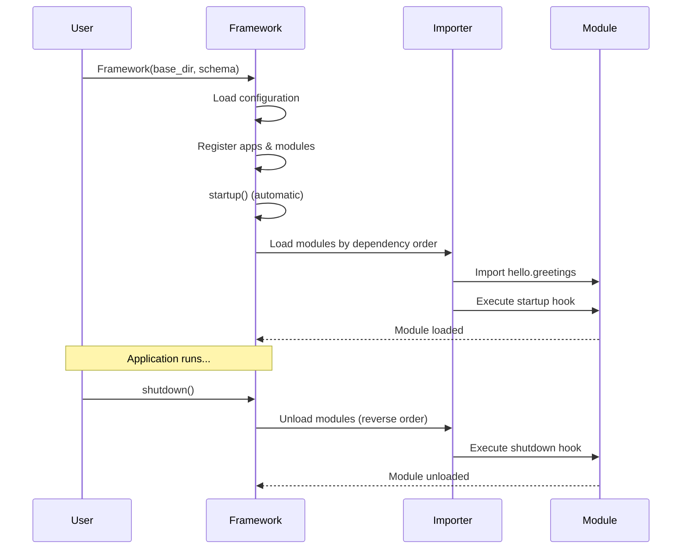

# Basic Example

This guide demonstrates a minimal SPOC application from scratch. You'll build a complete, runnable example that shows the core workflow: project structure, configuration, component registration, and lifecycle management.

---

## What You'll Build

A simple greeting application that:

- Organizes code into a modular app structure
- Defines and registers components
- Manages application lifecycle (startup/shutdown)
- Accesses components through the framework

---

## Project Structure

Create the following directory structure:

```
my_project/
├── config/
│   ├── __init__.py
│   ├── settings.py
│   └── spoc.toml
├── apps/
│   └── hello/
│       ├── __init__.py
│       └── greetings.py
└── main.py
```

---

## Step 1: Configuration Files

### config/__init__.py

Create an empty `__init__.py` to make `config` a Python package:

```python
"""Configuration package."""
```

### config/settings.py

Define your project settings:

```python
"""Project settings configuration."""

from pathlib import Path

# Base directory of the project - used by the framework to locate apps
BASE_DIR: Path = Path(__file__).resolve().parent.parent

# Apps to always load (core apps)
INSTALLED_APPS: list = [
    "hello",
]

# Plugins for extending functionality
# Middleware and hooks can be registered here
PLUGINS: dict = {
    "middleware": [],
    "hooks": [],
}
```

**Key Points:**

- `BASE_DIR` points to the project root (parent of config directory)
- `INSTALLED_APPS` lists apps that load in all environments
- `PLUGINS` is a dictionary for middleware and hook extensions

### config/spoc.toml

Define environment-specific configuration:

```toml
# Application Configuration
[spoc]
mode = "development"  # Options: development, staging, production
debug = true

# Apps by Environment Mode
# These apps load based on the active mode
[spoc.apps]
production = []    # Apps loaded only in production
staging = []       # Apps loaded in staging + production
development = []   # Apps loaded in development + staging + production

# Additional Plugins
[spoc.plugins]
middleware = []
hooks = []
```

**How Modes Work:**

- `development` mode loads: development + staging + production apps
- `staging` mode loads: staging + production apps
- `production` mode loads: production apps only
- `INSTALLED_APPS` from settings.py always loads regardless of mode

---

## Step 2: Create Your App

### apps/hello/__init__.py

Create an empty `__init__.py` to make `hello` a Python package:

```python
"""Hello app - A simple greeting application."""
```

### apps/hello/greetings.py

Define your app's components with decorators:

```python
"""Greetings module - Components for greeting functionality."""

from spoc import Components

# Create a component registry for this module
components = Components()

# Register component type
components.add_type("service")


@components.register("service", config={"default_language": "en"})
class GreetingService:
    """Service for generating greetings in different languages."""

    def __init__(self):
        """Initialize the greeting service."""
        self.greetings = {
            "en": "Hello",
            "es": "Hola",
            "fr": "Bonjour",
            "de": "Hallo",
        }

    def greet(self, name: str, language: str = "en") -> str:
        """
        Generate a greeting message.

        Args:
            name: Name to greet
            language: Language code (en, es, fr, de)

        Returns:
            Formatted greeting message
        """
        greeting = self.greetings.get(language, self.greetings["en"])
        return f"{greeting}, {name}!"

    def list_languages(self) -> list[str]:
        """
        Get list of supported languages.

        Returns:
            List of language codes
        """
        return list(self.greetings.keys())


@components.register("service", config={"max_length": 100})
def farewell_message(name: str) -> str:
    """
    Generate a farewell message.

    This demonstrates registering a function as a component.

    Args:
        name: Name to say goodbye to

    Returns:
        Farewell message
    """
    return f"Goodbye, {name}! See you soon!"
```

**Component Registration:**

- `Components()` creates a registry for component types
- `add_type("service")` registers the "service" component type
- `@components.register("service")` marks classes/functions as components
- `config` parameter attaches metadata to components

---

## Step 3: Main Application

### main.py

Create the framework and run your application:

```python
"""Main application entry point."""

from pathlib import Path
from spoc import Framework, Schema, Hook

# Import settings
from config import settings


def init_greetings(module):
    """
    Hook called when greetings module loads.

    Args:
        module: The loaded module instance
    """
    print(f"✓ Initialized: {module.__name__}")


def cleanup_greetings(module):
    """
    Hook called when greetings module unloads.

    Args:
        module: The module being unloaded
    """
    print(f"✗ Cleaning up: {module.__name__}")


# Define the application schema
schema = Schema(
    # Modules to load from each app
    modules=["greetings"],

    # Module dependencies (greetings has no dependencies)
    dependencies={},

    # Lifecycle hooks for each module
    hooks={
        "greetings": Hook(
            startup=init_greetings,
            shutdown=cleanup_greetings,
        ),
    },
)

# Create the framework instance
# The framework automatically calls startup() during initialization
framework = Framework(
    base_dir=settings.BASE_DIR,
    schema=schema,
    echo=False,  # Set to True to see detailed loading information
    mode="strict",  # "strict" requires all modules in all apps, "loose" allows missing modules
)


def main():
    """Run the application."""
    print("\n" + "=" * 60)
    print("SPOC Application - Basic Example")
    print("=" * 60 + "\n")

    # Display installed apps
    print(f"Installed Apps: {framework.installed_apps}")
    print()

    # Access the component registry
    print("Registered Components:")
    print("-" * 60)

    # Get all service components
    if hasattr(framework.components, "service"):
        for name, component in framework.components.service.items():
            print(f"  • {name}: {component}")
    print()

    # Use a specific component - Get the GreetingService class
    print("Using Components:")
    print("-" * 60)

    greeting_service_cls = framework.get_component("service", "hello.GreetingService")
    if greeting_service_cls:
        # Instantiate the service
        service = greeting_service_cls()

        # Use the service
        print(f"  {service.greet('World')}")
        print(f"  {service.greet('Mundo', 'es')}")
        print(f"  {service.greet('Monde', 'fr')}")
        print(f"  Supported languages: {service.list_languages()}")
        print()

    # Use the farewell function component
    farewell_fn = framework.get_component("service", "hello.farewell_message")
    if farewell_fn:
        print(f"  {farewell_fn('World')}")
        print()

    # Access component metadata
    print("Component Metadata:")
    print("-" * 60)

    if greeting_service_cls and hasattr(greeting_service_cls, "__spoc__"):
        metadata = greeting_service_cls.__spoc__
        print(f"  Config: {metadata.config}")
        print(f"  Metadata: {metadata.metadata}")
        print()

    # Application is running...
    print("=" * 60)
    print("Application Running - Press Ctrl+C to stop")
    print("=" * 60 + "\n")

    # Clean shutdown (framework handles this automatically on exit)
    # But you can manually call it when needed
    framework.shutdown()

    print("\n" + "=" * 60)
    print("Application Stopped")
    print("=" * 60 + "\n")


if __name__ == "__main__":
    main()
```

---

## Step 4: Run the Application

Execute your application from the project root:

```bash
cd my_project
python main.py
```

### Expected Output

```
apps_path C:\path\to\my_project\apps
✓ Initialized: hello.greetings

============================================================
SPOC Application - Basic Example
============================================================

Installed Apps: ['hello']

Registered Components:
------------------------------------------------------------
  • hello.GreetingService: <class 'hello.greetings.GreetingService'>
  • hello.farewell_message: <function farewell_message at 0x...>

Using Components:
------------------------------------------------------------
  Hello, World!
  Hola, Mundo!
  Bonjour, Monde!
  Supported languages: ['en', 'es', 'fr', 'de']

  Goodbye, World! See you soon!

Component Metadata:
------------------------------------------------------------
  Config: {'default_language': 'en'}
  Metadata: {'type': 'service'}

============================================================
Application Running - Press Ctrl+C to stop
============================================================

✗ Cleaning up: hello.greetings

============================================================
Application Stopped
============================================================
```

---

## Understanding the Code

### Component Registration

Components are the building blocks of your application:

```python
from spoc import Components

components = Components()
components.add_type("service")

@components.register("service", config={"key": "value"})
class MyService:
    pass
```

**Process:**

1. Create a `Components` registry
2. Add component types with `add_type()`
3. Use `@components.register()` decorator to mark classes/functions
4. Optionally attach configuration metadata

### Framework Schema

The schema defines your application structure:

```python
schema = Schema(
    modules=["greetings"],      # Modules to load from each app
    dependencies={},             # Module dependencies
    hooks={                      # Lifecycle hooks
        "greetings": Hook(
            startup=init_fn,
            shutdown=cleanup_fn,
        ),
    },
)
```

**Key Elements:**

- **modules**: List of Python module names to load from each app
- **dependencies**: Dict mapping modules to their required dependencies
- **hooks**: Dict mapping modules to startup/shutdown functions

### Framework Initialization

The framework orchestrates your application:

```python
framework = Framework(
    base_dir=settings.BASE_DIR,  # Project root directory
    schema=schema,                # Application schema
    echo=False,                   # Debug output flag
    mode="strict",                # Module validation mode
)
```

**Important:**

- Framework automatically calls `startup()` during initialization
- `mode="strict"` requires all modules exist in all apps
- `mode="loose"` allows apps to have missing modules
- Framework handles cleanup automatically, but you can call `shutdown()` manually

### Accessing Components

Retrieve components from the framework:

```python
# Get a specific component by type and name
component = framework.get_component("service", "hello.GreetingService")

# Get all components of a type
all_services = framework.components.service.values()

# Check if type exists
if hasattr(framework.components, "service"):
    # Access the service registry
    services = framework.components.service
```

---

## Lifecycle Flow

The framework follows this lifecycle:



---

## Key Takeaways

### 1. Apps Directory

SPOC automatically looks for apps in the `apps/` directory under `BASE_DIR`:

```
my_project/
├── apps/           # Framework scans this directory
│   └── hello/      # Each subdirectory is an app
```

### 2. Module Loading

Modules are loaded based on the schema:

- Framework loads modules from each installed app
- Modules load in dependency order
- Startup hooks execute after module import
- Shutdown hooks execute in reverse order

### 3. Component Discovery

Components are automatically discovered and registered:

- Each module can have its own `Components` registry
- Framework collects all registered components
- Access components via `framework.components.<type>`
- Components retain their metadata and configuration

### 4. Environment Management

Control app loading by environment:

```toml
[spoc]
mode = "production"

[spoc.apps]
production = ["core", "api"]
development = ["core", "api", "debug"]
```

---

## Common Patterns

### Pattern 1: Multiple Component Types

Register different types of components:

```python
from spoc import Components

components = Components()
components.add_type("model")
components.add_type("service")
components.add_type("view")

@components.register("model")
class User:
    pass

@components.register("service")
class UserService:
    pass

@components.register("view")
def user_list_view():
    pass
```

### Pattern 2: Shared Component Registry

Create a shared registry in a common module:

```python
# framework/components.py
from spoc import Components

components = Components("model", "service", "view")

# Export decorators for convenience
model = lambda obj: components.register("model", obj)
service = lambda obj: components.register("service", obj)
view = lambda obj: components.register("view", obj)
```

Use in your apps:

```python
# apps/hello/models.py
from framework.components import model

@model
class Greeting:
    pass
```

### Pattern 3: Component Configuration

Attach metadata to components:

```python
@components.register(
    "service",
    config={
        "timeout": 30,
        "retry": 3,
        "cache": True,
    }
)
class APIService:
    def __init__(self):
        # Access config from __spoc__ attribute
        config = self.__spoc__.config
        self.timeout = config.get("timeout", 10)
```

---

## Next Steps

Now that you understand the basics:

1. **Add More Apps**: Create additional apps in the `apps/` directory
2. **Define Dependencies**: Explore module dependencies in [Quick Start](../getting-started/quick-start.md)
3. **Use Lifecycle Hooks**: Learn advanced hook patterns in [Framework API](../api/framework.md)
4. **Explore Plugins**: Extend functionality in the [Advanced Guide](../getting-started/configuration.md)
5. **Review Examples**: Check the `examples/` directory in the repository

---

## Troubleshooting

### App Not Loading

**Problem**: Your app doesn't appear in `framework.installed_apps`.

**Solution:**

- Verify the app directory exists in `apps/`
- Check the app has an `__init__.py` file
- Ensure the app is listed in `INSTALLED_APPS` or `[spoc.apps.<mode>]`
- Verify `mode` matches your environment setting

### Module Import Error

**Problem**: `ModuleNotFoundError` when loading modules.

**Solution:**

- Check module filename matches schema (e.g., `greetings.py` for "greetings")
- Ensure module is listed in `schema.modules`
- Verify no syntax errors in the module
- Check dependencies are declared correctly

### Component Not Found

**Problem**: `framework.get_component()` returns `None`.

**Solution:**

- Verify component is decorated with `@components.register()`
- Check component type matches (e.g., "service" not "services")
- Ensure component name uses correct format: `"app.ComponentName"`
- Confirm module loaded successfully (check startup output)

### Strict Mode Errors

**Problem**: Framework raises errors about missing modules.

**Solution:**

- Set `mode="loose"` to allow missing modules
- Or create all required modules in all apps
- Or remove apps that don't match the schema

---

## Summary

You've learned how to:

- Structure a minimal SPOC project
- Configure settings and environment modes
- Create apps with components
- Define schemas with modules and hooks
- Initialize and manage the framework lifecycle
- Access and use registered components

This basic example provides a foundation for building more complex SPOC applications. Continue to the [Quick Start Guide](../getting-started/quick-start.md) for multi-app examples and advanced patterns.
