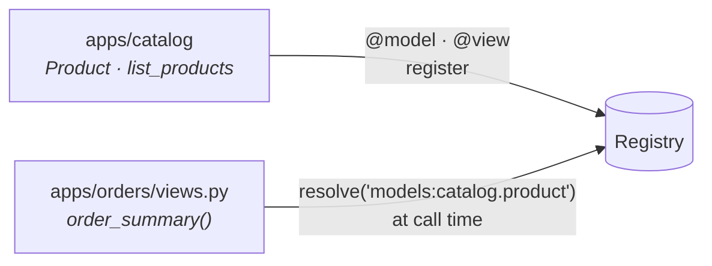

# The Reference Application

The repository's `examples/` directory is a complete storefront monolith —
three small apps that never import each other, wired only through the
registry, with both lifecycles, plugins, and an HTTP surface generated from
the registry. The test suite boots it, so it can never silently drift from
the kernel.

## Layout

```
examples/
├── apps/
│   ├── __init__.py              # apps/ is a package
│   ├── catalog/    models.py, views.py   (Product + stock)
│   ├── orders/     models.py, views.py   (Order; reaches catalog via the registry)
│   └── auth/       models.py, views.py   (UserAccount, Role)
├── config/
│   ├── spoc.toml        # the only file the kernel reads
│   └── settings.py      # user-owned; SPOC never imports it
├── framework.py         # the whole framework definition
├── data/                # mixed-format inputs for the spoc.formats demo
├── build/               # what data_app.py writes; generated, never collected
├── extras.py            # plugin-configured registrations
├── main.py              # synchronous entry
├── async_main.py        # asynchronous entry (coroutine hooks + astart)
├── data_app.py          # spoc.formats demo: collect, pointer, query, write
└── http_app.py          # routes generated from the registry
```

`config/spoc.toml` declares the apps as dotted module paths, imported
exactly as written — the namespace is the final segment:

```toml
[spoc.apps]
production  = ["apps.catalog", "apps.orders", "apps.auth"]

[spoc.plugins]
middleware = ["extras.middleware"]
hooks      = ["extras.hook"]
```

## The framework definition

`framework.py` — the entire thing, on the same top-level convention
`spoc init` emits:

```python
import spoc

framework = spoc.Framework(
    "models",
    spoc.KindSpec("views", depends_on=("models",)),
    spoc.KindSpec("middleware", required=False),
    spoc.KindSpec("hooks", required=False),
)

model = framework.kind("models")
view = framework.kind("views")
```

## Declaring components

`apps/catalog/models.py` — the identifier derives from the class name, and
the module's `initialize`/`teardown` seed and clear the stock:

```python
import dataclasses as dc
from framework import model

PRODUCTS: dict[int, "Product"] = {}

@dc.dataclass
@model
class Product:              # → models:catalog.product
    id: int
    name: str
    price_cents: int

def initialize():
    PRODUCTS.update({1: Product(id=1, name="keyboard", price_cents=7900)})

def teardown():
    PRODUCTS.clear()
```

## Cross-namespace resolution — the registry way

`apps/orders/views.py` never imports catalog's modules. It asks the registry
for catalog's objects by name, at call time — so the only thing the two apps
share is the naming scheme:


```mermaid
flowchart LR
    catalog["apps/catalog<br/><i>Product · list_products</i>"]
    reg[("Registry")]
    orders["apps/orders/views.py<br/><i>order_summary()</i>"]

    catalog -- "@model · @view<br/>register" --> reg
    orders -- "resolve('models:catalog.product')<br/>at call time" --> reg
```

```python
from framework import framework, view

@view
def order_summary():
    product_cls = framework.resolve("models:catalog.product").object
    stock = framework.resolve("views:catalog.list_products").object()
    ...
```

## Both lifecycles

`main.py` boots the shared declaration with `start()` and shuts down with
`shutdown()`. `async_main.py` is the async variant: coroutine
`on_startup`/`on_shutdown` hooks make a declaration async-only (the sync
path refuses coroutines loudly), so a process runs one declaration or the
other:

```console
$ uv run python examples/main.py
Ready: 8 components registered
Order total: 15800 cents

$ uv run python examples/async_main.py
warm_up awaited over 2 models
cheapest product: {'id': 2, 'name': 'mouse', 'price_cents': 2900}
```

## Projecting the HTTP surface

`http_app.py` builds its routes **purely by enumerating the registry** — no
kernel internals involved:

```python
def build_routes(registry):
    return [
        {
            "method": "GET",
            "path": f"/{record.namespace}/{record.object_name}",
            "endpoint": record.object,
            "name": record.identifier,
        }
        for record in registry.by_kind("views")
    ]
```

```console
$ uvicorn http_app:app        # from examples/, fastapi installed
GET  /catalog/list_products   <- views:catalog.list_products
GET  /orders/order_summary    <- views:orders.order_summary
```

The same `build_routes` works for Robyn, a CLI, or any other surface — the
registry record is the whole contract. And because the example sits on the
same layout convention `spoc init` emits, plain `spoc check examples`
validates the whole thing before any of it runs.

## Loading project data

`data_app.py` sits deliberately outside the framework: the kernel reads
`config/spoc.toml` and stops, and the *project* loads its own files through
[`spoc.formats`](../advanced/data-formats.md). One `collect()` call walks the
mixed-format `data/` tree (TOML, CSV, YAML), `pointer` addresses
configuration where a typo must fail loudly, `query` filters the datasets,
and `write` emits `build/books.json` from the CSV via the format-agnostic
representation. It requires the extras (`pip install "spoc[full]"`):

```console
$ uv run python examples/data_app.py
```

The output lands in `build/`, not `data/`: if `books.json` sat next to
`books.csv`, both files would claim the same key (`catalog.books`) and the
next `collect()` would refuse to load the tree. Generated files do not
belong in the tree you collect from.
