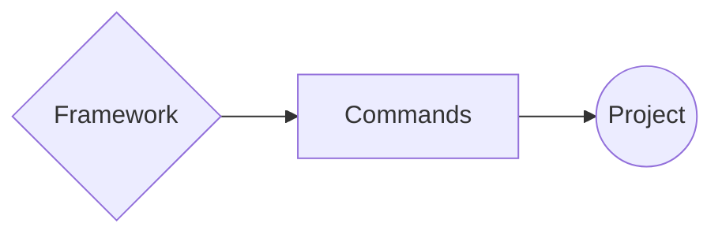

Congratulations! If you've made it this far, you've **successfully** crafted your first **`Framework`**. However, its capabilities might seem modest at the moment.

**Or do they?**

Now, we're set to delve into creating something more intricate. Imagine assembling all those commands and employing them within an actual application.

