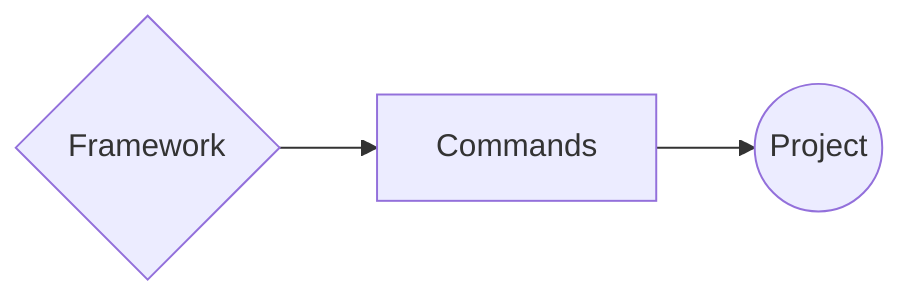

If you have reached this far, it means that you have **successfully** created your first "**Framework**" but really it doesn't do much.

**¿Or does it?**

Now, we will learn how to build something more sophisticated. For example putting together all those commands and using them in an application.

