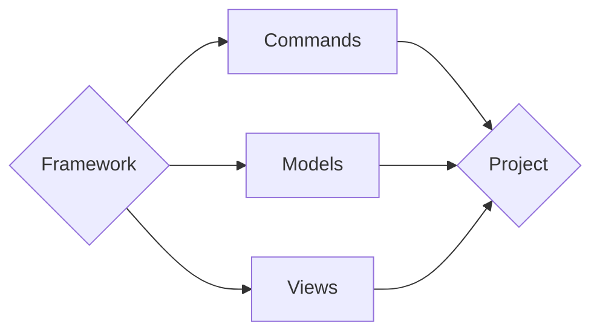

# Getting **Started**

!!! abstract "Framework"

    Let's build our first **Framework**

    - Imagine you have a **folder** named **`apps/`**
    - That contains a **folder** (**`module`**) named **`demo/`**
    - That contains a **file** named **`commands.py`**
    - That contains a **function** named **`test`**

    **Example:**

    ```python title="apps/demo/commands.py"
    from framework import commands # (1)

    @commands
    def test():
        print("Hello World (Commands)")
    ```

    1. **Explained Later ...**

    **Then** Imagine ...

    - That it also contains a **file** named **`middleware.py`**
    - That contains a **function** also named **`test`**

    > This part you will **learn more** under **Extras**

    **Example:**

    ```python title="apps/demo/middleware.py"
    def test():
        print("Hello World (Middleware)")
    ```

---

## Framework's **WorkFlow (Example)**



> Create your **root** folder. For example **`myproject/`**

<div id="terminal-0" data-termynal></div>

---

## Folder(s) **Setup**

```text
root/                   --> <Directory> - Project's Root
|
|-- config/             --> <Directory> - Project's Configurations
|   |-- settings.py     --> <File> - Settings { Pythonic }
|   |-- spoc.toml       --> <File> - Settings { TOML }
|   `-- .env/           --> <Directory> - Settings { Environment Variables }
|       |-- development.toml
|       |-- production.toml
|       `-- staging.toml
|
|--  framework/         --> <Directory> - Framework Demo
|   |-- __init__.py
|   |-- components.py   --> <File> - The Framework { Components }
|   `-- framework.py    --> <File> - The { Framework }
|
|--  apps/              --> <Directory> - { Apps } in HERE (aka: Py-Packages)
|   |-- app_one/
|   |-- app_two/
|   |-- etc...
|   `-- demo/
|       |
|       |-- __init__.py   --> <File> - Converts { Folder } to Python { Package }
|       |
|       |-- commands.py   --> <File> - Create Multiple { Commands } Here
|       |
|       |-- models.py     --> <File> - Create Multiple { Models } Here
|       |
|       `-- views.py      --> <File> - Create Multiple { Views } Here
|
|--  main.py              --> <File> - Main File
|
`-- etc...
```

> Create files for the **Settings**.

<div id="terminal-1" data-termynal></div>

## TOML **SPOC**

!!! abstract "Settings"

    Lets start by creating the **Project Settings**.

    - Imagine you have a **folder** called **`config/`**

```toml title="config/spoc.toml"
[spoc]
mode = "production" # development, production, staging, custom
# (1) custom_mode = "development"

[spoc.apps] # (2)
production = ["demo"]
development = []
staging = []

[spoc.extras]
middleware = ["demo.middleware.test"] # (3)
```

1. **Custom** uses **`settings.py`**.
2. **Apps** is where you select the "**Installed Apps**" for each **phase** of the **project**.
3. **Extras** are to create **`internal`** tools.

## Python **Settings**

```python title="config/settings.py"
# -*- coding: utf-8 -*-
"""
    { Settings }
"""

import pathlib

# Base Directory
BASE_DIR = pathlib.Path(__file__).parents[1]

# Installed Apps
INSTALLED_APPS = []
```

> Create files for the **Framework**.

<div id="terminal-2" data-termynal></div>

## **Setup** Framework (Demo)

=== "Framework"

    ```python title="framework/framework.py"
    # -*- coding: utf-8 -*-
    """{ Core } Read The Docs"""

    import spoc

    PLUGINS = ["commands", "models", "views"]

    @spoc.singleton
    class MyFramework:
        """Framework"""

        def init(
            self,
        ):
            """Class __init__ Replacement"""
            framework       = spoc.App(plugins=PLUGINS) # (1)

            # Core
            self.base_dir   = framework.base_dir
            self.mode       = framework.mode

            # Settings
            self.env        = framework.config["env"]
            self.pyproject  = framework.config["pyproject"]
            self.spoc       = framework.config["spoc"]
            self.settings   = framework.settings

            # Project
            self.component  = framework.component # (2)
            self.extras     = framework.extras # (3)

            # List All Tools (4)
            self.keys = [
                "base_dir",
                "mode",
                "env",
                "pyproject",
                "spoc",
                "settings",
                "component",
                "extras",
            ]
    ```

    1. **List**: The **name of the files** you want to **find**.
    2. **Component(s)**: (**`commands` | `models` | `views`**) will get **loaded here**
    3. **Extras**: for example (**`middleware`**) will get **loaded here**
    4. (**`Core` + `Settings` + `Project`**)

=== "Components"

    ```python title="framework/components.py"
    # -*- coding: utf-8 -*-
    """{ Components } Read The Docs"""

    import spoc

    components = {}
    components["command"] = {"type": "command"}

    # Class @Decorator
    def commands(
        cls: object = None,
    ):
        """Component Demo"""
        my_conf = {
            "is_cool": True
        }
        spoc.component(cls, config=my_conf, metadata=components["command"])
        return cls
    ```

    !!! abstract "Components"

        Remember I said I'll "**Explained Later**". Here we created a component **registration system** by using **`@decorator`**(s)

=== "Module"

    ```python title="framework/__init__.py"
    # -*- coding: utf-8 -*-
    """{ Module } Read The Docs"""

    from .components import commands, components
    from .framework import MyFramework
    ```

=== "Demo"

    !!! warning
        The **path** for this **file** is **"`apps/demo/`"** **not** **"`framework/`"**

    <div id="terminal-3" data-termynal></div>

    ```python title="apps/demo/commands.py"
    # -*- coding: utf-8 -*-
    """{ Demo } Read The Docs"""

    from framework import commands

    @commands
    def hello_world():
        print("Hello World (Commands)")
    ```

## **Test** Framework (Demo)

<div id="terminal-4" data-termynal></div>

```python title="main.py"
from framework import MyFramework

app = MyFramework()

app.component.commands['demo.hello_world'].object()
```

<div id="terminal-5" data-termynal></div>
