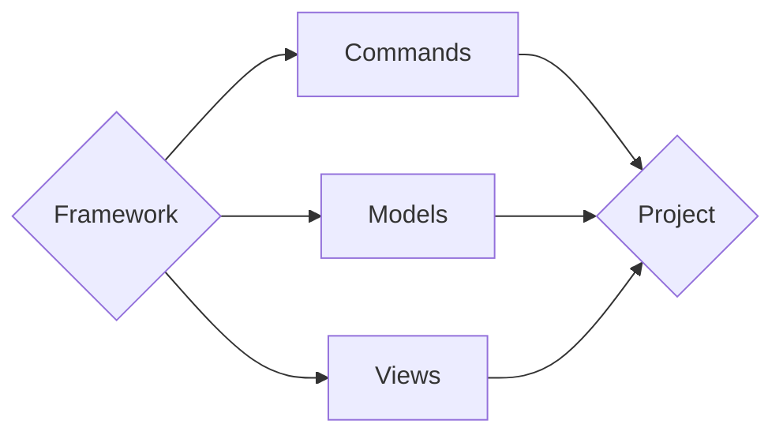

# Getting **Started**

We’re about to embark on an exciting journey of creating our very first framework from scratch and learning how to effectively use it in real-world applications. In this guide, we'll explore the essential building blocks of a framework, from setting up the project structure to creating components, defining plugins, and configuring settings.

---

## What You’ll Learn

By the end of this tutorial, you will:

1. **Understand the Fundamentals of a Framework**: Learn what a framework is, why it's useful, and how it differs from a library or a tool. We will cover the core concepts that make a framework powerful, such as modularity, extensibility, and configuration management.

2. **Set Up a Robust Project Structure**: We’ll guide you through setting up a clear and organized project structure that separates core framework files from application-specific files. This structure will make your framework easy to manage and extend.

3. **Create and Manage Components**: You’ll learn how to create reusable components within your framework. These components, like commands, models, and views, will form the foundation of your application logic.

4. **Implement Plugins for Extensibility**: Discover how to use plugins to extend the functionality of your framework. We’ll show you how to define and integrate plugins, allowing your framework to be adaptable to various needs.

5. **Configure Your Framework Using Python and TOML**: Configuration is key to making your framework flexible. You'll learn to use both Python and TOML for different configuration scenarios, making it easier to switch between development, staging, and production environments.

6. **Test and Validate Your Framework**: Testing is crucial to ensure your framework works as expected. We’ll cover best practices for testing your components and plugins to catch bugs early and ensure reliability.

## Why Build Your Own Framework?

Creating your own framework allows you to tailor its functionality to your specific needs, ensuring it fits perfectly with your development style and the requirements of your projects. It also gives you deeper insight into how frameworks work, enabling you to troubleshoot issues more effectively and innovate with new features that may not be available in existing frameworks.

## Let's Get Started!

We’ll start with the basics and gradually build up to more complex features. No prior experience in building frameworks is needed—just a willingness to learn and a passion for coding. By the end of this guide, you'll not only have a fully functional framework but also a solid understanding of the principles behind it.

Ready? Let’s dive in and start building something amazing together!

---

## Understanding the Framework's **Workflow**

Below is a high-level overview of the workflow in the framework using a flowchart:

