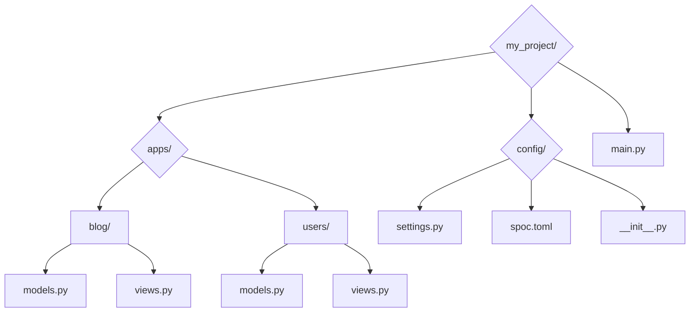
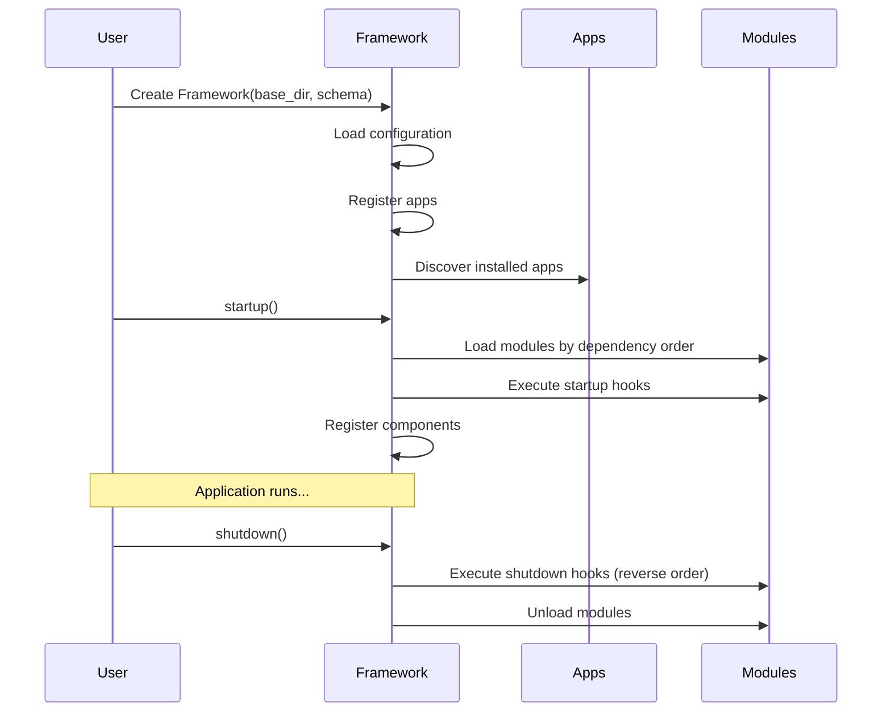

# Quick Start Guide

Get up and running with SPOC in minutes. This guide walks you through building your first SPOC application from scratch.

---

## What You'll Build

By the end of this guide, you'll have a working SPOC application that:

- Organizes code into modular apps
- Manages dependencies between modules
- Registers and discovers components
- Handles lifecycle events (startup/shutdown)

---

## Prerequisites

- Python 3.13 or higher
- Basic understanding of Python modules and classes

---

## Installation

Install SPOC using pip:

```bash
pip install spoc
```

---

## Project Structure

SPOC applications follow a Django-like structure with an `apps` directory containing your modular applications.



Create your project structure:

```bash
my_project/
├── apps/
│   ├── blog/
│   │   ├── __init__.py
│   │   ├── models.py
│   │   └── views.py
│   └── users/
│       ├── __init__.py
│       ├── models.py
│       └── views.py
├── config/
│   ├── __init__.py
│   ├── settings.py
│   └── spoc.toml
└── main.py
```

---

## Step 1: Configure Your Project

### Create Settings

Create `config/settings.py`:

```python
"""Project settings configuration."""

from pathlib import Path

# Base directory of the project
BASE_DIR: Path = Path(__file__).resolve().parent.parent

# Apps to load (always installed, regardless of mode)
INSTALLED_APPS: list = [
    "blog",
]

# Plugins for extending functionality
PLUGINS: dict = {
    "middleware": [],
    "hooks": [],
}
```

### Create SPOC Configuration

Create `config/spoc.toml`:

```toml
# Application Configuration
[spoc]
mode = "development"  # Options: development, staging, production
debug = true

# Apps by Environment Mode
[spoc.apps]
production = ["users"]
staging = []
development = []

# Additional Plugins
[spoc.plugins]
middleware = []
hooks = []
```

**How it works:**

- Apps in `INSTALLED_APPS` are always loaded
- Apps in `[spoc.apps.development]` load only in development mode
- Apps in `[spoc.apps.production]` load in production mode
- The mode determines which apps are active

---

## Step 2: Define Components

Components are reusable units of functionality that SPOC can discover and manage.

### Create Models

Create `apps/blog/models.py`:

```python
"""Blog models."""

import dataclasses as dc
from spoc import Components

# Create a component registry
components = Components()
components.add_type("model")

@dc.dataclass
@components.register("model")
class Post:
    """Blog post model."""
    id: int
    title: str
    content: str
    author_id: int

@dc.dataclass
@components.register("model")
class Comment:
    """Comment model."""
    id: int
    post_id: int
    text: str
    author_id: int
```

Create `apps/users/models.py`:

```python
"""User models."""

import dataclasses as dc
from spoc import Components

components = Components()
components.add_type("model")

@dc.dataclass
@components.register("model")
class User:
    """User model."""
    id: int
    username: str
    email: str
```

### Create Views

Create `apps/blog/views.py`:

```python
"""Blog views."""

from spoc import Components

components = Components()
components.add_type("view")

@components.register("view")
def list_posts():
    """List all blog posts."""
    return {"action": "list_posts", "status": "success"}

@components.register("view")
def create_post():
    """Create a new blog post."""
    return {"action": "create_post", "status": "success"}
```

---

## Step 3: Define Your Schema

The Schema defines which modules to load, their dependencies, and lifecycle hooks.

Create `main.py`:

```python
"""Main application entry point."""

from pathlib import Path
from spoc import Framework, Schema, Hook
from config import settings

# Define the application schema
schema = Schema(
    # Modules to load from each app
    modules=["models", "views"],

    # Module dependencies (views depend on models)
    dependencies={
        "views": ["models"],
    },

    # Lifecycle hooks
    hooks={
        "models": Hook(
            startup=lambda m: print(f"✓ Loaded models: {m.__name__}"),
            shutdown=lambda m: print(f"✗ Unloading models: {m.__name__}"),
        ),
        "views": Hook(
            startup=lambda m: print(f"✓ Loaded views: {m.__name__}"),
            shutdown=lambda m: print(f"✗ Unloading views: {m.__name__}"),
        ),
    },
)

# Create the framework instance
framework = Framework(
    base_dir=settings.BASE_DIR,
    schema=schema,
    echo=False,  # Set to True for debug output
    mode="strict",  # "strict" enforces all modules exist, "loose" allows missing
)

def main():
    """Run the application."""
    print("\n=== SPOC Application Started ===\n")

    # Access installed apps
    print(f"Installed apps: {framework.installed_apps}")

    # Get all models
    print("\n--- Registered Models ---")
    if hasattr(framework.components, 'models'):
        for name, model in framework.components.models.items():
            print(f"  • {name}: {model}")

    # Get all views
    print("\n--- Registered Views ---")
    if hasattr(framework.components, 'views'):
        for name, view in framework.components.views.items():
            print(f"  • {name}: {view}")

    # Get a specific component
    print("\n--- Using Components ---")
    list_posts = framework.get_component("views", "blog.list_posts")
    if list_posts:
        result = list_posts()
        print(f"list_posts() returned: {result}")

    print("\n=== Application Running ===\n")

    # When done, shutdown gracefully
    framework.shutdown()
    print("\n=== Application Stopped ===\n")

if __name__ == "__main__":
    main()
```

---

## Step 4: Run Your Application

Execute your application:

```bash
python main.py
```

Expected output:

```
apps_path C:\path\to\my_project\apps
✓ Loaded models: blog.models
✓ Loaded models: users.models
✓ Loaded views: blog.views

=== SPOC Application Started ===

Installed apps: ['blog', 'users']

--- Registered Models ---
  • blog.Post: <class 'blog.models.Post'>
  • blog.Comment: <class 'blog.models.Comment'>
  • users.User: <class 'users.models.User'>

--- Registered Views ---
  • blog.list_posts: <function list_posts at 0x...>
  • blog.create_post: <function create_post at 0x...>

--- Using Components ---
list_posts() returned: {'action': 'list_posts', 'status': 'success'}

=== Application Running ===

✗ Unloading views: blog.views
✗ Unloading models: users.models
✗ Unloading models: blog.models

=== Application Stopped ===
```

---

## Understanding Key Concepts

### 1. Schema

The `Schema` defines your application's structure:

```python
schema = Schema(
    modules=["models", "views", "services"],
    dependencies={
        "views": ["models"],
        "services": ["models"],
    },
    hooks={
        "models": Hook(startup=init_db, shutdown=close_db),
    },
)
```

- **modules**: List of module names to load from each app
- **dependencies**: Dictionary mapping modules to their required dependencies
- **hooks**: Lifecycle callbacks for module startup/shutdown

### 2. Framework

The `Framework` orchestrates your application:

```python
framework = Framework(
    base_dir=Path("./my_project"),
    schema=schema,
    echo=False,
    mode="strict",
)
```

- **base_dir**: Root directory of your project
- **schema**: Schema defining modules and dependencies
- **echo**: Enable debug output (default: False)
- **mode**:
  - `"strict"` - All modules must exist in all apps
  - `"loose"` - Apps can have missing modules

### 3. Components

Components are discoverable units with metadata:

```python
from spoc import Components

components = Components()
components.add_type("service")

@components.register("service", config={"timeout": 30})
class EmailService:
    pass
```

Access components via the framework:

```python
# Get a specific component
service = framework.get_component("service", "notifications.EmailService")

# Get all components of a type
all_services = framework.components.service.values()
```

### 4. Lifecycle Hooks

Hooks execute during module loading/unloading:

```python
def init_database(module):
    """Called when module loads."""
    print(f"Initializing database for {module.__name__}")
    # Setup database connections, create tables, etc.

def close_database(module):
    """Called when module unloads."""
    print(f"Closing database for {module.__name__}")
    # Close connections, cleanup resources

hooks = {
    "models": Hook(
        startup=init_database,
        shutdown=close_database,
    ),
}
```

---

## Application Lifecycle

The framework follows this lifecycle:



**Automatic Startup**: The Framework calls `startup()` automatically during initialization.

---

## Common Patterns

### Pattern 1: Shared Component Registry

Create a shared registry for consistent component types across your app:

```python
# framework/components.py
from spoc import Components

components = Components()
components.add_type("model")
components.add_type("view")
components.add_type("service")

# Export decorators
def model(obj):
    return components.register("model", obj)

def view(obj):
    return components.register("view", obj)

def service(obj):
    return components.register("service", obj)
```

Use in your apps:

```python
# apps/blog/models.py
from framework.components import model

@model
class Post:
    pass
```

### Pattern 2: Dependency Injection

Access framework components from anywhere:

```python
class PostService:
    def __init__(self, framework):
        self.framework = framework

    def create_post(self, title, content):
        # Get the Post model
        Post = self.framework.get_component("model", "blog.Post")
        return Post(id=1, title=title, content=content)
```

### Pattern 3: Environment-Based Apps

Control which apps load based on environment:

```toml
# spoc.toml
[spoc]
mode = "production"

[spoc.apps]
production = ["core", "api"]
development = ["core", "api", "debug", "docs"]
```

---

## Next Steps

Now that you have a working SPOC application:

1. **Learn about Configuration**: See [Configuration Guide](configuration.md) for advanced settings
2. **Explore Components**: Read [Components API](../api/components.md) for metadata and validation
3. **Study the Framework**: Check [Framework API](../api/framework.md) for advanced features
4. **Review Examples**: Browse the `examples/` directory in the repository

---

## Troubleshooting

### Apps Not Loading

**Problem**: Apps aren't being discovered.

**Solution**: Ensure:
- Apps are in the `apps/` directory
- Each app has an `__init__.py` file
- Apps are listed in `INSTALLED_APPS` or `[spoc.apps.<mode>]`

### Module Not Found

**Problem**: `ModuleNotFoundError` when loading modules.

**Solution**: Check:
- Module name matches the file name (e.g., `models.py` for "models")
- Module is listed in `schema.modules`
- Dependencies are declared correctly

### Circular Dependencies

**Problem**: `CircularDependencyError` during startup.

**Solution**:
- Review `schema.dependencies` for circular references
- Restructure dependencies to remove cycles
- Consider splitting modules differently

### Strict Mode Errors

**Problem**: Framework errors about missing modules.

**Solution**:
- Set `mode="loose"` to allow missing modules
- Or ensure all apps have all required modules
- Or remove apps that don't match the schema

---

## Summary

You've learned how to:

- Structure a SPOC project with apps
- Define schemas with modules, dependencies, and hooks
- Register and discover components
- Manage application lifecycle
- Access components from the framework

SPOC provides a solid foundation for building modular, maintainable Python applications. Continue exploring the documentation to unlock its full potential.
