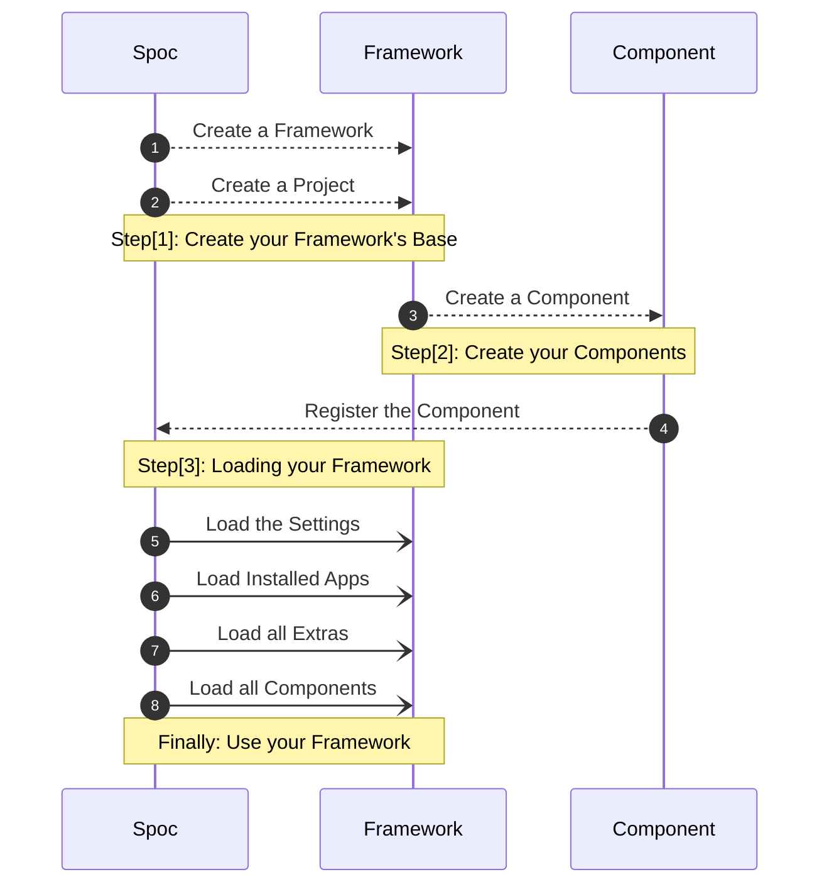

# Welcome to **S.P.O.C**

**SPOC** aims to be the **base** for building **elastic** **`frameworks`**.
The idea is to create a schema for your **project**(s) and then build up on that **schema**.

> **S.P.O.C** is the acronym of **Single Point of Connections**

<div id="terminal-root" data-termynal></div>

!!! abstract "Components"

    To put it in a simple way, **SPOC** will **collect** all of the **`Objects`** you **mark** aka: **`@decorate`** as a **Component**(s).

    ``` python title="example.py"
    @component
    def hello_world():
        print("Hello World")
    ```

!!! abstract "Extras"

    To put it in a simple way, **SPOC** will **collect** all of the **Extra(s)** **`Objects`** you **list** aka: **`register`** as a type of **Extra**(s).

    ``` toml title="spoc.toml"
    [spoc]
    # ...

    [spoc.extras]
    middleware = ["demo.middleware.function"] # (1)
    before_server = ["demo.middleware.before_server_function"] # (2)
    ```

    1. Extra: of type **`middleware`**
    1. Extra: of type **`before_server`**

---

## Spoc **WorkFlow**


