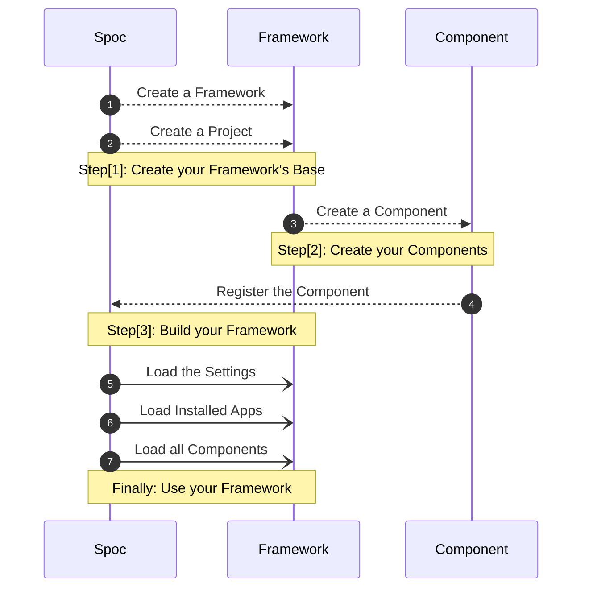

# Welcome to **S.P.O.C**

**SPOC** aims to be the **base** for building **elastic** **`frameworks`**.
The idea is to create a schema for your **project**(s) and then build up on that **schema**.

> **S.P.O.C** is the acronym of **Single Point of Contact**

---

## Spoc **WorkFlow**

