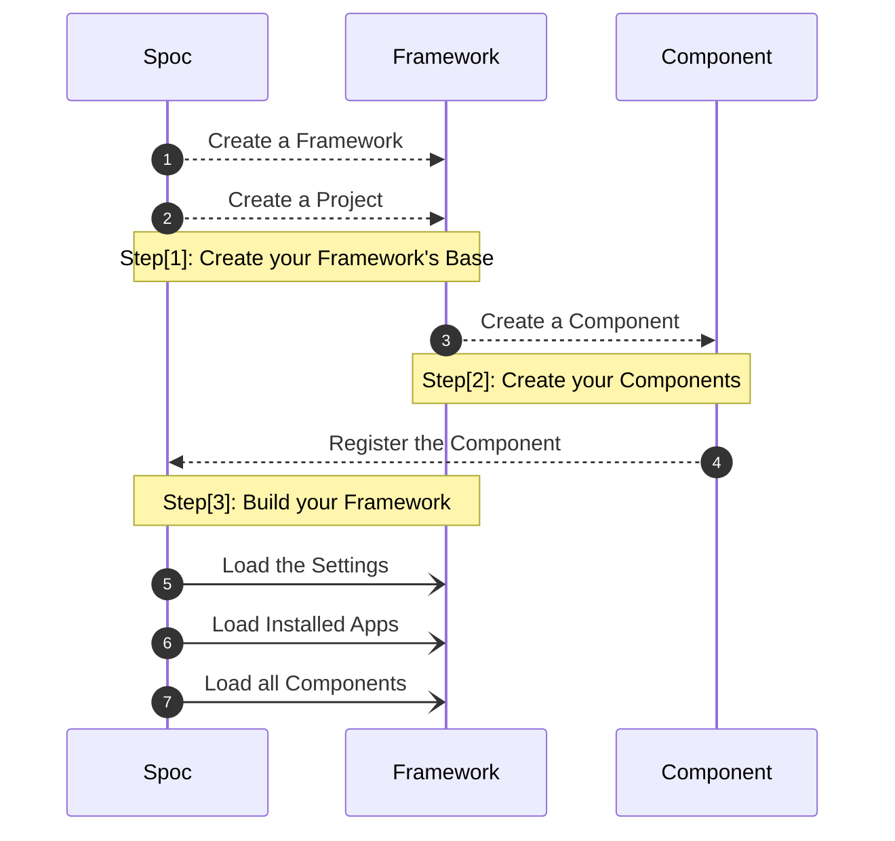
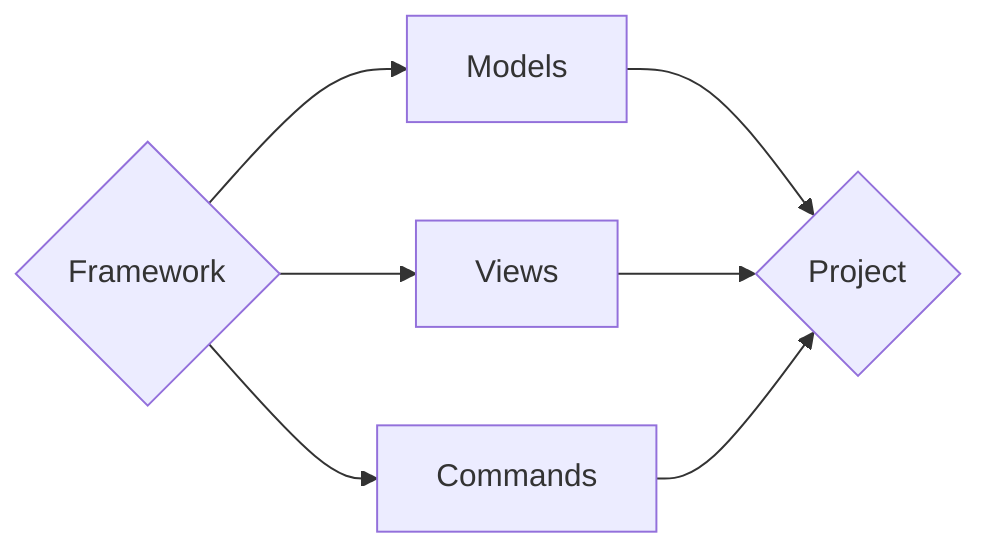

# Welcome to **S.P.O.C**

**SPOC** aims to be the **base** for building elastic **`frameworks`**.
The idea is to create a schema for your project(s) and then build up on those blocks.

> **S.P.O.C** is the acronym of **Single Point of Contact**

## Core **API**

| Key             | Description                                             | Variables                        |
| --------------- | ------------------------------------------------------- | -------------------------------- |
| **`framework`** | Tool to create the **Base** of the **Framework**.       | `(object)`                       |
| **`project`**   | Tool to create a **Framework** for your **Project**.    | `(object)`                       |
| **`component`** | Tool to create **Component(s)** for your **Framework**. | `(config: dict, metadata: dict)` |
| **`root`**      | A wrapper for **`pathlib.Path(path).parents`**          | `(path)`                         |

---

## Spoc **WorkFlow**



---

## Framework's **WorkFlow (Example)**



---

## Folder(s) **Setup**

```text
root/                   --> <Directory> - Project's Root.
|
|--  framework.py       --> <File> Framework Demo
|
|--  main.py            --> <File> Main File
|
|--  apps/              --> <Directory> - { Apps } in HERE (aka: Py-Packages).
|   |
|   |-- app_one/
|   |
|   `-- app_two/
|     |
|     |-- __init__.py   --> <File|Package> - Converts { Folder } to { Package }
|     |
|     |-- commands.py   --> <File|Module> - Create Multiple { Commands } Here.
|     |
|     `-- models.py     --> <File|Module> - Create Multiple { Models } Here.
|
`-- etc...
```

## Spoc **Demo**

=== "Framework"

    ```py title="framework.py"
    # -*- coding: utf-8 -*-
    """ [ Framework ]

        Step [1]: INIT a { Framework }.
        Step [2]: Create a Project with the { Framework }.
    """
    import typing

    import spoc

    root = spoc.root
    component = spoc.component

    @spoc.framework
    class Framework:
        """Framework Builder"""

        plugins = ["commands", "models", "views"]


    @spoc.project
    class Project:
        """Framework"""

        def init(
            self,
            base_dir: typing.Any = None,
            mode: str = "cli",
        ):
            """Class __init__ Replacement"""

            Framework(base_dir=base_dir, mode=mode, app=self)
    ```

=== "Component (commands.py)"

    ```py title="commands.py"
    # -*- coding: utf-8 -*-
    """ [ Plugin ]
    """
    import framework as fw

    # Example [ 1 ]
    @fw.component(config={"engine": "click"})
    class MyCommands:
        name: str

    # Example [ 2 ]
    class MyOtherCommand:
        name: str

    fw.component(MyOtherCommand, config={"engine": "click"})
    ```

=== "Testing (main.py)"

    ```py title="main.py"
    # -*- coding: utf-8 -*-
    """ [ Project ]
    """
    import framework as fw

    # Base Directory
    BASE_DIR = fw.root(__file__)[0]

    # App
    App = fw.Project(base_dir=BASE_DIR, mode="cli")
    ```
