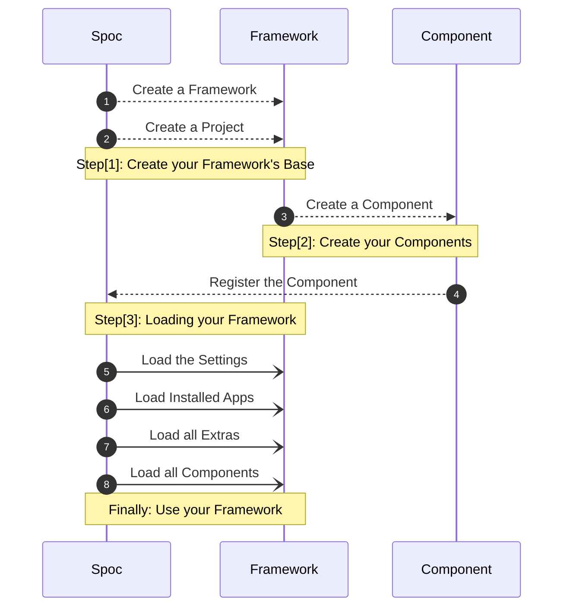

# Welcome to **S.P.O.C**

**SPOC** serves as the foundation for constructing dynamic and adaptable **`frameworks`**. The concept involves creating a schema for your **project**(s) and building upon that foundational **schema**.

> **S.P.O.C** stands for **Single Point of Connections**

<div id="terminal-root" data-termynal></div>

## **SPOC** allows you to **collect** designated **`Objects`**

!!! abstract "Components"

    **Components** are created by marking specific **`Objects`** with a **`@custom_decorator`**.

    ``` python title="example.py"
    @component
    def hello_world():
        print("Hello World")
    ```

!!! abstract "Extras"

    To load **Extras**, list them within a dedicated **`attribute`**.

    For example: **`middleware`** or **`before_server`** inside the **`spoc.toml`** configuration file.

    ``` toml title="spoc.toml"
    [spoc]
    # ...

    [spoc.extras]
    middleware = ["demo.middleware.function"] # (1)
    before_server = ["demo.middleware.before_server_function"] # (2)
    ```

    1. Extra: of type **`middleware`**
    1. Extra: of type **`before_server`**

---

## Spoc **WorkFlow**


