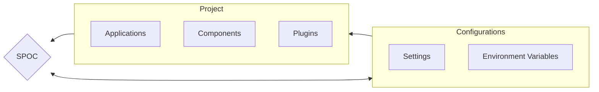
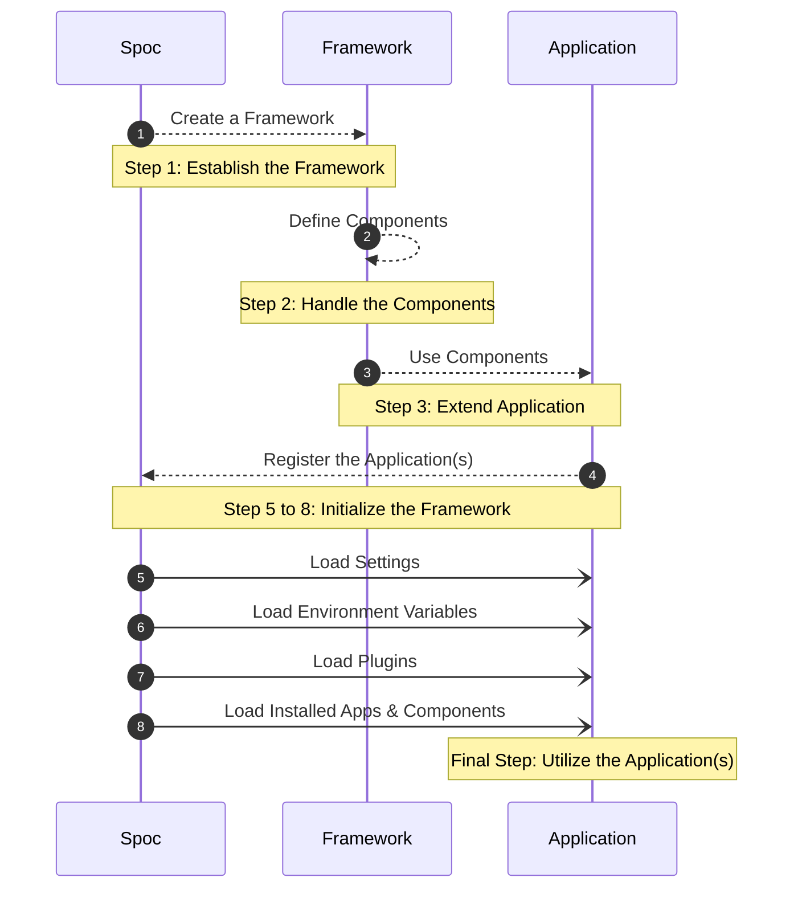

#

<div style="text-align:center; margin-top: -60px;">
 
</div>

**SPOC** is a foundational framework designed to create dynamic and adaptable **`frameworks`**. It involves defining a schema for your **project**(s) and building upon that schema to create a flexible and powerful Application.

---

<p align="center" class="name-acronym" >
    {{ acronym("Single") }} — 
    {{ acronym("Point") }} — 
    {{ acronym("Of") }} — 
    {{ acronym("Connections") }}
</p>

---

<!-- termynal -->

```
$ python -m pip install spoc
---> 100%
Successfully installed spoc!
```

---

## SPOC **Connections**



---

## SPOC **Workflow**



### Explanation

- (1) **Create a Framework Using SPOC**: Start by using SPOC to define the structure of your framework. This involves setting up the initial framework architecture.

- (2) **Handle Components within the Framework**: Organize and manage the various components that make up your framework. These components are the building blocks that define the functionality of your framework.

- (3) **Extend the Application Using Framework Components**: Incorporate the framework's components into your application. This step involves integrating these components to enhance and extend the capabilities of your application.

- (4) **Register Applications with the Framework and SPOC**: Connect your applications to the framework, thereby registering them with SPOC. This registration process ensures that all applications are aware of the framework's components and configurations.

- (5 - 8) **Load All Necessary Elements**: Sequentially load all required settings, environment variables, plugins, installed apps and components into the framework. This step ensures that all elements are properly initialized and ready for use.

- (Final) **Utilize Your Fully Loaded Applications**: Once everything is loaded, you can effectively use your applications. This final step allows you to leverage all loaded components, plugins, settings, and environment variables to operate your applications smoothly within the framework.

---

## Key Features of **SPOC**

- Loading **Configurations**
- Loading **Plugins**
- Collecting **Components**

### Loading **Plugin `Objects`**

To integrate **Plugins**, specify them under a dedicated **`attribute`** in your configuration files. This allows you to manage middleware and other plugin types effectively.

**Configuration Example (`TOML`):**

```toml title="config/spoc.toml"
...
[spoc.plugins]
middleware = ["demo.middleware.MyClass"] # (1)
before_server = ["demo.middleware.before_server_function"] # (2)
...
```

1. **`middleware`**: List of middleware classes to be used.
2. **`before_server`**: List of functions to be executed before the server starts.

**Configuration Example (`Python`):**

```python title="config/settings.py"
...
PLUGINS: dict = {
    "middleware": ["demo.middleware.MyClass"], # (1)
    "before_server": ["demo.middleware.before_server_function"], # (2)
}
...
```

1. **`middleware`**: Extra of type **middleware**.
2. **`before_server`**: Extra of type **before_server**.

### Collecting **Component `Objects`**

**SPOC** facilitates the collection of specific **`Objects`** through the use of a **`@component`** decorator or by subclassing **`Component`**.

**Usage Example:**

```python title="example.py"
@component
def hello_world():
    print("Hello World")

class HelloWorld(Component):
    """A subclass of Component"""
```

- **`@component` decorator**: Registers the function or class as a component.
- **`Component` subclass**: Inherits from a `Base` to be recognized as a component.

<style>
    .mermaid{
        text-align:center
    }
</style>
