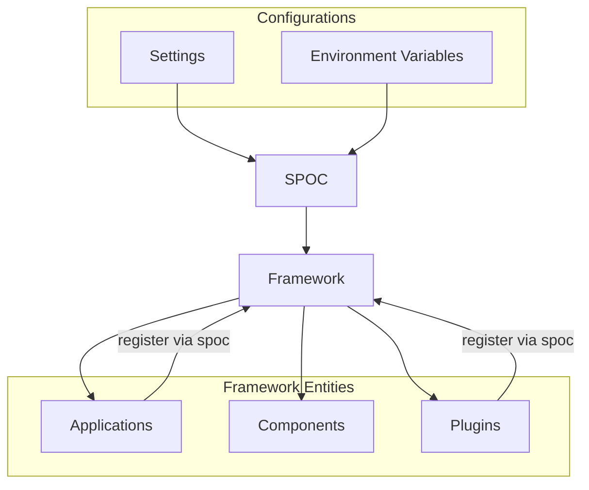
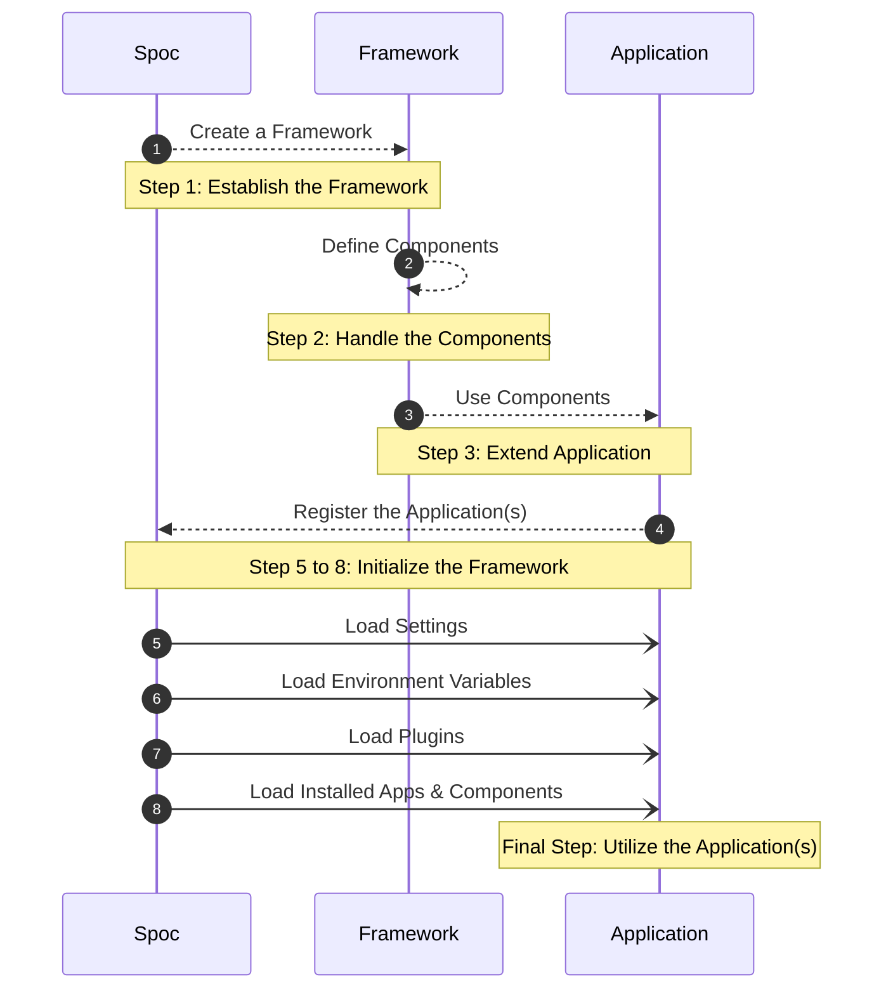

# SPOC - Single Point Of Connections

<div style="text-align:center; margin-top: 0px;">
 
</div>

**SPOC** is a powerful Python framework for building Django-like modular monolith applications. It provides a structured approach to application organization with dynamic module loading, dependency management, and lifecycle orchestration.

---

<p align="center" class="name-acronym" >
    {{ acronym("Single") }} — 
    {{ acronym("Point") }} — 
    {{ acronym("Of") }} — 
    {{ acronym("Connections") }}
</p>

---

<!-- termynal -->

```
$ python -m pip install spoc
---> 100%
Successfully installed spoc!
```

## What is SPOC?

SPOC (Single Point Of Connections) is a framework for building modular monolithic applications in Python, inspired by Django's app system. It provides:

- **App-based Architecture**: Organize your codebase into reusable, self-contained apps
- **Dynamic Module Loading**: Import modules at runtime with dependency resolution
- **Component Registration**: Declarative component system with metadata support
- **Middleware & Hooks**: Plugin system for cross-cutting concerns
- **Application Lifecycle**: Structured startup and shutdown processes
- **Dependency Management**: Handle module dependencies with circular dependency detection

SPOC helps you create organized, maintainable applications with clear separation of concerns while keeping the simplicity of a monolithic architecture.

## Key Features

- **Django-like App System**: Structure your application into reusable, self-contained modules
- **Framework**: Application orchestration with lifecycle management
- **Components Registry**: Tag and discover components with rich metadata
- **Importer**: Efficient module loading with dependency tracking and caching
- **Configuration Handling**: Flexible settings and environment variable management
- **Plugin System**: Extensible architecture for middleware and cross-cutting concerns
- **Worker System**: Background task management for concurrent operations

## SPOC **Architecture**



## SPOC **Workflow**



## App Structure

SPOC apps are organized in a modular structure similar to Django apps. A typical app might include:

```
myapp/
├── __init__.py  # App initialization
├── models.py    # Data models
├── views.py     # View handlers
├── services.py  # Business logic
└── components/  # Custom components
```

Apps are registered in your configuration and loaded automatically by the framework during startup.

## Getting Started

SPOC is designed to be simple to use while providing powerful capabilities:

```python
from pathlib import Path
from spoc.framework import Framework, Schema

# Define your application structure
schema = Schema(
    modules=["models", "views", "services"],
    dependencies={
        "views": ["models"],
        "services": ["models"]
    },
    hooks={
        "models": {
            "startup": lambda m: print(f"Initializing models: {m}"),
            "shutdown": lambda m: print(f"Shutting down models: {m}")
        }
    }
)

# Create and initialize the framework
framework = Framework(
    base_dir=Path("./my_project"),
    schema=schema
)

# Start your application
framework.startup()

# When done
framework.shutdown()
```

Check out the [Quick Start](getting-started/quick-start.md) guide to begin using SPOC in your projects.

---

<style>
    .mermaid{
        text-align:center
    }
</style>
