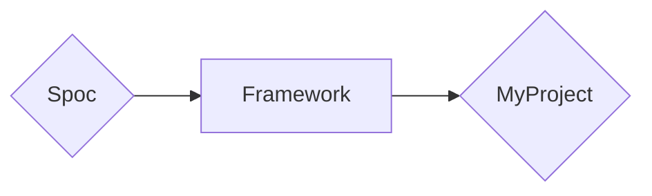

# Welcome to **S.P.O.C**

For full documentation visit [mkdocs.org](https://www.mkdocs.org).

## Folder(s) **Setup**

```text
root/                    --> <Directory> - Project's Root.
|
|--  main.py             --> Main File (for example: FastAPI's Main)
|
|--  apps/               --> <Directory> - Modules (aka: Apps) in HERE.
|    |
|    |-- app_one/
|    |
|    `-- app_two/
|        |
|        |-- __init__.py --> <File|Package> - Converts { Folder } to { Package }
|        |
|        |-- commands.py --> <File|Module> - Create Many { Commands } Here.
|        |
|        `-- models.py   --> <File|Module> - Create Many { Models } Here.
|
`-- etc...
```

## **WorkFlow**



## **Demo**

=== "Framework"

    ```py title="framework.py"
    # -*- coding: utf-8 -*-
    """ [ Framework ]

        Step [1]: INIT a { Framework }.
        Step [2]: Create a Project with the { Framework }.
    """
    import typing

    import spoc

    root = spoc.root
    plugin = spoc.plugin

    @spoc.framework
    class Framework:
        """Framework Builder"""

        plugins = ["commands", "models"]


    @spoc.project
    class Project:
        """Framework"""

        def init(
            self,
            base_dir: typing.Any = None,
            mode: str = "cli",
        ):
            """Class __init__ Replacement"""

            # Step[1]: INIT { Admin }
            Framework(base_dir=base_dir, mode=mode, app=self)

            # Finally: Collect { Keys }
            self.keys = [x for x in spoc.get_fields(self) if x not in ["init"]]
    ```

=== "Plugin (commands.py)"

    ```py title="commands.py"
    # -*- coding: utf-8 -*-
    """ [ Plugin ]
    """
    import framework as fw


    @fw.plugin(config={"engine": "click"})
    class MyCommands:
        name: str
    ```

=== "Testing (main.py)"

    ```py title="main.py"
    # -*- coding: utf-8 -*-
    """ [ Project ]
    """
    import framework as fw

    # Base Directory
    BASE_DIR = fw.root(__file__)[0]

    # App
    App = fw.Project(base_dir=BASE_DIR, mode="cli")
    ```
