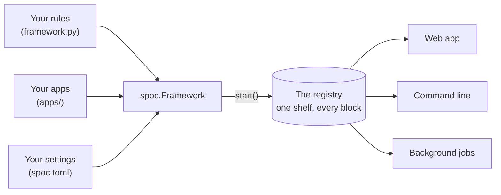

# Welcome to SPOC

**SPOC helps you build your own framework.**

Frameworks like Django have rules: "put models in `models.py`, and I will find
them." SPOC lets *you* write rules like that — in about five lines — and it
does all the finding for you. That claim is a tutorial, not a slogan:
[build a framework](learn/build-a-framework.md) takes you from an empty folder
to `curl` talking to your own framework, in four files.

## See it work

Three commands to a working, dependency-free application:

<!-- termynal -->

```
$ pip install spoc
$ spoc init myproject --template starter
$ cd myproject && python main.py --help
usage: myproject [-h] {core.add,core.items} ...

positional arguments:
  {core.add,core.items}
    core.add            Add an item to the store.
    core.items          List the items in the store.

options:
  -h, --help            show this help message and exit
```

That help text was not written anywhere. It is **derived** — from blocks the
generated app registered, by rules the generated `framework.py` declares. The
docs' test suite generates this exact project and checks this exact output.
[The starter](getting-started/starter.md) walks through every file.

## The idea, with a toy box

Imagine your project is a big box of building blocks.

1. **You say what kinds of blocks exist.** Maybe `models` and `views`.
2. **You put blocks in apps** — small folders, one file per kind.
3. **SPOC picks every block up** and puts it on **one shelf** (the registry).
4. **Every block gets one name tag**: `kind:namespace.object_name` —
   for example `models:blog.post`.

Need a block? Ask the shelf by its name tag. That's the whole trick.


```mermaid
flowchart LR
    F["Your rules<br/>(framework.py)"] --> S["spoc.Framework"]
    A["Your apps<br/>(apps/)"] --> S
    T["Your settings<br/>(spoc.toml)"] --> S
    S -- "start()" --> R[("The registry<br/>one shelf, every block")]
    R --> H["Web app"]
    R --> C["Command line"]
    R --> W["Background jobs"]
```

## What it looks like

Your whole framework is one declaration:

```python title="framework.py"
import spoc

framework = spoc.Framework("models")

model = framework.kind("models")
```

An app declares a block with one decorator:

```python title="apps/blog/models.py"
from framework import model


@model
class Post:
    """Registers as models:blog.post — the name tag is made for you."""
```

Your settings say which apps to boot:

```toml title="config/spoc.toml"
[spoc.apps]
development = ["apps.blog"]
```

And your entry point starts everything and asks the shelf:

```python title="main.py"
from pathlib import Path

from framework import framework

BASE_DIR = Path(__file__).resolve().parent

framework.start(BASE_DIR)

record = framework.resolve("models:blog.post")
print(record.object)  # <class 'apps.blog.models.Post'>
```

## What SPOC is (and is not)

SPOC is a **registry**: it discovers, organizes, and hands back your blocks.
It never runs them. The web server, the CLI, the worker — those are thin
layers *you* build by reading the shelf. That keeps SPOC small, and it keeps
you in charge.

So SPOC replaces nothing you already use. FastAPI still serves your HTTP,
Typer still parses your argv, Celery still runs your jobs, pytest still runs
your tests. SPOC answers the one question none of them answer: *what does
this app contain, and under what name?*

- **Zero dependencies.** The core is pure standard library.
- **Loud failures.** A typo never boots a half-working project; you get an
  error that names exactly what went wrong.
- **Nothing happens at import.** Your project only boots when you say
  `start()`.

## Where to go next

- [Install SPOC](getting-started/installation.md) — one command.
- [Your first project](getting-started/quick-start.md) — running in two minutes.
- [The settings file](getting-started/configuration.md) — the one file SPOC reads.
- [Learn the pieces](learn/framework.md) — framework, name tags, registry,
  apps, lifecycle.
- [Tools](tools/cli.md) — the `spoc` command, testing helpers, and data files.
