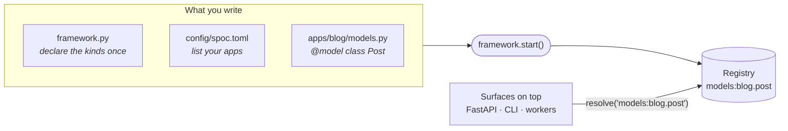

# SPOC

**A registry-first runtime kernel for modular monolithic Python applications.**

In plain words: you tell SPOC once what kinds of things your framework has
(`models`, `views`, `commands`, …), point it at your apps, and every class or
function you mark lands in one searchable registry under a name you can
predict:

```
kind:namespace.object_name        e.g.  models:blog.post
```

SPOC sits *below* your HTTP framework, not in place of it. It discovers apps,
loads their modules in dependency order, manages lifecycle, and registers
every declared object. Surfaces — FastAPI, Robyn, a CLI, a worker — are built
*on top* by enumerating the registry. The kernel **describes; it never
executes**: it never calls your code beyond lifecycle hooks, and resolution
is a pure lookup.


```mermaid
flowchart LR
    subgraph project ["What you write"]
        direction TB
        fw["framework.py<br/><i>declare the kinds once</i>"]
        toml["config/spoc.toml<br/><i>list your apps</i>"]
        app["apps/blog/models.py<br/><i>@model class Post</i>"]
    end

    boot(["framework.start()"])
    reg[("Registry<br/>models:blog.post")]
    surfaces["Surfaces on top<br/>FastAPI · CLI · workers"]

    project --> boot --> reg
    surfaces -- "resolve('models:blog.post')" --> reg
```

## What SPOC does

- **App discovery** — apps declared as dotted module paths in `spoc.toml` and
  imported through Python's normal import system, selected per mode (the
  default `development` → `staging` → `production` cascade, extensible via
  `[spoc.modes]`)
- **Dependency-ordered loading** — modules load and initialize in dependency
  order; teardown runs in reverse
- **One flat registry** — every component is a typed record with `kind`,
  `namespace`, and `object_name` facets; grouped views are derived, never stored
- **Conventional identity** — write PEP 8 Python; class names derive their
  snake_case identifier automatically. A name you *state* is verbatim and
  validated, and lookups are always exact
- **Precise resolution** — `framework.resolve("models:blog.post")` fails per
  segment, naming what didn't resolve and the valid candidates
- **Lifecycle phases** — `on_ready` finalize after discovery, per-kind
  startup/shutdown hooks, module `initialize`/`teardown` — sync and async
  entry points (`start`/`astart`, `shutdown`/`ashutdown`)
- **One config file** — `spoc.toml` is the only file the kernel reads;
  your `settings.py` stays yours

## What SPOC deliberately does not do

- **No dependency injection** — resolution is a lookup; wiring belongs to
  consumers (adopt a DI container on top if you want one)
- **No invocation** — there is no `do()`; identifiers have exactly three
  segments and never an operation suffix
- **No event bus, no HTTP, no workers** — those are apps and surfaces that
  register *on* the kernel

## Zero dependencies

The kernel has no runtime dependencies — `dependencies = []` is an invariant,
not an accident.

## A taste — a whole project in four files

`framework.py` — say what kinds exist, once:

```python
import spoc

framework = spoc.Framework("models")
model = framework.kind("models")
```

`config/spoc.toml` — say which apps to load:

```toml
[spoc.apps]
production = ["apps.blog"]
```

`apps/blog/models.py` — write normal Python and mark it. The file name is the
kind, the app is the namespace, the class name becomes the object name:

```python
from framework import model

@model
class Post:              # registered as models:blog.post
    ...
```

`main.py` — start, then look things up:

```python
from pathlib import Path

from framework import framework

framework.start(Path(__file__).resolve().parent)

record = framework.resolve("models:blog.post")
print(record.object)          # <class 'apps.blog.models.Post'>

for component in framework.registry:
    print(component.identifier)   # models:blog.post
```

(`apps/` and `apps/blog/` each carry an empty `__init__.py` — they are normal
Python packages.) `spoc init` generates exactly this shape for you — continue
with the [Quick Start](getting-started/quick-start.md).
