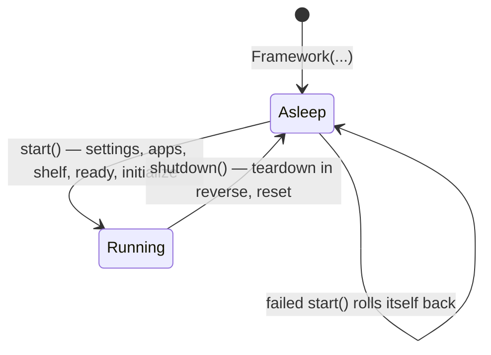

# Start & Stop

A SPOC project has a simple life: **asleep → starting → running → stopped**.
Nothing happens by accident, and every step either finishes or fails loudly.

## What `start()` does, in order

```python test="skip"
framework.start(BASE_DIR)
```

1. **Read settings** — `spoc.toml` and the active mode's env file.
2. **Import apps** — every installed app's modules, in dependency order.
3. **Fill the shelf** — discover every decorated block, tag it, register it.
4. **Ready callbacks** — your `@framework.on_ready` functions run once, with
   the full registry.
5. **Wake the modules** — for each app module: the kind's `on_startup` hook
   fires, then the module's own `initialize()` runs.

If *anything* fails, SPOC tears down what already came up and returns the
framework to its inert state — fix the cause and `start()` again cleanly.

`shutdown()` walks the same road backwards: each module's `teardown()` and the
kind's `on_shutdown` hook run in **reverse** order, then everything resets.

## Per-module wake-up and clean-up

Any app module may define two plain functions:

```python title="apps/blog/models.py"
from framework import model


@model
class Post: ...


def initialize():
    print("blog models are awake")


def teardown():
    print("blog models are done")
```

No decorator, no registration — if the functions exist, SPOC calls them at the
right moments. A module whose `initialize()` never completed is never asked to
`teardown()`.

Around it, the quick-start shape — rules, settings, start button — and both
moments print on cue:

```python title="framework.py"
import spoc

framework = spoc.Framework("models")

model = framework.kind("models")
```

```toml title="config/spoc.toml"
[spoc.apps]
development = ["apps.blog"]
```

```python title="main.py"
from pathlib import Path

from framework import framework

BASE_DIR = Path(__file__).resolve().parent

framework.start(BASE_DIR)     # blog models are awake
framework.shutdown()          # blog models are done
```

## Per-kind hooks

A kind can watch all its blocks come and go. The hook fires **once per app
module**, receiving that app's blocks of the kind, in tag order:

```python
import spoc


def warm_up(components):
    for c in components:
        print("starting:", c)


framework = spoc.Framework(
    spoc.KindSpec("models", on_startup=warm_up),
)
```

## Async projects

Everything above has an async twin. Declare coroutine hooks or an async
`initialize()`/`teardown()`, and boot with:

```python test="skip"
await framework.astart(BASE_DIR)
...
await framework.ashutdown()
```

The rule is strict on purpose: the sync path (`start`) **refuses** coroutine
hooks with a clear error instead of quietly not awaiting them. Pick one path
per project.

## Guard rails

- **Starting twice** → error. Stop first.
- **Calling `start()` or `shutdown()` from inside a hook or ready callback**
  → error. The boot is half-built; there is nothing correct that call could do.
- **Two threads racing to start** → exactly one boots; the other gets the
  already-started error.

## The whole life, at a glance



Next: [plugins — blocks declared in settings](plugins.md).
