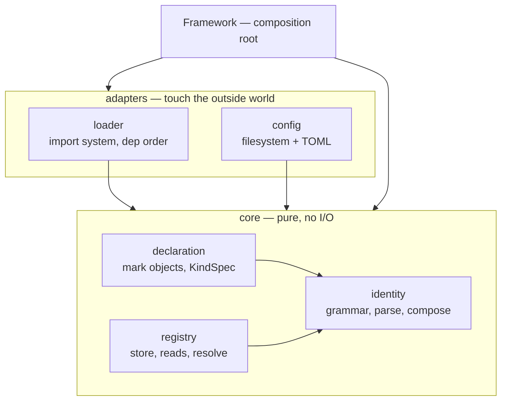

## Context

The kernel is 1,823 lines across nine modules. Measured: ~629 of those lines are
per-function prose restating type annotations, and the remainder contains three stored
copies of the declared kind set, five checks against those copies, two parallel hook
mechanisms, a regex engine serving exactly one pattern shape, and constructor options that
are stored and never read.

The structural root cause is a dependency inversion. `Registry` is a pure core concern —
a store with no I/O — but it is constructed and owned by `Importer`, which is an adapter
over Python's import system. Because core is nested inside an adapter, the adapter must
know what a kind is, `Framework` must reach through the importer to read its own registry,
and per-kind attributes have nowhere to live except parallel dictionaries keyed by kind
name. That is what makes both deferred API items expensive today: each would be threaded
as a new parameter through five layers.

Constraints: the package has no users, so no compatibility path is owed. The published
wheel has zero runtime dependencies, verified. The published API reference renders from
the docstrings this change removes.

## Goals / Non-Goals

**Goals:**

- Restore the inward-only dependency direction: pure core, adapters at the edge.
- Make a kind one declared object so per-kind optionality and per-kind metadata are fields
  rather than plumbing.
- Reduce the kernel from 1,823 to roughly 810 lines, reporting structural and
  documentation reductions separately so neither flatters the other.
- Preserve every invariant in "Invariants" below, and every error message a user can see.

**Non-Goals:**

- `src/spoc/scaffold/` — untouched, a separate subject.
- Removing capability. Whether module lifecycle, the plugin table, and the environment
  cascade belong in the kernel is a later question; this change relocates them without
  judging them.
- Changing the identifier grammar, the configuration file format, or the app cascade.
- Reducing test coverage. Tests are deleted only alongside the API they cover.

## Invariants

These hold before and after; any task that breaks one is wrong.

1. One canonical identity `kind:namespace.object_name`, each segment `^[a-z][a-z0-9_]*$`,
   exactly three segments, grammar defined in exactly one place.
2. Closed kind set, fixed at construction, no runtime extension.
3. Layout is taxonomy: `<app>/<kind>.py`; declared kind equals location kind; the app
   package name is the namespace.
4. Discovery is loud — a declared component that cannot register fails start.
5. Resolution fails per segment, in order kind → namespace → object_name, naming the value
   and the valid candidates at that step.
6. The kernel describes, never executes: resolution returns the object uninvoked.
7. Construction is inert; `start(base_dir)` does all the work.
8. Two instances in one process share nothing.
9. Derived names are converted then validated; stated names are verbatim.
10. All discovery completes before any module initialization runs.
11. Deterministic read order (sorted by identifier).
12. Zero runtime dependencies.

## Decisions

### D1 — Four modules matching the four jobs, dependencies pointing inward



`Registry` stops being owned by the loader. The loader becomes kind-blind: it loads named
modules in dependency order and reports what it loaded. Discovery — turning marked objects
into records — moves to core, where it belongs, and takes a loaded module as input rather
than reaching into a cache.

*Alternative rejected:* keep the current file layout and only delete duplication (explored
as strategy "A"). It reaches ~26% and leaves the inversion in place, so the two deferred
API items stay expensive.

### D2 — A kind is one declared object (`KindSpec`)

Replaces the `kinds` tuple, the `dependencies` dict, and the `_lifecycle_hooks` dict — three
structures keyed by kind name that must agree — with one sequence of records:

```
KindSpec(name, depends_on=(), required=True, metadata=None,
         on_startup=None, on_shutdown=None)
```

Both deferred API items become fields. This is the decision that makes the change worth
doing as one change rather than three.

*Alternative rejected:* add `optional` and `metadata_type` as new keyword arguments on the
existing surface. It works, and it grows the parameter list every time a kind gains an
attribute, which is the pattern that produced today's parallel dictionaries.

### D3 — Optionality is per kind, defaulting to required

A missing module consults its own kind's `required` field. The framework-wide switch is
deleted outright, not deprecated. Default is required, so tolerance is always deliberate.
A module that exists but raises on import is an error regardless of optionality — absent
and broken are different failures.

### D4 — The metadata contract is a type stated on the kind, supplied as an instance

`KindSpec(name="models", metadata=ModelMeta)` where `ModelMeta` is an ordinary dataclass
owned by the framework author. The registration handle takes it under one keyword:

```
@model(name="post", meta=ModelMeta(table="posts"))
```

Registration checks the instance against the declared type with one identity assertion —
field-level correctness is proved statically by `ty`, not re-proved at runtime (settled by
`/ai:decide`; ADR below). A kind stating no contract accepts no metadata at all, which is
what closes the untyped channel. The kind also stops
travelling inside the metadata mapping under a `"type"` string key — it is a field on the
record, checked against the module's location directly.

*Alternatives rejected:* forwarding free keyword arguments (`@model(table="posts")`) reads
better but collides with `name` and cannot be typed as one signature; a validating callable
per kind reintroduces a second way to describe the same thing.

### D5 — Keep the exception classes, delete their boilerplate

Invariant 5 requires per-segment precise failures, and each class is independently
catchable, so the family stays. What goes is the hand-written `__init__` on each: message
construction moves to a shared structured base with a per-class template. Every
user-visible message string is preserved verbatim — they are asserted in tests and quoted
in specs.

### D6 — Hooks are a per-kind lookup, not a pattern engine

`ModuleHooks`, `HookPattern`, `simple_regex`, and the generic/pattern split are deleted.
The framework only ever registered `*.<kind>`, so the loader reports each module's kind
and the hook is a dictionary lookup. The empty `on_startup`/`on_shutdown` subclass
extension points go too — this design composes, it does not subclass.

### D7 — Configuration validation: build-minimal on the standard library

**Settled by `/ai:decide` — see the ADR below and in `DECISIONS.md`.** Replace the generic
recursive validator with explicit checks over the four known keys, keeping `tomllib` and
zero dependencies. The reinvention was never validating the configuration; it was writing a
general-purpose schema engine to do it, so the fix is deletion.

### D8 — Docstring policy, stated so it is checkable

- **Module docstring = human.** Kept and curated: why this module exists, how its pieces
  fit, what invariant it carries.
- **Object docstring = machine.** The signature and annotations are the description.
  `Args:`, `Returns:`, and `Raises:` blocks are removed unconditionally. A one-line summary
  survives only where the symbol is published through the API reference and its name plus
  types do not already say it. Estimated retention ~60 of 629 lines.

Failure contracts are not lost: they are already stated in `openspec/specs/`, verified —
`component-resolution` requires that a failure name the failing segment, its value, and the
candidates. The docstrings were a third restatement of specs plus code.

### D9 — The API reference changes in the same commit

`docs/mkdocs.yml` runs mkdocstrings and `docs/docs/api/*.md` pulls ~30 symbols via `:::`
directives. Every deleted symbol breaks `mkdocs build --strict`, which is in the check
suite. Surviving symbols render as signature plus annotations, which is the intended
outcome of D8 rather than a side effect.

### D10 — The public surface is what a framework author needs

The export list drops from 24 names. Module-cache manipulation, the case-conversion
utilities beyond the one the kernel uses, and the internal declaration machinery stop being
exported. `Framework`, `Registry`, `Component`, `KindSpec`, and the error family remain.

## Build-vs-Adopt Decisions

Recorded by `/ai:decide`; mirrored project-wide in `DECISIONS.md`. Concrete tool names live
here and there only — `specs/` stays abstract.

### Decision: Declarative configuration validation — Build (minimal) on the standard library

- **Status**: approved
- **Why**: The reinvention was writing a general-purpose recursive schema engine, not
  validating configuration. Four closed keys, authored by the project owner rather than
  received from outside, so explicit checks are less build than what exists today. spoc is a
  library other frameworks build on, so every dependency propagates into every downstream
  tree — zero `Requires-Dist` is a product property here, not an aesthetic.
- **Considered**: msgspec (0.21.1, April 2026, py3.10–3.14 incl. freethreaded, no
  dependencies of its own; rejected as a compiled C extension every consumer inherits, with a
  community fork existing to route around slow upstream maintenance); jsonschema (the literal
  Rule 9 answer; rejected for four transitive dependencies — including Rust-compiled rpds-py
  — to describe a four-key contract).
- **Rule tension, accepted**: Rule 9 targets contracts exchanged with the outside world, not
  a four-key internal config file. Revisit if that surface stops being closed.
- **Isolation**: the configuration adapter module; the core never reads a file.

### Decision: Component metadata validation — Adopt `ty` statically, build the boundary check

- **Status**: approved
- **Why**: The data originates in author-written Python and never crosses a trust boundary.
  `ty` is already the adopted type checker (`uv run ty check` in `.canon/checks.md`) and
  proves field types where the mistake is made. The kernel needs one identity assertion at
  registration; a runtime validator would re-prove statically known facts on the hottest path.
- **Considered**: msgspec structs for both concerns (rejected — declaring a kind would then
  require importing msgspec, putting the dependency in spoc's *public API*); no runtime check
  (rejected — a wrong type would reach the registry and surface in an unrelated projection,
  breaking invariant 4).
- **Isolation**: the registration boundary in the declaration layer — one check, one place.

## Risks / Trade-offs

- **A line-count goal rewards deleting documentation over fixing structure** → Report the
  two independently at completion: structural lines removed, documentation lines removed.
  The structural figure is the one that must clear ~446.
- **Deleting docstrings breaks the published API reference silently** → `mkdocs build
  --strict` is already in `.canon/checks.md`; it fails on a missing symbol. The docs update
  is a task, not a follow-up.
- **The whole kernel changes at once, so a regression has a wide blast radius** → Sequence
  inward-out: identity and registry first (pure, no dependencies, fully testable alone),
  then declaration, then the loader and config adapters, then `Framework`. The suite runs
  at each boundary rather than once at the end.
- **195 tests exist and many exercise API being deleted** → Classify every failing test
  before rewriting it: either it covers removed API and is deleted with it, or it covers
  surviving behavior and must be ported. No test is deleted because it fails.
- **Typed metadata is stricter than the mapping it replaces, and the strictness lands on a
  surface no one has used yet** → Accepted deliberately: a kind with no stated contract
  accepting no metadata is the point. If it proves too strict in practice, that is a new
  proposal, not a free-form escape hatch smuggled back in.
- **`KindSpec` is more to type than a bare string for the simple case** → The bare form
  stays: a plain kind name is accepted and expands to a default `KindSpec`. This is the one
  place the design tolerates two spellings, because requiring a record for a kind with no
  attributes would tax the common case to serve the rare one.

## Resolved Questions

- **Should the loader remain public?** No. D1 makes it an adapter, and the only argument
  for exporting it was testability, which disappeared once the registry became separable —
  the loader's own tests construct it directly from `spoc.core.loader`. It is reachable for
  anyone extending the kernel and absent from `__all__`, which is the same treatment the
  declaration layer and the config adapter get. Resolved in task 7.2.
- **Does the scaffolder's generated `framework.py` need to change?** Confirmed unchanged —
  see task 9.5. It emits `spoc.Framework(<bare kind names>)`, which the D10 shorthand keeps
  valid.
- **Where did `case_style` land?** Merged into `core/identity.py` rather than kept as its
  own module. Once the three unused converters and the dispatcher were gone, the single
  survivor was snake_case derivation for component names — which is identity, not a general
  string utility. Recorded because it goes slightly beyond what task 2.1 asked for.
